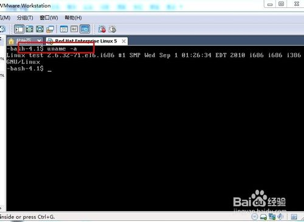

[TOC]

# Linux系统如何查看版本信息

在windows下我们查看系统信息直接右击电脑属性就可以查看了.那么在Linux系统中如何查看呢.下面给大家介绍几种查看的方式.

## 显示电脑以及操作系统的相关信息

输入"uname -a ",可显示电脑以及操作系统的相关信息。 

## 显示内核版本

输入"cat /proc/version",说明正在运行的内核版本。

## 显示的是发行版本信息

输入"cat /etc/issue", 显示的是发行版本信息

lsb_release -a (适用于所有的linux，包括Redhat、SuSE、Debian等发行版，但是在debian下要安装lsb)

 

## 注意事项

- 如果不知道命令的意思.可以通过 "man 命令"可以查看它的使用方式.及详细信息.

https://jingyan.baidu.com/article/7908e85c725159af481ad2f7.html