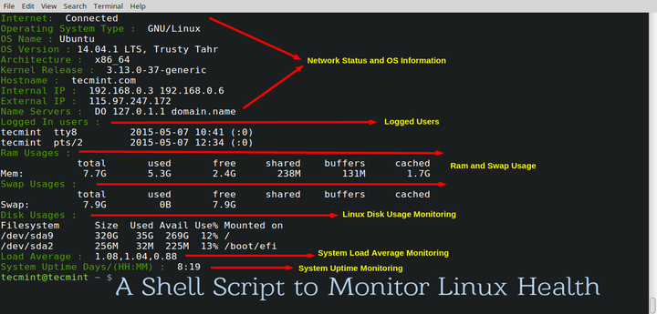
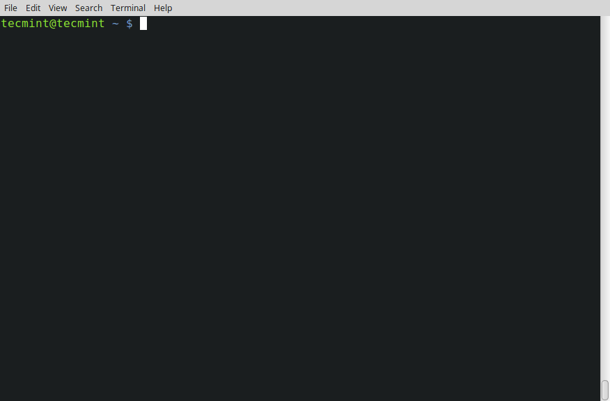

[TOC]


# 一个Linux中用于监控的简易shell脚本

## 简介

系统管理员的任务真的很艰难，因为他/她必须监控服务器、用户、日志，还得创建备份，等等等等。对于大多数重复性的任务，大多数管理员都会写一个自动化脚本来日复一日地重复这些任务。这里，我们已经写了一个shell脚本给大家，用来自动化完成系统管理员所要完成的常规任务，这可能在多数情况下，尤其是对于新手而言十分有用，他们能通过该脚本获取到大多数的他们想要的信息，包括系统、网络、用户、负载、内存、主机、内部IP、外部IP、开机时间等。

我们已经注意并进行了格式化输出（在一定程度上哦）。此脚本不包含任何恶意内容，并且它能以普通用户帐号运行。事实上，我们也推荐你以普通用户运行该脚本，而不是root。



*监控Linux系统健康的Shell脚本*

在保留Tecmint和脚本作者应得荣誉的前提下，可以自由使用/修改/再分发下面代码。我们已经试着在一定程度上自定义了输出结果，除了要求的输出内容外，其它内容都不会生成。我们也已经试着使用了那些Linux系统中通常不使用的变量，这些变量应该是可以随便用的。

#### 最小系统要求

你所需要的一切，就是一台正常运转的Linux机器。

#### 依赖性

对于一个标准的Linux发行版，使用此软件包不需任何依赖。此外，该脚本不需要root权限来执行。但是，如果你想要安装，则必须输入一次root密码。

#### 安全性

我们也关注到了系统安全问题，所以在安装此包时，不需要安装任何额外包，也不需要root访问权限来运行。此外，源代码是采用Apache 2.0许可证发布的，这意味着只要你保留Tecmint的版权，你可以自由地编辑、修改并再分发该代码。

## 如何安装和运行脚本？

首先，使用[wget命令](http://www.tecmint.com/10-wget-command-examples-in-linux/)下载监控脚本`“tecmint_monitor.sh”`，给它赋予合适的执行权限。

```
# wget http://tecmint.com/wp-content/scripts/tecmint_monitor.sh# chmod 755 tecmint_monitor.sh
```

强烈建议你以普通用户身份安装该脚本，而不是root。安装过程中会询问root密码，并且在需要的时候安装必要的组件。

要安装“`tecmint_monitor.sh`”脚本，只需像下面这样使用-i（安装）选项就可以了。

```
./tecmint_monitor.sh -i 
```

在提示你输入root密码时输入该密码。如果一切顺利，你会看到像下面这样的安装成功信息。

```
Password: Congratulations! Script Installed, now run monitor Command
```

安装完毕后，你可以在任何位置，以任何用户调用命令`‘monitor’`来运行该脚本。如果你不喜欢安装，你需要在每次运行时输入路径。

```
# ./Path/to/script/tecmint_monitor.sh
```

现在，以任何用户从任何地方运行monitor命令，就是这么简单：

```
$ monitor
```



*TecMint Monitor Script in Action*

你运行命令就会获得下面这些各种各样和系统相关的信息：

- 互联网连通性
- 操作系统类型
- 操作系统名称
- 操作系统版本
- 架构
- 内核版本
- 主机名
- 内部IP
- 外部IP
- 域名服务器
- 已登录用户
- 内存使用率
- 交换分区使用率
- 磁盘使用率
- 平均负载
- 系统开机时间

使用-v（版本）开关来检查安装的脚本的版本。

```
$ monitor -vtecmint_monitor version 0.1Designed by Tecmint.comReleased Under Apache 2.0 License
```

## 小结

该脚本在一些机器上可以开机即用，这一点我已经检查过。相信对于你而言，它也会正常工作。如果你们发现了什么毛病，可以在评论中告诉我。这个脚本还不完善，这仅仅是个开始。从这里开始，你可以将它改进到任何程度。如果你想要编辑脚本，将它带入一个更深的层次，尽管随意去做吧，别忘了给我们应的的荣誉，也别忘了把你更新后的脚本拿出来和我们分享哦，这样，我们也会更新此文来给你应得的荣誉。

别忘了和我们分享你的想法或者脚本，我们会在这儿帮助你。谢谢你们给予的所有挚爱。继续浏览，不要走开哦。

------

via: <http://www.tecmint.com/linux-server-health-monitoring-script/>

作者：[Avishek Kumar](http://www.tecmint.com/author/avishek/) 译者：[GOLinux](https://github.com/GOLinux) 校对：[wxy](https://github.com/wxy)

本文由 [LCTT](https://github.com/LCTT/TranslateProject) 原创翻译，[Linux中国](https://linux.cn/article-5604-1.html) 荣誉推出


https://linux.cn/article-5604-1.html