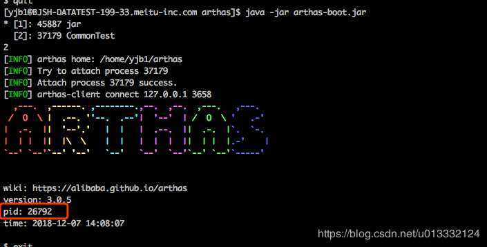

[TOC]


# athas详解

## 简介

图片看不到的话可以看我的CSDN的博客
 <https://blog.csdn.net/u013332124/article/details/84888074>

`Arthas` 是Alibaba开源的Java诊断工具，采用命令行交互模式，提供了丰富的功能，是排查jvm相关问题的利器。

在逛github时，发现了这款利器，深入了解之后，简直惊为天人。下面先列举一下它能做的一些事情：

1. 提供性能看板，包括线程、cpu、内存等信息，并且会定时的刷新。
2. 根据各种条件查看线程快照。比如找出cpu占用率最高的n个线程等
3. 输出jvm的各种信息，如gc算法、jdk版本、ClassPath等
4. 查看/设置sysprop和sysenv
5. 查看某个类的静态属性，也可以通过ognl语法执行一些语句
6. 查看已加载的类的详细信息，比如这个类从哪个jar包加载的。也可以查看类的方法的信息
7. dump某个类的字节码到指定目录
8. 直接反编译指定的类
9. 查看类加载器的一些信息
10. 可以让jvm重新加载某个类
11. 监控方法的执行，同时可以获取到执行的入参、出参以及抛出的异常
12. 追踪方法执行的调用栈，以及各个方法的调用时间

下面我会对如何使用这些功能做一个简单的介绍，也会加上一些自己对这些命令的理解。有一些命令不会介绍的太详细，因为官方文档已经写的很棒了，我没必要再这复述。想深入了解的朋友也可以直接去看arthas的官方文档，中文的，很容易阅读。

<https://alibaba.github.io/arthas/install-detail.html>

## 安装和使用arthas

官方文档：

<https://alibaba.github.io/arthas/install-detail.html>

### 安装

直接通过`java -jar启动:

```
apt-get update
apt  -y install wget

wget https://alibaba.github.io/arthas/arthas-boot.jar
# 启动后会自动下载响应的lib到 ~/.arthas 目录下
java -jar arthas-boot.jar
```

或者直接下载arthas的压缩包，然后解压:

```
unzip arthas-packaging-bin.zip
# 执行
./as.sh
```

启动asthas进程后，它会列出所有的jvm进程，并让我们选择要attach哪个进程。attach目标进程后，就进入athas的交互命令行了，这时候就可以开始输入arthas对应的命令使用了

### 卸载

```
 rm -rf ~/.arthas/
```

 

## athas的各个命令

> 请注意，这些命令，都通过字节码增强技术来实现的，会在指定类的方法中插入一些切面来实现数据统计和观测，因此在线上、预发使用时，请尽量明确需要观测的类、方法以及条件，诊断结束要执行 `shutdown` 或将增强过的类执行 `reset` 命令。

- [monitor](https://alibaba.github.io/arthas/monitor.html)——方法执行监控
- [watch](https://alibaba.github.io/arthas/watch.html)——方法执行数据观测
- [trace](https://alibaba.github.io/arthas/trace.html)——方法内部调用路径，并输出方法路径上的每个节点上耗时
- [stack](https://alibaba.github.io/arthas/stack.html)——输出当前方法被调用的调用路径
- [tt](https://alibaba.github.io/arthas/tt.html)——方法执行数据的时空隧道，记录下指定方法每次调用的入参和返回信息，并能对这些不同的时间下调用进行观测

### monitor 方法执行监控

> 方法执行监控

对匹配 `class-pattern`／`method-pattern`的类、方法的调用进行监控。

`monitor` 命令是一个非实时返回命令.

实时返回命令是输入之后立即返回，而非实时返回的命令，则是不断的等待目标 Java 进程返回信息，直到用户输入 `Ctrl+C` 为止。

服务端是以任务的形式在后台跑任务，植入的代码随着任务的中止而不会被执行，所以任务关闭后，不会对原有性能产生太大影响，而且原则上，任何Arthas命令不会引起原有业务逻辑的改变。


#### 监控的维度说明

| 监控项    | 说明                       |
| --------- | -------------------------- |
| timestamp | 时间戳                     |
| class     | Java类                     |
| method    | 方法（构造方法、普通方法） |
| total     | 调用次数                   |
| success   | 成功次数                   |
| fail      | 失败次数                   |
| rt        | 平均RT                     |
| fail-rate | 失败率                     |


#### 参数说明

方法拥有一个命名参数 `[c:]`，意思是统计周期（cycle of output），拥有一个整型的参数值

| 参数名称         | 参数说明                             |
| ---------------- | ------------------------------------ |
| *class-pattern*  | 类名表达式匹配                       |
| *method-pattern* | 方法名表达式匹配                     |
| [E]              | 开启正则表达式匹配，默认为通配符匹配 |
| `[c:]`           | 统计周期，默认值为120秒              |

查看帮助说明

```sh
$ monitor -h
 USAGE:                                                                                                      
   monitor [-c <value>] [-h] [-n <value>] [-E] class-pattern method-pattern                                  
                                                                                                             
 SUMMARY:                                                                                                    
   Monitor method execution statistics, e.g. total/success/failure count, average rt, fail rate, etc.        
                                                                                                             
 Examples:                                                                                                   
   monitor org.apache.commons.lang.StringUtils isBlank                                                       
   monitor org.apache.commons.lang.StringUtils isBlank -c 5                                                  
   monitor -E org\.apache\.commons\.lang\.StringUtils isBlank                                                
                                                                                                             
 WIKI:                                                                                                       
   https://alibaba.github.io/arthas/monitor                                                                  
                                                                                                             
 OPTIONS:                                                                                                    
 -c, --cycle <value>                 The monitor interval (in seconds), 60 seconds by default                
 -h, --help                          this help                                                               
 -n, --limits <value>                Threshold of execution times                                            
 -E, --regex                         Enable regular expression to match (wildcard matching by default)       
 <class-pattern>                     Path and classname of Pattern Matching                                  
 <method-pattern>                    Method of Pattern Matching    
```


#### 使用参考

```sh
$ monitor -c 5 demo.MathGame primeFactors
Press Ctrl+C to abort.
Affect(class-cnt:1 , method-cnt:1) cost in 94 ms.
 timestamp            class          method        total  success  fail  avg-rt(ms)  fail-rate
-----------------------------------------------------------------------------------------------
 2018-12-03 19:06:38  demo.MathGame  primeFactors  5      1        4     1.15        80.00%
 
 timestamp            class          method        total  success  fail  avg-rt(ms)  fail-rate
-----------------------------------------------------------------------------------------------
 2018-12-03 19:06:43  demo.MathGame  primeFactors  5      3        2     42.29       40.00%
 
 timestamp            class          method        total  success  fail  avg-rt(ms)  fail-rate
-----------------------------------------------------------------------------------------------
 2018-12-03 19:06:48  demo.MathGame  primeFactors  5      3        2     67.92       40.00%
 
 timestamp            class          method        total  success  fail  avg-rt(ms)  fail-rate
-----------------------------------------------------------------------------------------------
 2018-12-03 19:06:53  demo.MathGame  primeFactors  5      2        3     0.25        60.00%
 
 timestamp            class          method        total  success  fail  avg-rt(ms)  fail-rate
-----------------------------------------------------------------------------------------------
 2018-12-03 19:06:58  demo.MathGame  primeFactors  1      1        0     0.45        0.00%
 
 timestamp            class          method        total  success  fail  avg-rt(ms)  fail-rate
-----------------------------------------------------------------------------------------------
 2018-12-03 19:07:03  demo.MathGame  primeFactors  2      2        0     3182.72     0.00%
```


### watch 方法执行数据观测

> 方法执行数据观测

让你能方便的观察到指定方法的调用情况。能观察到的范围为：`返回值`、`抛出异常`、`入参`，通过编写 OGNL 表达式进行对应变量的查看。


#### 参数说明

watch 的参数比较多，主要是因为它能在 4 个不同的场景观察对象

| 参数名称            | 参数说明                                   |
| ------------------- | ------------------------------------------ |
| *class-pattern*     | 类名表达式匹配                             |
| *method-pattern*    | 方法名表达式匹配                           |
| *express*           | 观察表达式                                 |
| *condition-express* | 条件表达式                                 |
| [b]                 | 在**方法调用之前**观察                     |
| [e]                 | 在**方法异常之后**观察                     |
| [s]                 | 在**方法返回之后**观察                     |
| [f]                 | 在**方法结束之后**(正常返回和异常返回)观察 |
| [E]                 | 开启正则表达式匹配，默认为通配符匹配       |
| [x:]                | 指定输出结果的属性遍历深度，默认为 1       |

这里重点要说明的是观察表达式，观察表达式的构成主要由 ognl 表达式组成，所以你可以这样写`"{params,returnObj}"`，只要是一个合法的 ognl 表达式，都能被正常支持。

观察的维度也比较多，主要体现在参数 `advice` 的数据结构上。`Advice` 参数最主要是封装了通知节点的所有信息。请参考[表达式核心变量](https://alibaba.github.io/arthas/advice-class.html)中关于该节点的描述。

- 特殊用法请参考：<https://github.com/alibaba/arthas/issues/71>
- OGNL表达式官网：<https://commons.apache.org/proper/commons-ognl/language-guide.html>

**特别说明**：

- watch 命令定义了4个观察事件点，即 `-b` 方法调用前，`-e` 方法异常后，`-s` 方法返回后，`-f` 方法结束后
- 4个观察事件点 `-b`、`-e`、`-s` 默认关闭，`-f` 默认打开，当指定观察点被打开后，在相应事件点会对观察表达式进行求值并输出
- 这里要注意`方法入参`和`方法出参`的区别，有可能在中间被修改导致前后不一致，除了 `-b` 事件点 `params` 代表方法入参外，其余事件都代表方法出参
- 当使用 `-b` 时，由于观察事件点是在方法调用前，此时返回值或异常均不存在


```sh
$ watch  -h
 USAGE:                                                                                                                                                   
   watch [-b] [-e] [-x <value>] [-f] [-h] [-n <value>] [-E] [-M <value>] [-s] class-pattern method-pattern express [condition-express]                    
                                                                                                                                                          
 SUMMARY:                                                                                                                                                 
   Display the input/output parameter, return object, and thrown exception of specified method invocation                                                 
   The express may be one of the following expression (evaluated dynamically):                                                                            
           target : the object                                                                                                                            
            clazz : the object's class                                                                                                                    
           method : the constructor or method                                                                                                             
           params : the parameters array of method                                                                                                        
     params[0..n] : the element of parameters array                                                                                                       
        returnObj : the returned object of method                                                                                                         
         throwExp : the throw exception of method                                                                                                         
         isReturn : the method ended by return                                                                                                            
          isThrow : the method ended by throwing exception                                                                                                
            #cost : the execution time in ms of method invocation                                                                                         
 Examples:                                                                                                                                                
   watch -b org.apache.commons.lang.StringUtils isBlank params                                                                                            
   watch -f org.apache.commons.lang.StringUtils isBlank returnObj                                                                                         
   watch org.apache.commons.lang.StringUtils isBlank '{params, target, returnObj}' -x 2                                                                   
   watch -bf *StringUtils isBlank params                                                                                                                  
   watch *StringUtils isBlank params[0]                                                                                                                   
   watch *StringUtils isBlank params[0] params[0].length==1                                                                                               
   watch *StringUtils isBlank params '#cost>100'                                                                                                          
   watch -E -b org\.apache\.commons\.lang\.StringUtils isBlank params[0]                                                                                  
                                                                                                                                                          
 WIKI:                                                                                                                                                    
   https://alibaba.github.io/arthas/watch                                                                                                                 
                                                                                                                                                          
 OPTIONS:                                                                                                                                                 
 -b, --before                                       Watch before invocation                                                                               
 -e, --exception                                    Watch after throw exception                                                                           
 -x, --expand <value>                               Expand level of object (1 by default)                                                                 
 -f, --finish                                       Watch after invocation, enable by default                                                             
 -h, --help                                         this help                                                                                             
 -n, --limits <value>                               Threshold of execution times                                                                          
 -E, --regex                                        Enable regular expression to match (wildcard matching by default)                                     
 -M, --sizeLimit <value>                            Upper size limit in bytes for the result (10 * 1024 * 1024 by default)                                
 -s, --success                                      Watch after successful invocation                                                                     
 <class-pattern>                                    The full qualified class name you want to watch                                                       
 <method-pattern>                                   The method name you want to watch                                                                     
 <express>                                          the content you want to watch, written by ognl.                                                       
                                                    Examples:                                                                                             
                                                      params                                                                                              
                                                      params[0]                                                                                           
                                                      'params[0]+params[1]'                                                                               
                                                      '{params[0], target, returnObj}'                                                                    
                                                      returnObj                                                                                           
                                                      throwExp                                                                                            
                                                      target                                                                                              
                                                      clazz                                                                                               
                                                      method                                                                                              
                                                                                                                                                          
 <condition-express>                                Conditional expression in ognl style, for example:                                                    
                                                      TRUE  : 1==1                                                                                        
                                                      TRUE  : true                                                                                        
                                                      FALSE : false                                                                                       
                                                      TRUE  : 'params.length>=0'                                                                          
                                                      FALSE : 1==2       
```


#### 使用参考


##### 启动 Demo

启动[快速入门](https://alibaba.github.io/arthas/quick-start.html)里的`arthas-demo`。


##### 观察方法出参和返回值

```
$ watch demo.MathGame primeFactors "{params,returnObj}" -x 2
Press Ctrl+C to abort.
Affect(class-cnt:1 , method-cnt:1) cost in 44 ms.
ts=2018-12-03 19:16:51; [cost=1.280502ms] result=@ArrayList[
    @Object[][
        @Integer[535629513],
    ],
    @ArrayList[
        @Integer[3],
        @Integer[19],
        @Integer[191],
        @Integer[49199],
    ],
]
```


##### 观察方法入参

```
$ watch demo.MathGame primeFactors "{params,returnObj}" -x 2 -b
Press Ctrl+C to abort.
Affect(class-cnt:1 , method-cnt:1) cost in 50 ms.
ts=2018-12-03 19:23:23; [cost=0.0353ms] result=@ArrayList[
    @Object[][
        @Integer[-1077465243],
    ],
    null,
]
```

- 对比前一个例子，返回值为空（事件点为方法执行前，因此获取不到返回值）


##### 同时观察方法调用前和方法返回后

```
$ watch demo.MathGame primeFactors "{params,target,returnObj}" -x 2 -b -s -n 2
Press Ctrl+C to abort.
Affect(class-cnt:1 , method-cnt:1) cost in 46 ms.
ts=2018-12-03 19:29:54; [cost=0.01696ms] result=@ArrayList[
    @Object[][
        @Integer[1544665400],
    ],
    @MathGame[
        random=@Random[java.util.Random@522b408a],
        illegalArgumentCount=@Integer[13038],
    ],
    null,
]
ts=2018-12-03 19:29:54; [cost=4.277392ms] result=@ArrayList[
    @Object[][
        @Integer[1544665400],
    ],
    @MathGame[
        random=@Random[java.util.Random@522b408a],
        illegalArgumentCount=@Integer[13038],
    ],
    @ArrayList[
        @Integer[2],
        @Integer[2],
        @Integer[2],
        @Integer[5],
        @Integer[5],
        @Integer[73],
        @Integer[241],
        @Integer[439],
    ],
]
```

- 参数里`-n 2`，表示只执行两次
- 这里输出结果中，第一次输出的是方法调用前的观察表达式的结果，第二次输出的是方法返回后的表达式的结果
- 结果的输出顺序和事件发生的先后顺序一致，和命令中 `-s -b` 的顺序无关


##### 调整`-x`的值，观察具体的方法参数值

```
$ watch demo.MathGame primeFactors "{params,target}" -x 3
Press Ctrl+C to abort.
Affect(class-cnt:1 , method-cnt:1) cost in 58 ms.
ts=2018-12-03 19:34:19; [cost=0.587833ms] result=@ArrayList[
    @Object[][
        @Integer[47816758],
    ],
    @MathGame[
        random=@Random[
            serialVersionUID=@Long[3905348978240129619],
            seed=@AtomicLong[3133719055989],
            multiplier=@Long[25214903917],
            addend=@Long[11],
            mask=@Long[281474976710655],
            DOUBLE_UNIT=@Double[1.1102230246251565E-16],
            BadBound=@String[bound must be positive],
            BadRange=@String[bound must be greater than origin],
            BadSize=@String[size must be non-negative],
            seedUniquifier=@AtomicLong[-3282039941672302964],
            nextNextGaussian=@Double[0.0],
            haveNextNextGaussian=@Boolean[false],
            serialPersistentFields=@ObjectStreamField[][isEmpty=false;size=3],
            unsafe=@Unsafe[sun.misc.Unsafe@2eaa1027],
            seedOffset=@Long[24],
        ],
        illegalArgumentCount=@Integer[13159],
    ],
]
```

- `-x`表示遍历深度，可以调整来打印具体的参数和结果内容，默认值是1。


##### 条件表达式的例子

```
$ watch demo.MathGame primeFactors "{params[0],target}" "params[0]<0"
Press Ctrl+C to abort.
Affect(class-cnt:1 , method-cnt:1) cost in 68 ms.
ts=2018-12-03 19:36:04; [cost=0.530255ms] result=@ArrayList[
    @Integer[-18178089],
    @MathGame[demo.MathGame@41cf53f9],
]
```

- 只有满足条件的调用，才会有响应。


##### 观察异常信息的例子

```
$ watch demo.MathGame primeFactors "{params[0],throwExp}" -e -x 2
Press Ctrl+C to abort.
Affect(class-cnt:1 , method-cnt:1) cost in 62 ms.
ts=2018-12-03 19:38:00; [cost=1.414993ms] result=@ArrayList[
    @Integer[-1120397038],
    java.lang.IllegalArgumentException: number is: -1120397038, need >= 2
    at demo.MathGame.primeFactors(MathGame.java:46)
    at demo.MathGame.run(MathGame.java:24)
    at demo.MathGame.main(MathGame.java:16)
,
]
```

- `-e`表示抛出异常时才触发
- express中，表示异常信息的变量是`throwExp`


##### 按照耗时进行过滤

```
$ watch demo.MathGame primeFactors '{params, returnObj}' '#cost>200' -x 2
Press Ctrl+C to abort.
Affect(class-cnt:1 , method-cnt:1) cost in 66 ms.
ts=2018-12-03 19:40:28; [cost=2112.168897ms] result=@ArrayList[
    @Object[][
        @Integer[2141897465],
    ],
    @ArrayList[
        @Integer[5],
        @Integer[428379493],
    ],
]
```

- `#cost>200`(单位是`ms`)表示只有当耗时大于200ms时才会输出，过滤掉执行时间小于200ms的调用


##### 观察当前对象中的属性

如果想查看方法运行前后，当前对象中的属性，可以使用`target`关键字，代表当前对象

```
$ watch demo.MathGame primeFactors 'target' -x 2
Press Ctrl+C to abort.
Affect(class-cnt:1 , method-cnt:1) cost in 52 ms.
ts=2018-12-03 19:41:52; [cost=0.477882ms] result=@MathGame[
    random=@Random[java.util.Random@522b408a],
    illegalArgumentCount=@Integer[13355],
]
```

然后使用`target.field_name`访问当前对象的某个属性

```
$ watch demo.MathGame primeFactors 'target.illegalArgumentCount'
Press Ctrl+C to abort.
Affect(class-cnt:1 , method-cnt:1) cost in 67 ms.
ts=2018-12-03 20:04:34; [cost=131.303498ms] result=@Integer[8]
ts=2018-12-03 20:04:35; [cost=0.961441ms] result=@Integer[8]
```

 


### trace 方法内部调用路径，并输出方法路径上的每个节点上耗时

> 方法内部调用路径，并输出方法路径上的每个节点上耗时

`trace` 命令能主动搜索 `class-pattern`／`method-pattern` 对应的方法调用路径，渲染和统计整个调用链路上的所有性能开销和追踪调用链路。


#### 参数说明

| 参数名称            | 参数说明                             |
| ------------------- | ------------------------------------ |
| *class-pattern*     | 类名表达式匹配                       |
| *method-pattern*    | 方法名表达式匹配                     |
| *condition-express* | 条件表达式                           |
| [E]                 | 开启正则表达式匹配，默认为通配符匹配 |
| `[n:]`              | 命令执行次数                         |
| `#cost`             | 方法执行耗时                         |

这里重点要说明的是观察表达式，观察表达式的构成主要由 ognl 表达式组成，所以你可以这样写`"{params,returnObj}"`，只要是一个合法的 ognl 表达式，都能被正常支持。

观察的维度也比较多，主要体现在参数 `advice` 的数据结构上。`Advice` 参数最主要是封装了通知节点的所有信息。

请参考[表达式核心变量](https://alibaba.github.io/arthas/advice-class.html)中关于该节点的描述。

- 特殊用法请参考：<https://github.com/alibaba/arthas/issues/71>
- OGNL表达式官网：<https://commons.apache.org/proper/commons-ognl/language-guide.html>

很多时候我们只想看到某个方法的rt大于某个时间之后的trace结果，现在Arthas可以按照方法执行的耗时来进行过滤了，例如`trace *StringUtils isBlank '#cost>100'`表示当执行时间超过100ms的时候，才会输出trace的结果。

> watch/stack/trace这个三个命令都支持`#cost`


```sh
$ trace -h
 USAGE:                                                                                                                                                   
   trace [-h] [-j] [-n <value>] [-p <value>] [-E] class-pattern method-pattern [condition-express]                                                        
                                                                                                                                                          
 SUMMARY:                                                                                                                                                 
   Trace the execution time of specified method invocation.                                                                                               
   The express may be one of the following expression (evaluated dynamically):                                                                            
           target : the object                                                                                                                            
            clazz : the object's class                                                                                                                    
           method : the constructor or method                                                                                                             
           params : the parameters array of method                                                                                                        
     params[0..n] : the element of parameters array                                                                                                       
        returnObj : the returned object of method                                                                                                         
         throwExp : the throw exception of method                                                                                                         
         isReturn : the method ended by return                                                                                                            
          isThrow : the method ended by throwing exception                                                                                                
            #cost : the execution time in ms of method invocation                                                                                         
 EXAMPLES:                                                                                                                                                
   trace org.apache.commons.lang.StringUtils isBlank                                                                                                      
   trace *StringUtils isBlank                                                                                                                             
   trace *StringUtils isBlank params[0].length==1                                                                                                         
   trace *StringUtils isBlank '#cost>100'                                                                                                                 
   trace -E org\\.apache\\.commons\\.lang\\.StringUtils isBlank                                                                                           
   trace -E com.test.ClassA|org.test.ClassB method1|method2|method3                                                                                       
                                                                                                                                                          
 WIKI:                                                                                                                                                    
   https://alibaba.github.io/arthas/trace                                                                                                                 
                                                                                                                                                          
 OPTIONS:                                                                                                                                                 
 -h, --help                                         this help                                                                                             
 -j, --jdkMethodSkip                                skip jdk method trace                                                                                 
 -n, --limits <value>                               Threshold of execution times                                                                          
 -p, --path <value>                                 path tracing pattern                                                                                  
 -E, --regex                                        Enable regular expression to match (wildcard matching by default)                                     
 <class-pattern>                                    Class name pattern, use either '.' or '/' as separator                                                
 <method-pattern>                                   Method name pattern                                                                                   
 <condition-express>                                Conditional expression in ognl style, for example:                                                    
                                                      TRUE  : 1==1                                                                                        
                                                      TRUE  : true                                                                                        
                                                      FALSE : false                                                                                       
                                                      TRUE  : 'params.length>=0'                                                                          
                                                      FALSE : 1==2                                                                                        
                                                                    
```


#### 注意事项

`trace` 能方便的帮助你定位和发现因 RT 高而导致的性能问题缺陷，但其每次只能跟踪一级方法的调用链路。


#### 使用参考


##### 启动 Demo

启动[快速入门](https://alibaba.github.io/arthas/quick-start.html)里的`arthas-demo`。


##### trace函数

```
$ trace demo.MathGame run
Press Ctrl+C to abort.
Affect(class-cnt:1 , method-cnt:1) cost in 42 ms.
`---ts=2018-12-04 00:44:17;thread_name=main;id=1;is_daemon=false;priority=5;TCCL=sun.misc.Launcher$AppClassLoader@3d4eac69
    `---[10.611029ms] demo.MathGame:run()
        +---[0.05638ms] java.util.Random:nextInt()
        +---[10.036885ms] demo.MathGame:primeFactors()
        `---[0.170316ms] demo.MathGame:print()
```


##### 过滤掉jdk的函数

```
$ trace -j  demo.MathGame run
Press Ctrl+C to abort.
Affect(class-cnt:1 , method-cnt:1) cost in 31 ms.
`---ts=2018-12-04 01:09:14;thread_name=main;id=1;is_daemon=false;priority=5;TCCL=sun.misc.Launcher$AppClassLoader@3d4eac69
    `---[5.190646ms] demo.MathGame:run()
        +---[4.465779ms] demo.MathGame:primeFactors()
        `---[0.375324ms] demo.MathGame:print()
```

- `-j`: jdkMethodSkip, skip jdk method trace


##### 据调用耗时过滤

```
$ trace demo.MathGame run '#cost > 10'
Press Ctrl+C to abort.
Affect(class-cnt:1 , method-cnt:1) cost in 41 ms.
`---ts=2018-12-04 01:12:02;thread_name=main;id=1;is_daemon=false;priority=5;TCCL=sun.misc.Launcher$AppClassLoader@3d4eac69
    `---[12.033735ms] demo.MathGame:run()
        +---[0.006783ms] java.util.Random:nextInt()
        +---[11.852594ms] demo.MathGame:primeFactors()
        `---[0.05447ms] demo.MathGame:print()
```

> 只会展示耗时大于10ms的调用路径，有助于在排查问题的时候，只关注异常情况

- 是不是很眼熟，没错，在 JProfiler 等收费软件中你曾经见识类似的功能，这里你将可以通过命令就能打印出指定调用路径。 友情提醒下，`trace` 在执行的过程中本身是会有一定的性能开销，在统计的报告中并未像 JProfiler 一样预先减去其自身的统计开销。所以这统计出来有些许的不准，渲染路径上调用的类、方法越多，性能偏差越大。但还是能让你看清一些事情的。
- [12.033735ms] 的含义，`12.033735` 的含义是：当前节点在当前步骤的耗时，单位为毫秒
- [0,0,0ms,11]xxx:yyy() [throws Exception]，对该方法中相同的方法调用进行了合并，`0,0,0ms,11` 表示方法调用耗时，`min,max,total,count`；`throws Exception` 表明该方法调用中存在异常返回
- 这里存在一个统计不准确的问题，就是所有方法耗时加起来可能会小于该监测方法的总耗时，这个是由于 Arthas 本身的逻辑会有一定的耗时


##### trace多个类或者多个函数

trace命令只会trace匹配到的函数里的子调用，并不会向下trace多层。因为trace是代价比较贵的，多层trace可能会导致最终要trace的类和函数非常多。

可以用正则表匹配路径上的多个类和函数，一定程度上达到多层trace的效果。

```
trace -E com.test.ClassA|org.test.ClassB method1|method2|method3
```

 


### stack 输出当前方法被调用的调用路径

> 输出当前方法被调用的调用路径

很多时候我们都知道一个方法被执行，但这个方法被执行的路径非常多，或者你根本就不知道这个方法是从那里被执行了，此时你需要的是 stack 命令。


#### 参数说明

| 参数名称            | 参数说明                             |
| ------------------- | ------------------------------------ |
| *class-pattern*     | 类名表达式匹配                       |
| *method-pattern*    | 方法名表达式匹配                     |
| *condition-express* | 条件表达式                           |
| [E]                 | 开启正则表达式匹配，默认为通配符匹配 |
| `[n:]`              | 执行次数限制                         |

这里重点要说明的是观察表达式，观察表达式的构成主要由 ognl 表达式组成，所以你可以这样写`"{params,returnObj}"`，只要是一个合法的 ognl 表达式，都能被正常支持。

观察的维度也比较多，主要体现在参数 `advice` 的数据结构上。`Advice` 参数最主要是封装了通知节点的所有信息。

请参考[表达式核心变量](https://alibaba.github.io/arthas/advice-class.html)中关于该节点的描述。

- 特殊用法请参考：<https://github.com/alibaba/arthas/issues/71>
- OGNL表达式官网：<https://commons.apache.org/proper/commons-ognl/language-guide.html>


```sh
$ stack -h
 USAGE:                                                                                                                                                   
   stack [-h] [-n <value>] [-E] class-pattern [method-pattern] [condition-express]                                                                        
                                                                                                                                                          
 SUMMARY:                                                                                                                                                 
   Display the stack trace for the specified class and method                                                                                             
   The express may be one of the following expression (evaluated dynamically):                                                                            
           target : the object                                                                                                                            
            clazz : the object's class                                                                                                                    
           method : the constructor or method                                                                                                             
           params : the parameters array of method                                                                                                        
     params[0..n] : the element of parameters array                                                                                                       
        returnObj : the returned object of method                                                                                                         
         throwExp : the throw exception of method                                                                                                         
         isReturn : the method ended by return                                                                                                            
          isThrow : the method ended by throwing exception                                                                                                
            #cost : the execution time in ms of method invocation                                                                                         
 EXAMPLES:                                                                                                                                                
   stack org.apache.commons.lang.StringUtils isBlank                                                                                                      
   stack *StringUtils isBlank                                                                                                                             
   stack *StringUtils isBlank params[0].length==1                                                                                                         
   stack *StringUtils isBlank '#cost>100'                                                                                                                 
   stack -E org\.apache\.commons\.lang\.StringUtils isBlank                                                                                               
                                                                                                                                                          
 WIKI:                                                                                                                                                    
   https://alibaba.github.io/arthas/stack                                                                                                                 
                                                                                                                                                          
 OPTIONS:                                                                                                                                                 
 -h, --help                                         this help                                                                                             
 -n, --limits <value>                               Threshold of execution times                                                                          
 -E, --regex                                        Enable regular expression to match (wildcard matching by default)                                     
 <class-pattern>                                    Path and classname of Pattern Matching                                                                
 <method-pattern>                                   Method of Pattern Matching                                                                            
 <condition-express>                                Conditional expression in ognl style, for example:                                                    
                                                      TRUE  : 1==1                                                                                        
                                                      TRUE  : true                                                                                        
                                                      FALSE : false                                                                                       
                                                      TRUE  : 'params.length>=0'                                                                          
                                                      FALSE : 1==2                                                                                        
                                                                       
```


#### 使用例子


##### 启动 Demo

启动[快速入门](https://alibaba.github.io/arthas/quick-start.html)里的`arthas-demo`。


##### stack

```
$ stack demo.MathGame primeFactors
Press Ctrl+C to abort.
Affect(class-cnt:1 , method-cnt:1) cost in 36 ms.
ts=2018-12-04 01:32:19;thread_name=main;id=1;is_daemon=false;priority=5;TCCL=sun.misc.Launcher$AppClassLoader@3d4eac69
    @demo.MathGame.run()
        at demo.MathGame.main(MathGame.java:16)
```


##### 据条件表达式来过滤

```
$ stack demo.MathGame primeFactors 'params[0]<0' -n 2
Press Ctrl+C to abort.
Affect(class-cnt:1 , method-cnt:1) cost in 30 ms.
ts=2018-12-04 01:34:27;thread_name=main;id=1;is_daemon=false;priority=5;TCCL=sun.misc.Launcher$AppClassLoader@3d4eac69
    @demo.MathGame.run()
        at demo.MathGame.main(MathGame.java:16)
 
ts=2018-12-04 01:34:30;thread_name=main;id=1;is_daemon=false;priority=5;TCCL=sun.misc.Launcher$AppClassLoader@3d4eac69
    @demo.MathGame.run()
        at demo.MathGame.main(MathGame.java:16)
 
Command execution times exceed limit: 2, so command will exit. You can set it with -n option.
```


##### 据执行时间来过滤

```
$ stack demo.MathGame primeFactors '#cost>5'
Press Ctrl+C to abort.
Affect(class-cnt:1 , method-cnt:1) cost in 35 ms.
ts=2018-12-04 01:35:58;thread_name=main;id=1;is_daemon=false;priority=5;TCCL=sun.misc.Launcher$AppClassLoader@3d4eac69
    @demo.MathGame.run()
        at demo.MathGame.main(MathGame.java:16)
```

 

### tt 方法执行数据的时空隧道

> 方法执行数据的时空隧道，记录下指定方法每次调用的入参和返回信息，并能对这些不同的时间下调用进行观测

`watch` 虽然很方便和灵活，但需要提前想清楚观察表达式的拼写，这对排查问题而言要求太高，因为很多时候我们并不清楚问题出自于何方，只能靠蛛丝马迹进行猜测。

这个时候如果能记录下当时方法调用的所有入参和返回值、抛出的异常会对整个问题的思考与判断非常有帮助。

于是乎，TimeTunnel 命令就诞生了。


```sh
$ tt -h
 USAGE:                                                                                                                                                                               
   tt [-d] [--delete-all] [-x <value>] [-h] [-i <value>] [-n <value>] [-l] [-p] [-E] [--replay-interval <value>] [--replay-times <value>] [-s <value>] [-M <value>] [-t] [-w <value>] 
  [class-pattern] [method-pattern] [condition-express]                                                                                                                                
                                                                                                                                                                                      
 SUMMARY:                                                                                                                                                                             
   Time Tunnel                                                                                                                                                                        
   The express may be one of the following expression (evaluated dynamically):                                                                                                        
           target : the object                                                                                                                                                        
            clazz : the object's class                                                                                                                                                
           method : the constructor or method                                                                                                                                         
           params : the parameters array of method                                                                                                                                    
     params[0..n] : the element of parameters array                                                                                                                                   
        returnObj : the returned object of method                                                                                                                                     
         throwExp : the throw exception of method                                                                                                                                     
         isReturn : the method ended by return                                                                                                                                        
          isThrow : the method ended by throwing exception                                                                                                                            
            #cost : the execution time in ms of method invocation                                                                                                                     
 EXAMPLES:                                                                                                                                                                            
   tt -t *StringUtils isEmpty                                                                                                                                                         
   tt -t *StringUtils isEmpty params[0].length==1                                                                                                                                     
   tt -l                                                                                                                                                                              
   tt -i 1000                                                                                                                                                                         
   tt -i 1000 -w params[0]                                                                                                                                                            
   tt -i 1000 -p                                                                                                                                                                      
   tt -i 1000 -p --replay-times 3 --replay-interval 3000                                                                                                                              
   tt --delete-all                                                                                                                                                                    
                                                                                                                                                                                      
 WIKI:                                                                                                                                                                                
   https://alibaba.github.io/arthas/tt                                                                                                                                                
                                                                                                                                                                                      
 OPTIONS:                                                                                                                                                                             
 -d, --delete                                                 Delete time fragment specified by index                                                                                 
     --delete-all                                             Delete all the time fragments                                                                                           
 -x, --expand <value>                                         Expand level of object (1 by default)                                                                                   
 -h, --help                                                   this help                                                                                                               
 -i, --index <value>                                          Display the detailed information from specified time fragment                                                           
 -n, --limits <value>                                         Threshold of execution times                                                                                            
 -l, --list                                                   List all the time fragments                                                                                             
 -p, --play                                                   Replay the time fragment specified by index                                                                             
 -E, --regex                                                  Enable regular expression to match (wildcard matching by default)                                                       
     --replay-interval <value>                                replay interval  for  play tt with option r greater than 1                                                              
     --replay-times <value>                                   execution times when play tt                                                                                            
 -s, --search-express <value>                                 Search-expression, to search the time fragments by ognl express.                                                        
                                                              The structure of 'advice' like conditional expression                                                                   
 -M, --sizeLimit <value>                                      Upper size limit in bytes for the result (10 * 1024 * 1024 by default)                                                  
 -t, --time-tunnel                                            Record the method invocation within time fragments                                                                      
 -w, --watch-express <value>                                  watch the time fragment by ognl express.                                                                                
                                                              Examples:                                                                                                               
                                                                params                                                                                                                
                                                                params[0]                                                                                                             
                                                                'params[0]+params[1]'                                                                                                 
                                                                '{params[0], target, returnObj}'                                                                                      
                                                                returnObj                                                                                                             
                                                                throwExp                                                                                                              
                                                                target                                                                                                                
                                                                clazz                                                                                                                 
                                                                method                                                                                                                
                                                                                                                                                                                      
 <class-pattern>                                              Path and classname of Pattern Matching                                                                                  
 <method-pattern>                                             Method of Pattern Matching                                                                                              
 <condition-express>                                          Conditional expression in ognl style, for example:                                                                      
                                                                TRUE  : 1==1                                                                                                          
                                                                TRUE  : true                                                                                                          
                                                                FALSE : false                                                                                                         
                                                                TRUE  : 'params.length>=0'                                                                                            
                                                                FALSE : 1==2                                                                                                          
                                                                                    
```


#### 使用参考


##### 启动 Demo

启动[快速入门](https://alibaba.github.io/arthas/quick-start.html)里的`arthas-demo`。


##### 记录调用

对于一个最基本的使用来说，就是记录下当前方法的每次调用环境现场。

```
$ tt -t demo.MathGame primeFactors
Press Ctrl+C to abort.
Affect(class-cnt:1 , method-cnt:1) cost in 66 ms.
 INDEX   TIMESTAMP            COST(ms)  IS-RET  IS-EXP   OBJECT         CLASS                          METHOD
-------------------------------------------------------------------------------------------------------------------------------------
 1000    2018-12-04 11:15:38  1.096236  false   true     0x4b67cf4d     MathGame                       primeFactors
 1001    2018-12-04 11:15:39  0.191848  false   true     0x4b67cf4d     MathGame                       primeFactors
 1002    2018-12-04 11:15:40  0.069523  false   true     0x4b67cf4d     MathGame                       primeFactors
 1003    2018-12-04 11:15:41  0.186073  false   true     0x4b67cf4d     MathGame                       primeFactors
 1004    2018-12-04 11:15:42  17.76437  true    false    0x4b67cf4d     MathGame                       primeFactors
```

- 命令参数解析

  - `-t`

    tt 命令有很多个主参数，`-t` 就是其中之一。这个参数的表明希望记录下类 `*Test` 的 `print` 方法的每次执行情况。

  - `-n 3`

    当你执行一个调用量不高的方法时可能你还能有足够的时间用 `CTRL+C` 中断 tt 命令记录的过程，但如果遇到调用量非常大的方法，瞬间就能将你的 JVM 内存撑爆。

    此时你可以通过 `-n` 参数指定你需要记录的次数，当达到记录次数时 Arthas 会主动中断tt命令的记录过程，避免人工操作无法停止的情况。

- 表格字段说明

| 表格字段  | 字段解释                                                     |
| --------- | ------------------------------------------------------------ |
| INDEX     | 时间片段记录编号，每一个编号代表着一次调用，后续tt还有很多命令都是基于此编号指定记录操作，非常重要。 |
| TIMESTAMP | 方法执行的本机时间，记录了这个时间片段所发生的本机时间       |
| COST(ms)  | 方法执行的耗时                                               |
| IS-RET    | 方法是否以正常返回的形式结束                                 |
| IS-EXP    | 方法是否以抛异常的形式结束                                   |
| OBJECT    | 执行对象的`hashCode()`，注意，曾经有人误认为是对象在JVM中的内存地址，但很遗憾他不是。但他能帮助你简单的标记当前执行方法的类实体 |
| CLASS     | 执行的类名                                                   |
| METHOD    | 执行的方法名                                                 |

- 条件表达式

  不知道大家是否有在使用过程中遇到以下困惑

  - Arthas 似乎很难区分出重载的方法
  - 我只需要观察特定参数，但是 tt 却全部都给我记录了下来

  条件表达式也是用 `OGNL` 来编写，核心的判断对象依然是 `Advice` 对象。除了 `tt` 命令之外，`watch`、`trace`、`stack` 命令也都支持条件表达式。

- 解决方法重载

  `tt -t *Test print params.length==1`

  通过制定参数个数的形式解决不同的方法签名，如果参数个数一样，你还可以这样写

  `tt -t *Test print 'params[1] instanceof Integer'`

- 解决指定参数

  `tt -t *Test print params[0].mobile=="13989838402"`

- 构成条件表达式的 `Advice` 对象

  前边看到了很多条件表达式中，都使用了 `params[0]`，有关这个变量的介绍，请参考[表达式核心变量](https://alibaba.github.io/arthas/advice-class.html)


##### 检索调用记录

当你用 `tt` 记录了一大片的时间片段之后，你希望能从中筛选出自己需要的时间片段，这个时候你就需要对现有记录进行检索。

假设我们有这些记录

```
$ tt -l
 INDEX   TIMESTAMP            COST(ms)  IS-RET  IS-EXP   OBJECT         CLASS                          METHOD
-------------------------------------------------------------------------------------------------------------------------------------
 1000    2018-12-04 11:15:38  1.096236  false   true     0x4b67cf4d     MathGame                       primeFactors
 1001    2018-12-04 11:15:39  0.191848  false   true     0x4b67cf4d     MathGame                       primeFactors
 1002    2018-12-04 11:15:40  0.069523  false   true     0x4b67cf4d     MathGame                       primeFactors
 1003    2018-12-04 11:15:41  0.186073  false   true     0x4b67cf4d     MathGame                       primeFactors
 1004    2018-12-04 11:15:42  17.76437  true    false    0x4b67cf4d     MathGame                       primeFactors
                              9
 1005    2018-12-04 11:15:43  0.4776    false   true     0x4b67cf4d     MathGame                       primeFactors
Affect(row-cnt:6) cost in 4 ms.
```

我需要筛选出 `primeFactors` 方法的调用信息

```
$ tt -s 'method.name=="primeFactors"'
 INDEX   TIMESTAMP            COST(ms)  IS-RET  IS-EXP   OBJECT         CLASS                          METHOD
-------------------------------------------------------------------------------------------------------------------------------------
 1000    2018-12-04 11:15:38  1.096236  false   true     0x4b67cf4d     MathGame                       primeFactors
 1001    2018-12-04 11:15:39  0.191848  false   true     0x4b67cf4d     MathGame                       primeFactors
 1002    2018-12-04 11:15:40  0.069523  false   true     0x4b67cf4d     MathGame                       primeFactors
 1003    2018-12-04 11:15:41  0.186073  false   true     0x4b67cf4d     MathGame                       primeFactors
 1004    2018-12-04 11:15:42  17.76437  true    false    0x4b67cf4d     MathGame                       primeFactors
                              9
 1005    2018-12-04 11:15:43  0.4776    false   true     0x4b67cf4d     MathGame                       primeFactors
Affect(row-cnt:6) cost in 607 ms.
```

你需要一个 `-s` 参数。同样的，搜索表达式的核心对象依旧是 `Advice` 对象。


##### 查看调用信息

对于具体一个时间片的信息而言，你可以通过 `-i` 参数后边跟着对应的 `INDEX` 编号查看到他的详细信息。

```
$ tt -i 1003
 INDEX            1003
 GMT-CREATE       2018-12-04 11:15:41
 COST(ms)         0.186073
 OBJECT           0x4b67cf4d
 CLASS            demo.MathGame
 METHOD           primeFactors
 IS-RETURN        false
 IS-EXCEPTION     true
 PARAMETERS[0]    @Integer[-564322413]
 THROW-EXCEPTION  java.lang.IllegalArgumentException: number is: -564322413, need >= 2
                      at demo.MathGame.primeFactors(MathGame.java:46)
                      at demo.MathGame.run(MathGame.java:24)
                      at demo.MathGame.main(MathGame.java:16)
 
Affect(row-cnt:1) cost in 11 ms.
```


##### 重做一次调用

当你稍稍做了一些调整之后，你可能需要前端系统重新触发一次你的调用，此时得求爷爷告奶奶的需要前端配合联调的同学再次发起一次调用。而有些场景下，这个调用不是这么好触发的。

`tt` 命令由于保存了当时调用的所有现场信息，所以我们可以自己主动对一个 `INDEX` 编号的时间片自主发起一次调用，从而解放你的沟通成本。此时你需要 `-p` 参数。通过 `--replay-times` 指定 调用次数，通过 `--replay-interval` 指定多次调用间隔(单位ms, 默认1000ms)

```
$ tt -i 1004 -p
 RE-INDEX       1004
 GMT-REPLAY     2018-12-04 11:26:00
 OBJECT         0x4b67cf4d
 CLASS          demo.MathGame
 METHOD         primeFactors
 PARAMETERS[0]  @Integer[946738738]
 IS-RETURN      true
 IS-EXCEPTION   false
 COST(ms)         0.186073
 RETURN-OBJ     @ArrayList[
                    @Integer[2],
                    @Integer[11],
                    @Integer[17],
                    @Integer[2531387],
                ]
Time fragment[1004] successfully replayed.
Affect(row-cnt:1) cost in 14 ms.
```

你会发现结果虽然一样，但调用的路径发生了变化，有原来的程序发起变成了 Arthas 自己的内部线程发起的调用了。

- 需要强调的点

  1. **ThreadLocal 信息丢失**

     很多框架偷偷的将一些环境变量信息塞到了发起调用线程的 ThreadLocal 中，由于调用线程发生了变化，这些 ThreadLocal 线程信息无法通过 Arthas 保存，所以这些信息将会丢失。

     一些常见的 CASE 比如：鹰眼的 TraceId 等。

  2. **引用的对象**

     需要强调的是，`tt` 命令是将当前环境的对象引用保存起来，但仅仅也只能保存一个引用而已。如果方法内部对入参进行了变更，或者返回的对象经过了后续的处理，那么在 `tt` 查看的时候将无法看到当时最准确的值。这也是为什么 `watch` 命令存在的意义。

### options 用来打开 是否支持json化的输出

options用来打开关闭某些功能:

| 名称               | 默认值 | 描述                                                         |
| ------------------ | ------ | ------------------------------------------------------------ |
| unsafe             | false  | 是否支持对系统级别的类进行增强，打开该开关可能导致把JVM搞挂，请慎重选择！ |
| dump               | false  | 是否支持被增强了的类dump到外部文件中，如果打开开关，class文件会被dump到`/${application dir}/arthas-class-dump/`目录下，具体位置详见控制台输出 |
| batch-re-transform | true   | 是否支持批量对匹配到的类执行retransform操作                  |
| json-format        | false  | 是否支持json化的输出                                         |
| disable-sub-class  | false  | 是否禁用子类匹配，默认在匹配目标类的时候会默认匹配到其子类，如果想精确匹配，可以关闭此开关 |
| debug-for-asm      | false  | 打印ASM相关的调试信息                                        |
| save-result        | false  | 是否打开执行结果存日志功能，打开之后所有命令的运行结果都将保存到`/home/admin/logs/arthas/arthas.log`中 |
| job-timeout        | 1d     | 异步后台任务的默认超时时间，超过这个时间，任务自动停止；比如设置 1d, 2h, 3m, 25s，分别代表天、小时、分、秒 |

```
$ options save-result true                                                                                         
 NAME         BEFORE-VALUE  AFTER-VALUE                                                                            
----------------------------------------                                                                           
 save-result  false         true
```

### ognl

#### 参数说明

```sh
[arthas@8673]$ ognl -h
 USAGE:                                                                                                                              
   ognl [-c <value>] [-x <value>] [-h] express                                                                                       
                                                                                                                                     
 SUMMARY:                                                                                                                            
   Execute ognl expression.                                                                                                          
                                                                                                                                     
 EXAMPLES:                                                                                                                           
   ognl '@java.lang.System@out.println("hello")'                                                                                     
   ognl -x 2 '@Singleton@getInstance()'                                                                                              
   ognl '@Demo@staticFiled'                                                                                                          
   ognl '#value1=@System@getProperty("java.home"), #value2=@System@getProperty("java.runtime.name"), {#value1, #value2}'             
   ognl -c 5d113a51 '@com.taobao.arthas.core.GlobalOptions@isDump'                                                                   
                                                                                                                                     
 WIKI:                                                                                                                               
   https://alibaba.github.io/arthas/ognl                                                                                             
   https://commons.apache.org/proper/commons-ognl/language-guide.html                                                                
                                                                                                                                     
 OPTIONS:                                                                                                                            
 -c, --classLoader <value>                   The hash code of the special class's classLoader, default classLoader is SystemClassLoa 
                                             der.                                                                                    
 -x, --expand <value>                        Expand level of object (1 by default).                                                  
 -h, --help                                  this help                                                                               
 <express>                                   The ognl expression.                                                                    

```

通过s表达式来执行一些语句。

```
## 调用静态函数
ognl '@java.lang.System@out.println("hello")'
## 输出
null

## 获取静态类的静态字段
ognl '@demo.MathGame@random'
## 输出
@Random[
    serialVersionUID=@Long[3905348978240129619],
    seed=@AtomicLong[125451474443703],
    multiplier=@Long[25214903917],
    addend=@Long[11],
    mask=@Long[281474976710655],
    DOUBLE_UNIT=@Double[1.1102230246251565E-16],
    BadBound=@String[bound must be positive],
    BadRange=@String[bound must be greater than origin],
    BadSize=@String[size must be non-negative],
    seedUniquifier=@AtomicLong[-3282039941672302964],
    nextNextGaussian=@Double[0.0],
    haveNextNextGaussian=@Boolean[false],
    serialPersistentFields=@ObjectStreamField[][isEmpty=false;size=3],
    unsafe=@Unsafe[sun.misc.Unsafe@28ea5898],
    seedOffset=@Long[24],
]

## 执行多行表达式，赋值给临时变量，返回一个List
ognl '#value1=@System@getProperty("java.home"),#value2=@System@getProperty("java.runtime.name"), {#value1, #value2}'
## 输出
@ArrayList[
    @String[/opt/java/8.0.181-zulu/jre],
    @String[OpenJDK Runtime Environment],
]
```

ognl表达式在arthas中用的还是比较多的，语法也比较简单。在后面的monitor、watch、trace、stack等命令中都会排上用场。

关于ognl，这个userCase上有丰富的案例：

<https://github.com/alibaba/arthas/issues/11>

#### 使用例子

```
//执行方法
ognl '
@com.cosmos.common.support.service.BaseService@setUserNo("2736273623@qq.com"),
@com.cosmos.common.utils.SpringContextHolder@getBean("actTaskService").revoke("321312321")
'
//执行方法,入参是对象,json序列化赋值
ognl '
@com.cosmos.common.support.service.BaseService@setUserNo("2736273623@qq.com"), 
#dto = new com.cosmos.service.module.price.vo.CreatePricePlanAndRuleItemsDto(),
@com.cosmos.common.utils.SpringContextHolder@getBean("mstItemPricePlanBizService").createPricePlanAndRuleItems(@com.alibaba.fastjson.JSON@parseObject("{\"mail\":\"12112@mai\",\"planName\":\"dfsdfd\"}",#dto.getClass()))
'
//执行方法,入参是对象,每个值赋值
ognl '
@com.cosmos.common.support.service.BaseService@setUserNo("2736273623@qq.com"),
#dto = new com.cosmos.service.module.price.vo.CreatePricePlanAndRuleItemsDto(),
#dto.mail="asdasdsa",
#dto.planName="12122", 
@com.cosmos.common.utils.SpringContextHolder@getBean("mstItemPricePlanBizService").createPricePlanAndRuleItems(#dto)
'
```


### 其他


#### dashboard

进入当前系统的实时数据面板，按 ctrl+c 退出。这个面板会实时刷新，其中包括线程信息、内存信息、gc信息、还有一些运行时的数据。

**另外，当运行在Ali-tomcat时，会显示当前tomcat的实时信息，如HTTP请求的qps, rt, 错误数, 线程池信息等等**。

 

#### thread

通过thread命令可以查看当前jvm进程的线程详情。可以查看线程的cpu使用时间占比，通过指定各种参数可以找出最忙的几个线程，以及阻塞其他线程的线程。具体如何使用这里不多做介绍，大家可以去看arthas的官方文档。

#### jvm

通过jvm命令直接输出当前jvm的各种信息。

#### sysprop和sysenv

通过sysprop可以查看所有的系统变量，也可以设置某个系统变量。

同理，通过sysenv可以查看所有的操作系统环境变量，也可以查看设置某个环境变量。

#### getstatic

通过该命令可以查看类的静态属性。**不过查看类的静态属性ognl命令也可以做到，官方也比较推荐使用ognl表达式来做**。

不过使用getstatic可以使用通配符来查看变量，好像用ognl不行。（也可能是我对ognl表达式了解还不够）

```
## 查看CommonConstants类下的所有静态属性
getstatic *.CommonConstants *
```


#### sc 和 sm

通过sc可以查看已加载类的相关信息，比如该类是从哪个jar包加载的，被哪个类加载器加载的，以及是否是接口等等。

sm查看已加载类的方法详情。

#### dump

将已加载类的字节码dump到本地磁盘上。

#### jad

反编译已加载的类。让它变成可读的形式。

有时我们经常会不确定线上或者测试环境的包是否是我们修改过的，这时候就可以通过jad反编译来看下。

#### classloader

将 JVM 中所有的classloader的信息统计出来，并可以展示继承树，urls等。

#### redefine

该命令可以加载外部的`.class`文件，然后覆盖 jvm已加载的类。注意，这个命令不一定都能覆盖成功，如果添加了新的field，就不会加载成功。

关于redefine，arthas的github上有个非常经典的userCase：

<https://github.com/alibaba/arthas/issues/263>

大体就是作者遇到项目中的日志一直输出`[] [] [] No credential found`，想要找到是哪个类输出的。由于大多数日志框架输出日志时都用到了StringBuilder，因此作者对StringBuilder的toString方法做了以下修改：

```
    @Override
    public String toString() {
        // Create a copy, don't share the array
        String result = new String(value, 0, count);
        if(result.contains("No credential found")) {
            System.err.println(result);
            new Throwable().printStackTrace();
        }
        return result;
    }
```

改完类之后再用redefine把修改后的StringBuilder加载进去，这样，当后面继续输出`[] [] [] No credential found`就可以知道到底是从哪里输出的了。

## 遇到的一些问题

在使用arthas的过程中，会遇到一些问题，这里做个记录。

### 1. attach错进程

在我们要去sc、jad某个类，发现arthas提示类没加载，但是我们很确定类已经加载了。这时候就要检查arthas attach的进程是不是我们目标的进程。在进入arthas交互界面时会输出一些信息，里面就有真正attach的进程id：

 

 

 在上图我们可以看到，明明我选择的是要attach 37179这个进程，但实际arthas attach的是26792这个进程。这是由于我们之前用arthas attach过26792这个进程，

并且没有执行 shutdown命令导致的

。也就是说执行exit或者quit只会退出交互界面，不会关闭attach的arthas进程。


#### 解决办法

再次进入arthas交互界面，执行 `shutdown` 命令，之后重新attach新的进程即可。


作者：疯狂的哈丘

链接：https://www.jianshu.com/p/76d9a81ede7e

来源：简书

简书著作权归作者所有，任何形式的转载都请联系作者获得授权并注明出处。 


 