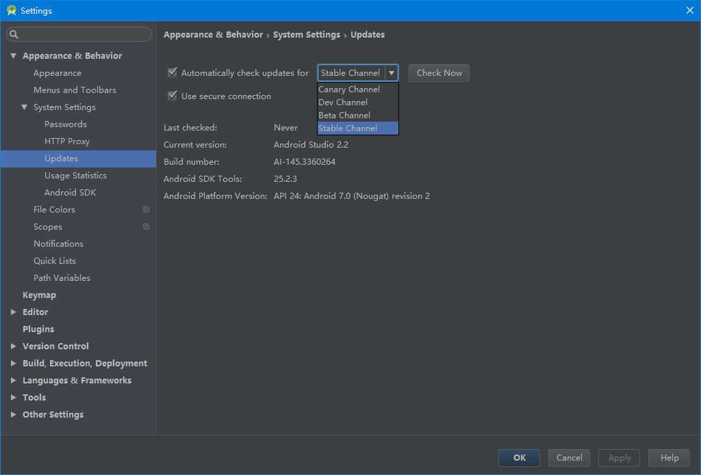

# Android Studio的Beta, Canary, Dev, Stable四种Channel版本介绍

2016.12.01 10:04* 字数 716 阅读 3537评论 0喜欢 4

今天偶然发现，Android Studio有Canary版本，英语不好去查了一下意思：金丝雀。
于是去Google官网上看了看，发现下载页有相关介绍。
地址：[https://sites.google.com/a/android.com/tools/download/studio](https://link.jianshu.com/?t=https://sites.google.com/a/android.com/tools/download/studio)

当然地址需要科学上网才能打开，至于如何科学上网，我就不说~
你也可以看我摘录过来的，介绍如下：

------

#### Downloads & Preview Channels

Download the official stable release from the [Android Developer SDK](https://link.jianshu.com/?t=http://developer.android.com/sdk/index.html) site.

Android Studio's built-in update mechanism can be set to receive updates through any one of these 4 channels.

- **Canary**: Bleeding edge, released about weekly. These are early previews released in order to obtain real-world feedback during development. The canary channel will always have the latest build, including updates to beta or stable releases. We recommend running canary builds side-by-side with a beta or stable installation.
- **Dev**: Canary builds after a full round of internal testing get promoted into the Dev Channel.
- **Beta**: Release candidates based on stable canary builds, released and updated to obtain feedback prior to the stable release. The beta channel will be updated with new stable builds until a new canary build goes to beta.
- **Stable**: The official stable release, as available from the Android Developer site.

You can download the full installations of the build offered in each of these channels: [Canary](https://link.jianshu.com/?t=https://sites.google.com/a/android.com/tools/download/studio/canary), [Dev](https://link.jianshu.com/?t=https://sites.google.com/a/android.com/tools/download/studio/dev), [Beta](https://link.jianshu.com/?t=https://sites.google.com/a/android.com/tools/download/studio/beta), [Stable](https://link.jianshu.com/?t=https://sites.google.com/a/android.com/tools/download/studio/stable).

------

#### 下载和预览通道

可以从这里下载稳定版本：[Android Developer SDK](https://link.jianshu.com/?t=http://developer.android.com/sdk/index.html)

Android Studio内置的更新机制被设置成为如下四个可选的版本：

- Canary（金丝雀）：Bleeding Edge
  （一种最新的、因而也并非完美的技术）,大约周更。这是最早被发布的预览版本，为了能够在开发过程中获得真实世界的反馈。金丝雀版本会一直拥有最新的版本包括beta、stable发布版的更新。我们建议在安装金丝雀版本的同时再安装一个beta版本或者stable版本。
- Dev（开发版）：金丝雀版本在经过完整的测试之后会被提升到Dev版本。
- Beta（Beta版）：发布预选基于稳定的金丝雀版本。被发布并更新以获取反馈先于稳定版本。Beta版本将与一个新的稳定版本一起被更新，直到一个新的金丝雀版本被确定为Beta版本。
- Stable（稳定版）：从Android Developer网站上可获得的稳定版本。

各个预览版本下载地址： [Canary](https://link.jianshu.com/?t=https://sites.google.com/a/android.com/tools/download/studio/canary), [Dev](https://link.jianshu.com/?t=https://sites.google.com/a/android.com/tools/download/studio/dev), [Beta](https://link.jianshu.com/?t=https://sites.google.com/a/android.com/tools/download/studio/beta), [Stable](https://link.jianshu.com/?t=https://sites.google.com/a/android.com/tools/download/studio/stable).

------

#### Selecting an Update Channel

**选择更新渠道**

 

------

**写在最后：**

对于正常开发来说，强烈不建议选择其他渠道，还是安心的用稳定版本吧，否则遇到了问题，耽误了项目开发不说，还影响心情。
当然了，如果你喜欢折腾，当我没说。 

<https://www.jianshu.com/p/28a5a622f236>