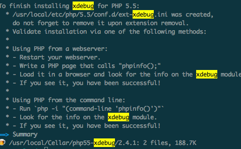
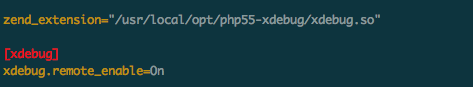
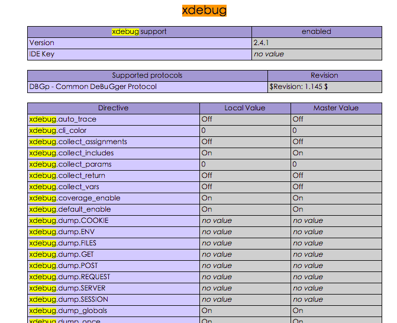
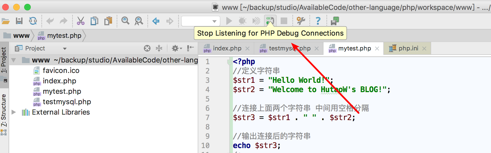

[TOC]


# mac下使用brew安装php的xdebug扩展,并在phpstorm中debug

mac环境已经默认安装了php

## 1、查看本地的php环境

```
jerrydeMacBookPro:lib jerryye$ php -versin
PHP 5.6.30 (cli) (built: Feb  7 2017 16:18:37) 
Copyright (c) 1997-2016 The PHP Group
Zend Engine v2.6.0, Copyright (c) 1998-2016 Zend Technologies
```

## 2、使用brew 命令安装xdbug

brew支持以下版本的php

```
homebrew/php/php53-xdebug         
homebrew/php/php55-xdebug         
homebrew/php/php70-xdebug         
homebrew/php/xdebug-osx
homebrew/php/php54-xdebug         
homebrew/php/php56-xdebug         
homebrew/php/php71-xdebug
```

选择一个版本，如以下命令：

```
brew install homebrew/php/php56-xdebug
```

接着会有一大段日志输出，没关系，结果如下：



## 3、获取扩展文件

到以上日志指定的路径下找到：ext-xdebug.ini这个文件，并打开，内容如下：

```
[xdebug]
zend_extension="/usr/local/opt/php55-xdebug/xdebug.so"
```

拷贝以上路径。

## 4、在php配置文件中配置扩展

打开php配置文件:php.ini，mac环境下，此文件在 /etc/php.ini，加入以下内容：

```
zend_extension="/usr/local/Cellar/php56-xdebug/2.5.5/xdebug.so"
xdebug.remote_enable=1
xdebug.remote_port="9000"
xdebug.profiler_enable=1
```



## 5、重启Apache

```
sudo apachectl restart
```

## 6、测试

测试文件：

```
<?php

echo phpinfo();

?>
```

放到Apache服务目录下，默认的应该是：/Libiary/WebServer/Decuments/，在浏览器访问：

http://localhost/info.php，在打开的页面中搜索：xdebug。有内容输出表示安装成功。




## phpstorm中测试



然后访问的位置打断点就可以debug了.

https://my.oschina.net/u/2391658/blog/738276