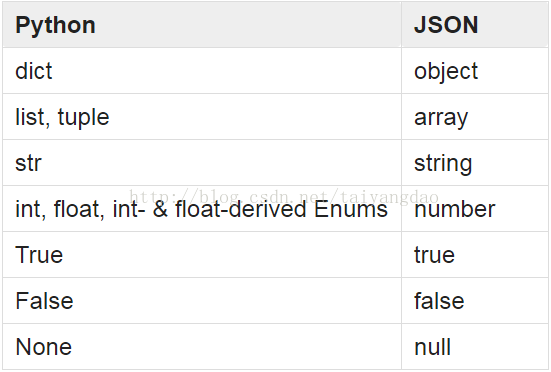
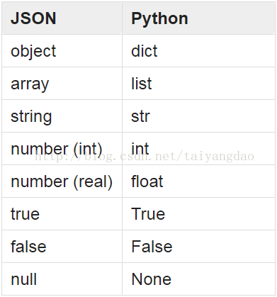
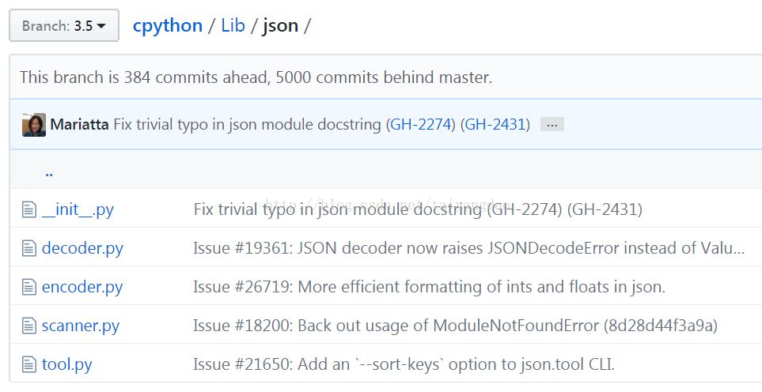

[TOC]


# python中的JSON模块详解

## 简介

JSON是一种轻量级的数据交换格式。Python中的json模块是JSON格式的编解码器实现。

在编解码过程中，Python对象的类型与JSON类型的对应关系如下图所示：





## \1. json模块的组成，如下图所示：



其中，encoder.py和decoder.py是实际的编解码实现。scanner.py辅助编解码的帮助模块。

下面我们详细介绍一下json模块的代码调用接口__init__.py和命令行接口tool.py。

## \2. Python代码调用接口

1) dump()，序列化一个Python对象为文本流

```python
def dump(obj, fp, skipkeys=False, ensure_ascii=True, check_circular=True,
        allow_nan=True, cls=None, indent=None, separators=None,
        default=None, sort_keys=False, **kw)
```

将Python中的dict类型对象obj转换为JSON格式的字符流fp。

如果序列化失败，抛出TypeError异常。

2) dumps()

```python
def dumps(obj, skipkeys=False, ensure_ascii=True, check_circular=True,
        allow_nan=True, cls=None, indent=None, separators=None,
        default=None, sort_keys=False, **kw)
```

该返回一个str对象。
将Python对象obj转换为JSON格式的str。

3) load()

```python
def load(fp, cls=None, object_hook=None, parse_float=None,
        parse_int=None, parse_constant=None, object_pairs_hook=None, **kw)
```

实际上是调用loads(fp.read(),...)实现的。

如果序列化失败，抛出JSONDecodeError异常。

4) loads()

```
def loads(s, encoding=None, cls=None, object_hook=None, parse_float=None,


        parse_int=None, parse_constant=None, object_pairs_hook=None, **kw)
```

s是一个str对象，内容为一个有效的JSON文档。该函数将s转换为Python对象并返回。

如果序列化失败，抛出JSONDecodeError异常。

## \3. 命令行接口

json.tool是一款独立的命令行工具，用以验证输入的JSON文件是否为有效的JSON数据，并能够将通过验证的JSON数据已便于人阅读的方式输出到文件或控制台。

基本命令如下：

python -m json.tool [-h][--sort-keys] [infile][outfile]

1) 从控制台输入，通过验证的JSON数据

```
echo '{"json": "obj"}' | python -m json.tool
或者
curl -X "POST" "http://115.159.35.145:8071/redlwx/dash/po/poDistribution" | python -m json.tool
```

2) 从控制台输入，未通过JSON验证的数据

```
echo '{1.2:3.4}' | python -m json.tool
```

3) 从文件输入，通过验证的JSON数据

```
python -m json.tool my_data.json
```

```
python -m json.tool --sort-keys my_data.json
```

参考链接：

https://docs.python.org/3.5/library/json.html
https://github.com/python/cpython/tree/3.5/Lib/json


https://blog.csdn.net/taiyangdao/article/details/78360002