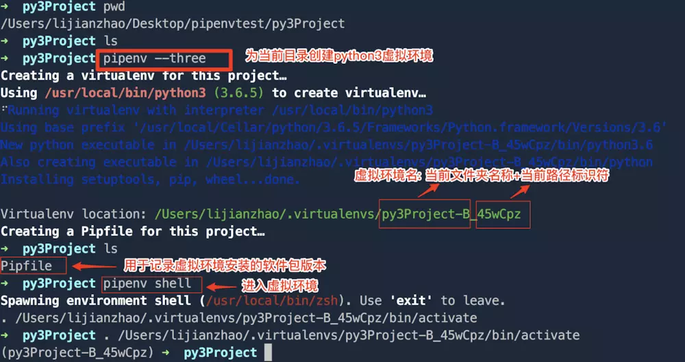
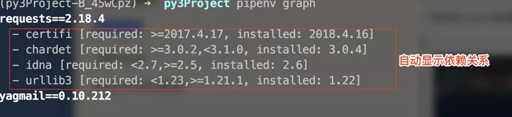

[TOC]


# Pipenv一键搭建python虚拟环境

- 由于python2和python3在部分语法上不兼容, 导致有人打趣道:"Python2和Python3是两门语言"
- 对于初学者而言, 如果同时安装了python2和python3, 那运行python程序就可能会遇到2和3混用的尴尬
- 为解决python不同版本混用的尴尬,避免污染系统python的依赖包环境, 我们需要创建虚拟环境, 将python2和python3隔离使用

#### pipenv的优势:

- 以前我们搭建虚拟环境需要学习使用virtualenv和virtualenvwrapper,在虚拟环境内管理软件依赖包需要学习使用pip, 而有了pipenv, 前面几个就可以不用学了...
- 以前我们需要将虚拟环境依赖包的导出为`requirements.txt`, 一旦依赖包变动,就要重新导出,而pipenv会自动帮我们生成`Pipfile`和`Pipfile.lock`, Pipfile会随着项目,当我们安装时只需在`Pipfile`和`Pipfile.lock`所在的目录下运行`pipenv install`

#### 安装[pipenv](https://github.com/pypa/pipenv)

- 方法一: ubuntu用apt安装

```
sudo apt install software-properties-common python-software-properties
sudo add-apt-repository ppa:pypa/ppa
sudo apt update
sudo apt install pipenv
```

- 方法二: windows用pip安装

```
pip install pipenv
```

- 方法三: MacOS直接使用brew安装

```
brew install pipenv
```

#### 快速创建并进入虚拟环境

- 前提条件: 系统已安装python2和python3

```
# 创建python3环境
pipenv --three
# 创建python2环境
pipenv --two
```

```
# 在上一步新建环境的目录下,运行此命令才有效
pipenv shell
```



- 小技巧: 如果子级目录的父级目录已经创建过虚拟环境, 则子级目录无法创建虚拟目录(子级目录无法生成Pipfile, 子级默认会使用父级的虚拟环境), 如果确实需要在子级目录创建独立的虚拟环境,可以运行`pipenv --where` 获取父级虚拟环境的名字, 根据虚拟环境的前半部分名字, 确定父级目录的位置, 然后删除父级目录下的`Pipfile`, `Pipfile.lock`, 运行`exit`退出父级虚拟环境,然后回到子目录,运行`pipenv --three`创建子目录的虚拟环境即可

#### 在虚拟环境管理依赖包

- 安装依赖包 yagmail requests

```
pipenv install yagmail requests
```

- 查看已安装软件

```
pipenv graph
```



- 删除依赖包yagmail

```
pipenv uninstall yagmail
```

#### 退出虚拟环境

```
exit
```

------

#### 扩展命令(不看也没关系)

- 查看虚拟环境python解释器所在位置

```
pipenv --py
```

- 查看虚拟环境所在位置

```
pipenv --venv
```

- 使用更底层的命令`pip freeze`

```
pipenv run pip freeze
```

- 只在安装开发阶段使用的软件包(和npm类似)

```
pipenv install pytest --dev
```

- 安装Pipfile.lock的所有包(完整移植开发环境)

```
pipenv sync
```

#### 小结:

- pipenv借鉴了npm管理包的方式, 与virtualenv和virtualenvwrapper相比, pipenv对新手要更友好一些,推荐学习~


https://www.jianshu.com/p/1441169b3dbe