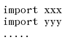
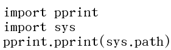
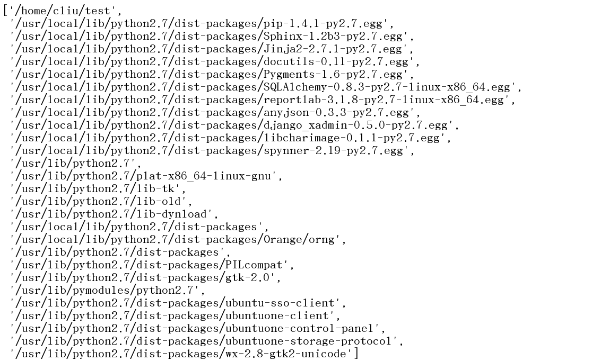
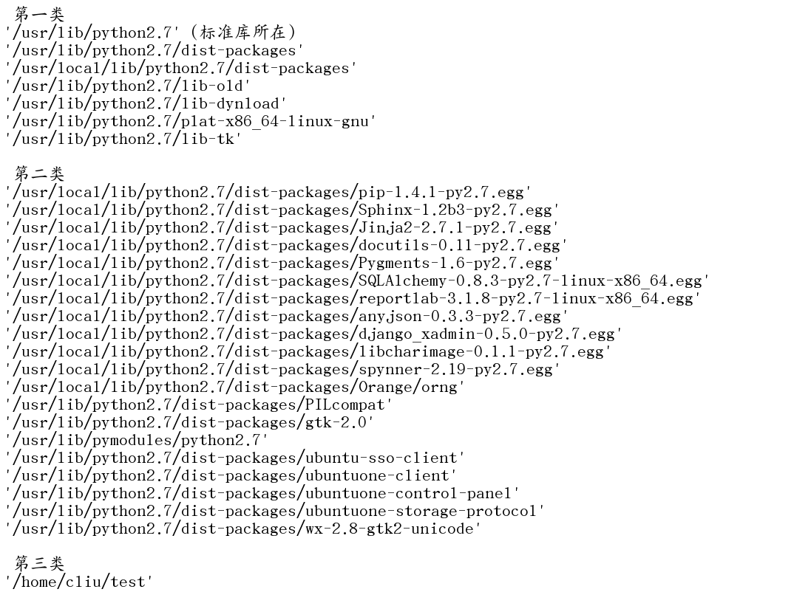
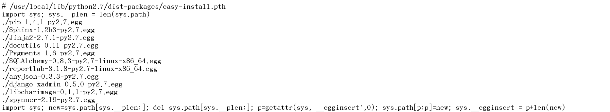
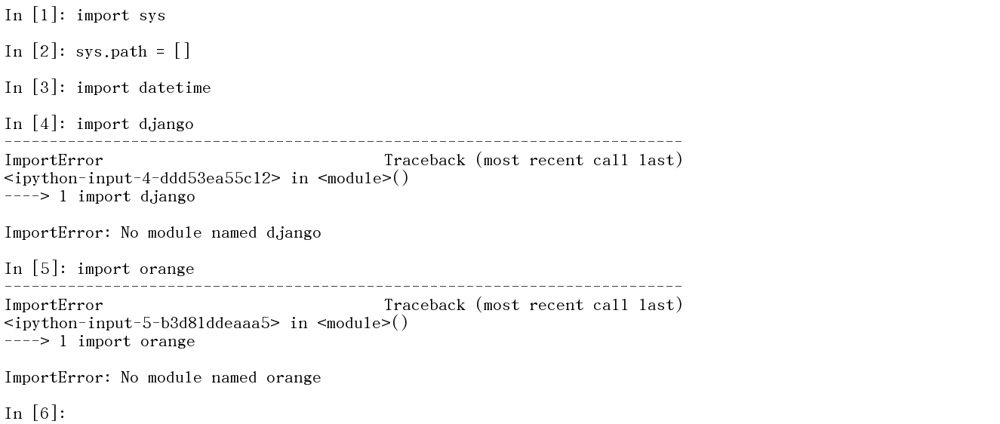

# 深扒Python是如何找到模块的?


## 模块路径寻找

在Python代码中, 文件的一开始几乎无一例外地是


一大堆的import. 语义很好理解, 这是引用了这个文件需要的依赖. 但是大家有没有想过, **Python是如何找到这些被引用的包的呢? 这些被引用的包又实际上放置在哪里呢?**

对于Python在哪里找到需要引用的包, 事实上Python提供了一个接口, 来获得Python查找路径的列表. 示例如下([去试试>>>](http://mp.weixin.qq.com/s?__biz=MjM5NzU0MzU0Nw==&mid=210338894&idx=1&sn=203c124624b7428a86f8a6696564343e&scene=21#wechat_redirect))



运行这几行代码, 小编得到如下的结果.



对于这个结果,小编把它们分为几类来讲解



**第一类**, 很显然, 这些路径是**Python安装时内置进去的**.

**第二类**, 都是**放在第一类的路径中**, 但是一眼就能看出它们其实都**不是Python自带的东西**, 而是后安装进去的. 

这类路径能够让Python纳入搜索的范围, 要归功于一种特殊的文件, *.pth文件. Python在搜索模块的过程中, 如果遇到了*.pth文件, 则将*.pth文件中所罗列的路径也纳入到搜索路径中来. 下面是一个*.pth文件的示例



其中首行和尾行的代码是什么含义, 小编也没有深究过, 大家有兴趣可以研究下, 如果愿意和小编讨论就更好了^_^. 小编可以确定的是那两行代码完全可以没有,可以直接罗列路径就行了,绝对路径 相对路径都可以.甚至可以简单地只有一行.
**第三类, 就是当前路径**. 这里小编的当前路径是'/home/cliu/test'. Python搜索包的顺序是按照sys.path输出的列表的顺序进行的, 并且搜索到第一个匹配的包即停止. 所以可以看出, 当前路径是第一个搜索的路径, 当前路径中的包具有覆盖所有其他包的能力. 如果你在当前路径下放置了一个datetime.py, 那么你的标准库datetime模块就不能用了( ⊙o⊙ )哇, 所以起名字一定要谨慎, 不要与系统中其他的包重名. 这一点小编是有着深刻教训的...(此处让我一个人静静)

## 添加配置自定义路径

讲完了Python搜索路径的规则, 接下来我们讲讲**如何改变这个规则**.(与天斗, 与地斗, 与阶级敌人斗)

哈哈, 这太简单了. 既然**搜索路径存放在sys.path, 那我们就改变这个变量就好了**. 对于Python这样的动态语言, 并没有什么只读这回事.

我们来验证一下, 把sys.path置为空列表, 是不是就什么包都找不到了呢?([去试试>>>](http://mp.weixin.qq.com/s?__biz=MjM5NzU0MzU0Nw==&mid=210338894&idx=1&sn=203c124624b7428a86f8a6696564343e&scene=21#wechat_redirect))



看起来并不是这样, 标准库还是找得到的, 第三方库确实统统找不到了. (果然官方还是要吃小炤的)

不过不必在意这个例子, 实际业界实践中你永远也不用这么做. 下面这段代码才是你最常用的:

```python
import sys

sys.path.insert(0,'/path/to/your/packages')
```

这段代码经常被用在Python脚本的最开始, 用来设置脚本需要引用的包的查找位置.
除了设置sys.path, **还有一种改变搜索路径的常用办法, 那就是PYTHONPATH**. PYTHONPATH是一个环境变量, 通常我们使用这个句子来改变它

```sh
export PYTHONPATH=$PYTHONPATH:/path/to/your/packages
```

当然,你也可以把自己的搜索路径放在前面.

PYTHONPATH为程序的部署提供了更好的灵活性, 你会发现, 几乎所有的Python部署工具, Python程序监控工具都使用PYTHONPATH来配置搜索路径.

聪明的你可能还想到了**我们前面讲的\*.pth文件**. 对, 创建一个.pth文件, 放置到默认路径里, 同样可以达到增加搜索路径的目的. 不过, 这很不常用. 向系统中注入自己的代码不是一个好的实践, 除非你本身就是开发系统, 或者中间件的程序员.
到此, 你对于Python如何搜索需要的包已经有足够的了解了, 可以向更高的山峰攀登~\(≧▽≦)/~啦啦啦


https://python.freelycode.com/contribution/detail/10