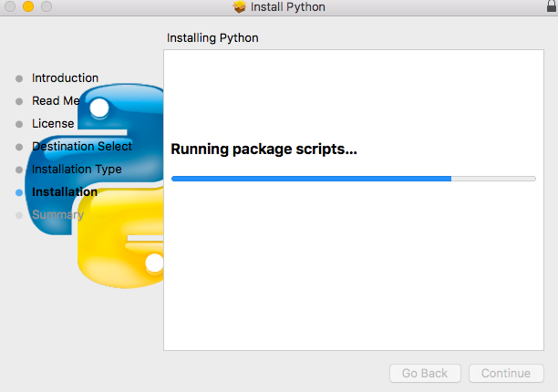

[TOC]


# Mac 系统下安装及卸载 Python 3 的方法

> 对于 Mac 而言，其自带的 Python 2.7 这个版本已经能够满足大部分需求。但由于历史原因 Python 2 和 Python 3 有很大的不同，不能兼容。而 Python 2 将在 2020 年停止维护，秉持着学新不学旧的原则，我建议应该安装 Python 3，以供学习和使用。

## 安装 Python

首先，登录 Python 官网，下载所需版本：[Download Pytho](https://www.python.org/downloads//)

[](http://16bing.com/wp-content/uploads/2018/06/install_python_01.png)

如上图所示，我们下载了`python-3.6.5`这个版本，双击打开：

[](http://16bing.com/wp-content/uploads/2018/06/install_python_02.png)

如上图所示，依次进入`Introduction`、`Read Me`和`License`选项，对于这些，感兴趣的同学可以看看，否则的话，狂按`Continue`即可：

[](http://16bing.com/wp-content/uploads/2018/06/install_python_03.png)

但是对于`License`，则会弹出一个 “许可协议” 提示框，毫无疑问，既然我们想使用 Python，自然要同意其许可协议。因此，依次点击`Agree`和`Continue`：

[](http://16bing.com/wp-content/uploads/2018/06/install_python_04.png)

接下来，选择 Python 安装地址，安装到默认盘即可。然后，直到`Installation`，安装进行中，耐心等待：

[](http://16bing.com/wp-content/uploads/2018/06/install_python_05.png)

如上图所示，至此 Python 安装完成。

我们在终端上输入 `python3 --version` 可以验证是否安装成功和查看目前安装的 Python 3 的版本号。

> 在 macOS 系统内置的 Python 没有完全改为 Python 3 之前，这里我建议新安装的 Python 3 命令使用 `python3`。`python` 命令调用系统内置的 Python 2.7 比较好。

## 卸载 Python

有些同学在安装完 Python 之后，又想将其删除或者卸载。

想卸载 Python，我们首先应该知道其具体都安装了什么，安装在了哪里。实际上，在安装 Python 时，其自动生成：

- Python framework，即 Python 框架；
- Python 应用目录；
- 指向 Python 的连接。

对于 Mac 自带的 Python（**强烈建议不要乱删除这里的环境**），其框架目录在这里：

`System/Library/Frameworks/Python.framework`

而我们安装的 Python，其（默认）框架目录在这里：

`/Library/Frameworks/Python.framework`

接下来，我们就分别（在 Mac 终端进行）删除上面所提到的三部分。（其中`x.x`为 Python 的版本号）

- **第 1 步，删除框架**：

`sudo rm -rf /Library/Frameworks/Python.framework/Versions/x.x`

- **第 2 步，删除应用目录**：

`sudo rm -rf "/Applications/Python x.x"`

- **第 3 步，删除指向 Python 的连接**：

```sh
cd /usr/local/bin/
ls -l /usr/local/bin | grep '../Library/Frameworks/Python.framework/Versions/x.x' | awk '{print $9}' | tr -d @ | xargs rm12
```

至此，我们已经成功删除 Python 的相关文件。


http://16bing.com/2018/06/08/mac-install-uninstall-python3/