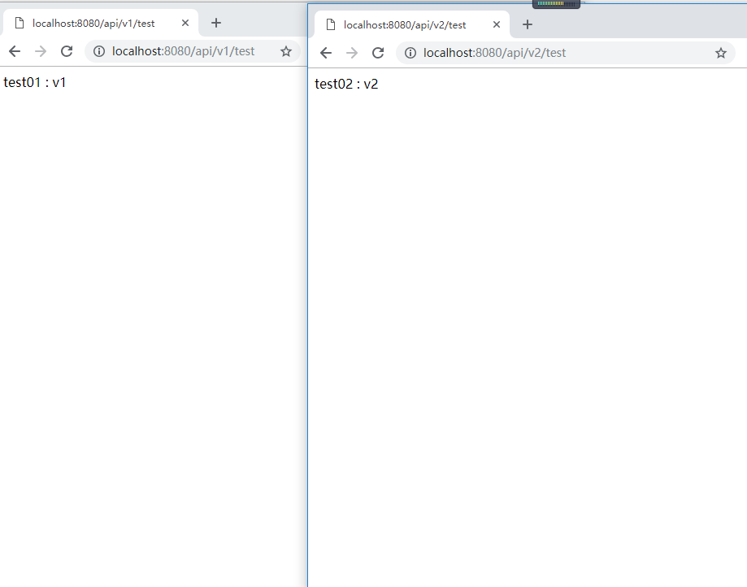

[TOC]


# 如何优雅的设计 Spring Boot API 接口版本号

[happyJared](https://cloud.tencent.com/developer/user/1104878)发表于[happyJared](https://cloud.tencent.com/developer/column/72462)订阅 

## 简介

一般来说，系统上线以后，需求仍会发生变动，功能也会迭代更新。可能是接口参数发生变更，也有可能是业务逻辑需要调整，如果直接在原来的接口上进行修改，必然会影响原有服务的正常运行。

常见的解决方案，是在接口路径中加入版本号用于区分，此外还可以在参数甚至 header 里带上版本号。这里以在请求路径中带上版本号为例，如：[http://IP:PORT/api/v1/test](http://ip:PORT/api/v1/test) ，v1 即代表的是版本号。当然了，可以像这样，直接写死在 `@RequestMapping("api/v1/test")` 属性中，不过下面提供了更为优雅的解决方案。

## 自定义版本号标记注解

```javascript
@Target({ElementType.METHOD, ElementType.TYPE})
@Retention(RetentionPolicy.RUNTIME)
@Documented
public @interface ApiVersion {

    /**
     * 标识版本号，从1开始
     */
    int value() default 1;

}
```

## 重写相应的 RequestCondition

```javascript
@Data
@Slf4j
public class ApiVersionCondition implements RequestCondition<ApiVersionCondition> {

    /**
     * 接口路径中的版本号前缀，如: api/v[1-n]/test
     */
    private final static Pattern VERSION_PREFIX_PATTERN = Pattern.compile("/v(\\d+)/");

    private int apiVersion;

    ApiVersionCondition(int apiVersion) {
        this.apiVersion = apiVersion;
    }

    @Override
    public ApiVersionCondition combine(ApiVersionCondition other) {
        // 最近优先原则，方法定义的 @ApiVersion > 类定义的 @ApiVersion
        return new ApiVersionCondition(other.getApiVersion());
    }

    @Override
    public ApiVersionCondition getMatchingCondition(HttpServletRequest request) {
        Matcher m = VERSION_PREFIX_PATTERN.matcher(request.getRequestURI());
        if (m.find()) {
            // 获得符合匹配条件的ApiVersionCondition
            int version = Integer.valueOf(m.group(1));
            if (version >= getApiVersion()) {
                return this;
            }
        }
        return null;
    }

    @Override
    public int compareTo(ApiVersionCondition other, HttpServletRequest request) {
        // 当出现多个符合匹配条件的ApiVersionCondition，优先匹配版本号较大的
        return other.getApiVersion() - getApiVersion();
    }

}
```

## 重写部分 RequestMappingHandlerMapping 的方法

```javascript
@Slf4j
public class CustomRequestMappingHandlerMapping extends RequestMappingHandlerMapping {

    @Override
    protected RequestCondition<?> getCustomTypeCondition(Class<?> handlerType) {
        // 扫描类上的 @ApiVersion
        ApiVersion apiVersion = AnnotationUtils.findAnnotation(handlerType, ApiVersion.class);
        return createRequestCondition(apiVersion);
    }

    @Override
    protected RequestCondition<?> getCustomMethodCondition(Method method) {
        // 扫描方法上的 @ApiVersion
        ApiVersion apiVersion = AnnotationUtils.findAnnotation(method, ApiVersion.class);
        return createRequestCondition(apiVersion);
    }

    private RequestCondition<ApiVersionCondition> createRequestCondition(ApiVersion apiVersion) {
        if (Objects.isNull(apiVersion)) {
            return null;
        }
        int value = apiVersion.value();
        Assert.isTrue(value >= 1, "Api Version Must be greater than or equal to 1");
        return new ApiVersionCondition(value);
    }

}
```

## 配置注册自定义的 CustomRequestMappingHandlerMapping

```javascript
@Slf4j
@Configuration
public class WebMvcConfig extends WebMvcConfigurationSupport {

    @Override
    public RequestMappingHandlerMapping requestMappingHandlerMapping() {
        return new CustomRequestMappingHandlerMapping();
    }

}
```

## 编写接口，标记上相应的 `@ApiVersion` 

```javascript
@Slf4j
@ApiVersion
@RestController
@RequestMapping("api/{version}/test")
public class TestController {

    @GetMapping
    public String test01(@PathVariable String version) {
        return "test01 : " + version;
    }

    @GetMapping
    @ApiVersion(2)
    public String test02(@PathVariable String version) {
        return "test02 : " + version;
    }

}
```

## 启动 Application，测试及查看结果



## 源码

 [示例源码](https://github.com/happyjared/spring-boot-learning/tree/master/spring-boot-api-version)  

本文参与[腾讯云自媒体分享计划](https://cloud.tencent.com/developer/support-plan)，欢迎正在阅读的你也加入，一起分享。

发表于 2019-03-19


## 个人见解(推荐)

个人觉得直接把版本号放在最后,如下

```
http://localhost:8080/api/test/v1
http://localhost:8080/api/test/v2
```

这样子就不用改添加代码复杂度,什么都不用改只需要地址改下,反正上面的方式也都是需要修改地址的


https://cloud.tencent.com/developer/article/1405054