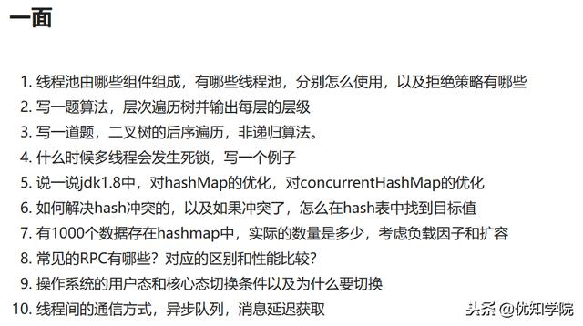
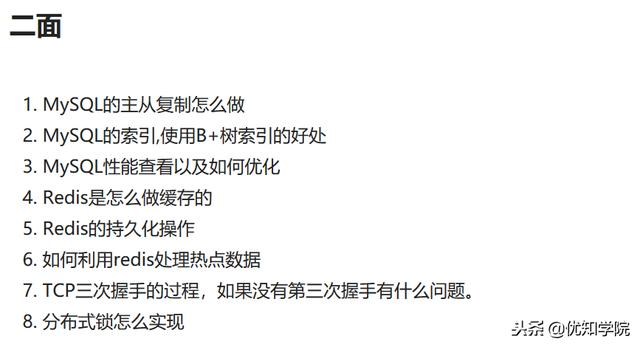
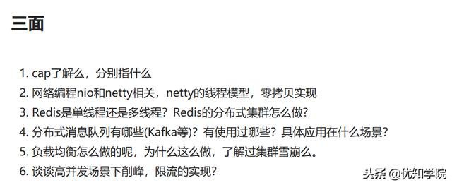
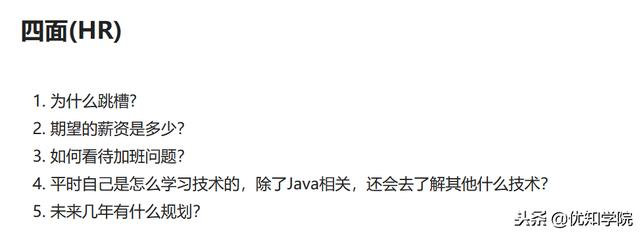

# 最新拼多多面试题和总结：Hash集合类+B树+并发削峰+Redis核心等

[胖嘟嘟小米粒](https://www.jutuilian.com/space-uid-147.html)*|*2018-12-27 10:21阅读 497 评论 20

继续分享Java高级工程师面试题目，本期的面试题目的主要集中在如下5个方面：

 **1.Hash集合类系列**  重点就是HashMap、CurrentHashMap在jdk1.8版本前后的详细比较，以及必考的数据扩容和数据存储的时候，底层的数据结构的变化，这个也是经常问到的。  
**2.Redis缓存的题目**  很多同学都是只会基本的key value存储、删除等Redis相关的命令，甚至很多同学也不了解为什么redis是单线程，为什么要这样设计。对redis在分布式环境场景遇到的问题都不了解，比如：redis和mysql的数据一致性，在并发的情况下redis会存在key值的竞争吗？怎么解决。  建议大家在面试前对缓存需要重点准备，在互联网访问大的情况，这些真的太重要了，面试官考的也是你是否具备这样的能力。

**3.数据算法题目**  常用的排序算法、二叉树、B树、B+树等等，这里就不一一举例了，下面的面试题目也有涉及，可以参考。 

**4.网络题目**  TCP的握手全过程、重点还有NIO也是经常面试的，以及相关的Netty等。  

**5.高并发**  典型的例子就是秒杀，如果让你设计，你怎么来应对峰值，怎么来削峰、怎么来保证可靠性等。  好了，简短的概述了面试重点，下面是对应的Java高级工程师面试题目，不会的同学抓紧补习哦~ 

     以上就是最新拼多多资深java工程师面试题目， 

<https://www.jutuilian.com/article-85867-1.html>