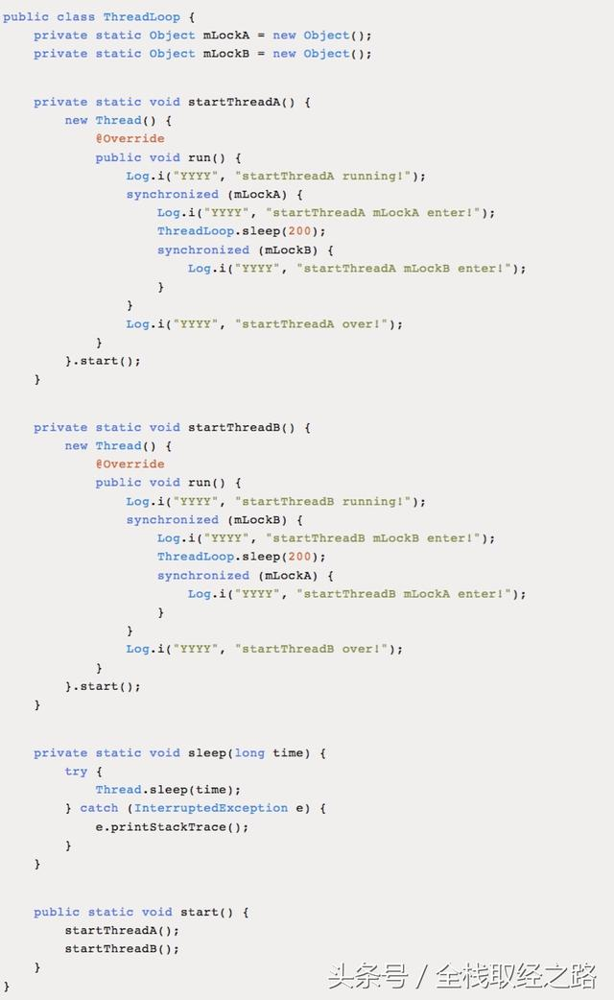
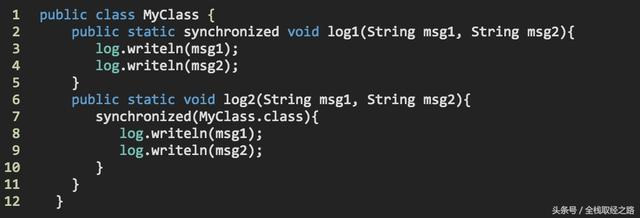

# 死锁相关的经典面试题

全栈取经之路 2018-05-31 07:40:00

以前去高德地图面试，其中一个问题就是关于死锁问题。我学习死锁概念是在大学操作系统中第一次学到，今天再复盘一下死锁常见问题。

------

# **Q:死锁概念及其产生原因及条件?**

死锁是两个或更多线程阻塞着等待其它处于死锁状态的线程所持有的锁。死锁通常发生在多个线程同时但以不同的顺序请求同一组锁的时候。

**产生死锁的原因主要是：**

> （1） 因为系统资源不足。
>
> （2） 进程运行推进的顺序不合适。
>
> （3） 资源分配不当等。

如果系统资源充足，进程的资源请求都能够得到满足，死锁出现的可能性就很低，否则就会因争夺有限的资源而陷入死锁。其次，进程运行推进顺序与速度不同，也可能产生死锁。

**产生死锁的四个必要条件：**

> （1） 互斥条件：一个资源每次只能被一个进程使用。
>
> （2） 请求与保持条件：一个进程因请求资源而阻塞时，对已获得的资源保持不放。
>
> （3） 不剥夺条件:进程已获得的资源，在末使用完之前，不能强行剥夺。
>
> （4） 循环等待条件:若干进程之间形成一种头尾相接的循环等待资源关系。

这四个条件是死锁的必要条件，只要系统发生死锁，这些条件必然成立，而只要上述条件之一不满足，就不会发生死锁。

------

# **Q:手写代码**




运行结果可能如下：

```
startThreadA running!
startThreadA mLockA enter!
startThreadB running!
startThreadB mLockB enter!
//陷入死锁...
```

笼统的说解决死锁的方法就是从四个必要条件考虑：

- 预防死锁（破坏产生死锁的条件）
- 避免死锁（银行家算法）
- 检测死锁（资源分配图）
- 解除死锁

代码方面主要有如下几个：

- 考虑加锁顺序：当多个线程需要相同的一些锁但每个线程又按照不同顺序加锁则很容易发生死锁（如上面死锁的例子），如果能确保所有的线程都是按照相同的顺序获得锁则发生死锁的情况就不存在了。
- 考虑加锁时限：可以在尝试获取锁的时候加一个超时时间，若一个线程没有在给定的时限内成功获得所有需要的锁则会进行回退并释放所有已经获得的锁，然后等待一段随机的时间再重试，这段随机的等待时间让其它线程有机会尝试获取相同的这些锁，并且让该应用在没有获得锁的时候可以继续运行。

------

# **Q:死锁出现的一些场景**

**如果线程1锁住了A，然后尝试对B进行加锁，同时线程2已经锁住了B，接着尝试对A进行加锁，这时死锁就发生了**

**synchronized方式死锁：**

线程thread1先获取锁locka，然后在同步块里嵌套竞争锁lockb。而线程thread2先获取锁lockb，然后在同步块里嵌套竞争锁locka （此时已经被线程thread1拥有，而thread1在等待lockb，而lockb被thread2拥有，thread2在等待locka……无线循环）。


执行main方法之后控制台打印内容如下：

> thread1 get locka ing!
>
> thread2 get lockb ing!
>
> thread1 after sleep 500ms!
>
> thread1 need lockb!Just waiting!
>
> thread2 after sleep 500ms!
>
> thread2 need locka! Just waiting!

thread1 need lockb!Just waiting!表明thread1线程进入死锁等待lockb释放。

thread2 need locka! Just waiting! 表明thread2线程进入死锁等待locka释放。

**concurrent包**ReentrantLock**错误使用，导致死锁：**

lock.unlock()；释放锁使用地方不规范，导致死锁不能正常释放！




**数据库的死锁:**

一个数据库事务可能由多条SQL更新请求组成。当在一个事务中更新一条记录，这条记录就会被锁住避免其他事务的更新请求，直到第一个事务结束。同一个事务中每一个更新请求都可能会锁住一些记录。

当多个事务同时需要对一些相同的记录做更新操作时，就很有可能发生死锁，例如：

```
Transaction 1, request 1, locks record 1 for update
Transaction 2, request 1, locks record 2 for update
Transaction 1, request 2, tries to lock record 2 for update.
Transaction 2, request 2, tries to lock record 1 for update.
```

因为锁发生在不同的请求中，并且对于一个事务来说不可能提前知道所有它需要的锁，因此很难检测和避免数据库事务中的死锁。

------

当发生死锁可以采用 jstack 命令进行分析，Android 上面可以采用 Android Device Monitor Thread 进行分析。


https://www.toutiao.com/a6561415967715361284/?tt_from=android_share&utm_campaign=client_share&timestamp=1527729344&app=news_article&iid=33981045006&utm_medium=toutiao_androidf