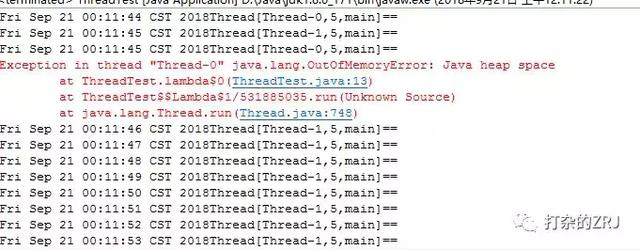
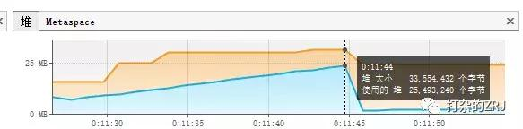

[TOC]


# 美团面试真题：一个线程OOM，进程里其他线程还能运行么？

程序猿猩球 2018-10-08 08:30:51

## **引言**

这题是一个网友@大脸猫爱吃鱼给我的提问，出自今年校招美团三面的一个真题。大致如下

> **一个进程有3个线程，如果一个线程抛出oom，其他两个线程还能运行么?**

先说一下答案，答案是**还能运行**

不瞒大家说，真在面试中，我遇到这一题，我估计也是答错。因为我初看到这一题，内心嘿嘿一笑，觉得这题是在考察JVM的内存结构。我第一反应是OOM的常见情况**堆溢出**，也就是下面的这种异常

```
java.lang.OutOfMemoryError: Java heap space
```

先回忆一下，多线程中栈与堆是公有的还是私有的？回答如下

> **在多线程环境下，每个线程拥有一个栈和一个程序计数器。栈和程序计数器用来保存线程的执行历史和线程的执行状态，是线程私有的资源。其他的资源（比如堆、地址空间、全局变量）是由同一个进程内的多个线程共享。**

也就是说，堆是线程共享。那么一个线程堆抛出OOM异常，我第一反应是另外两个线程也抛出OOM异常，毕竟堆是共有的，大家应该都抛出异常。于是，我机智的让@大脸猫爱吃鱼写个代码去测试一下，结果我被**啪啪啪**打脸了。

测试代码伪如下

一个线程去构造堆溢出，每隔1S申请一次堆，代码长下面这样

```java
new Thread(() -> {
    List<byte[]> list = new ArrayList<byte[]>();
    while (true) {
        System.out.println(new Date().toString() + Thread.currentThread() + "==");
        byte[] b = new byte[1024 * 1024 * 1];
        list.add(b);
        try {
            Thread.sleep(1000);
        } catch (Exception e) {
            e.printStackTrace();
        }
    }
}).start();
```

另一个线程，睡眠1秒然后输出就好，代码长下面这样

```java
new Thread(() -> {
    while(true){
        System.out.println(new Date().toString()+Thread.currentThread()+"==");
        try {
            Thread.sleep(1000);
        } catch (Exception e) {
            e.printStackTrace();
        }
    }
}).start();
```

结果，输出是长下面这样的



大家发现了么，一个线程溢出了，其他线程还在跑，这好像和我们的认知不大一样。坦白说，我看到这个结果，瞬间觉得自己一世英名毁于一旦，从此无法抬起头来做人。没办法了，只能亮出工具来看一下了。

先说一下，在本例测试中，参数如下

```
-Xms16m -Xmx32m
-Xms 初始堆内存 
-Xmx 最大堆内存
```

接下来，亮出JvisualVM看堆的变化，注意看上面那张图，抛出OOM的时间约在00:11:45左右，因此我们需要重点关注00:11:45左右的曲线变化，如下图所示



如图所示，我们仔细观察一下在00:11:44~00:11:45之间曲线变化，你会发现使用堆的数量，突然间急剧下滑！这代表着一点，**当一个线程抛出OOM异常后，它所占据的内存资源会全部被释放掉，从而不会影响其他线程的运行！**

讲到这里大家应该懂了，此题的答案为**一个线程溢出后，进程里的其他线程还能照常运行。**注意了，这个例子我只演示了堆溢出的情况。如果是栈溢出，结论也是一样的，大家可自行通过代码测试。

> 作者： 孤独烟
>
> 来源： 打杂的ZRJ
>
> 商业用途请与作者联系！


https://www.toutiao.com/a6609774230768714248/?tt_from=android_share&utm_campaign=client_share&timestamp=1539060451&app=news_article&iid=45404301382&utm_medium=toutiao_android&group_id=6609774230768714248