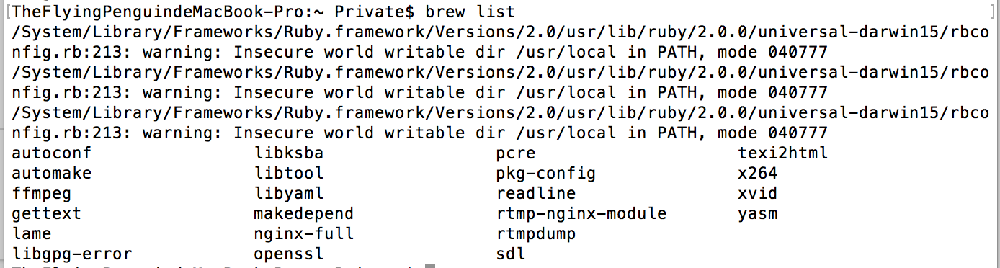
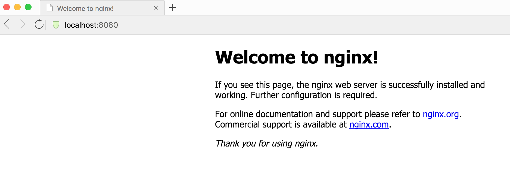

# Mac下用brew安装nginx

## 1. [nginx](http://nginx.org/)

```
nginx [engine x] is an HTTP and reverse proxy server, a mail proxy server, and a generic TCP/UDP proxy server.
```

从[niginx基本介绍](http://nginx.org/en/)上看到*Other HTTP server features*中有一项:

```
FLV and MP4 streaming;
```

可知nginx也支持流媒体.

## 2. [brew](http://brew.sh/)

brew又叫Homebrew，是Mac中的一款软件包管理工具，通过brew可以很方便的在Mac中安装软件或者是卸载软件.一般Mac电脑会默认安装有brew.常用指令如下:

- brew 搜索软件`brew search nginx`
- brew 安装软件`brew install nginx`
- brew 卸载软件`brew uninstall nginx`
- brew 升级`sudo brew update`
- 查看安装信息(经常用到, 比如查看安装目录等)`sudo brew info nginx`
- 查看已经安装的软件`brew list`



brew list 运行结果

## 3. brew安装nginx

- 安装nginx

  可以用brew很方便地安装nginx.

  `sudo brew install nginx`

- 启动nginx服务

  `sudo brew services start nginx`

  利用`http://localhost:8080`进行访问, 如果出现如下界面，说明启动成功.

  

- 查看nginx版本

  `nginx -v`

- 关闭nginx服务

  `sudo brew services stop nginx`

另外几个比较方便的指令

- 重新加载nginx

  `nginx -s reload`

- 停止nginx

  `nginx -s stop`


1、安装

```
brew install nginx
```

2、修改配置文件

```
sudo vi /usr/local/etc/nginx/nginx.conf

修改默认的8080端口为80

修改日志文件地方
    error_log  logs/error.log;

    pid        logs/nginx.pid;

    access_log  logs/access.log;

按上面修改后日志文件在/usr/local/opt/nginx/logs
```

3、修改管理员权限

```
sudo chown root:wheel/usr/local/opt/nginx/bin/nginx
sudo chmod u+s/usr/local/opt/nginx/bin/nginx
```

4、加上launchctl控制

```
mkdir -p ~/Library/LaunchAgents

cp /usr/local/opt/nginx/homebrew.mxcl.nginx.plist ~/Library/LaunchAgents/

launchctl load -w ~/Library/LaunchAgents/homebrew.mxcl.nginx.plist
```

5、启动nginx

```
sudo nginx #启动

sudo nginx -t #测试配置文件是否有错

sudo nginx -s reload #重启nginx
```

6、问题

```
如果出现nginx: [error] invalid PID number "" in "/usr/local/var/run/nginx/nginx.pid"，则需要
    sudo nginx -c /usr/local/etc/nginx/nginx.conf
    sudo nginx -s reload
```


## 一些常见的问题整理

### 问题1. 重启nginx 报错

> localhost:~ wany$ sudo nginx -s reload
>
> Password:
>
> nginx: [error] open() "/usr/local/var/run/nginx.pid" failed (2: No such file or directory)

出现该问题的原因是没有nginx.pid 这个文件，这里先讲一个小知识

> $sudo nginx  (执行该命令之后，nginx 会在 /usr/local/var/run/ 路径下创建一个名为nginx.pid 的文件 )
>
> $sudo nginx -s stop  (执行该命令之后，nginx 会将 /usr/local/var/run/ 路径下名为nginx.pid 的文件删除掉。**但前提是/usr/local/var/run/ 路径下必须存在 nginx.pid 文件**)
>
> $sudo nginx -s reload  (执行该命令之后，nginx会重新启动，**但前提是/usr/local/var/run/ 路径下必须存在 nginx.pid 文件**) 

所以在执行$sudo nginx -s stop 或者 $sudo nginx -s reload 命令时,如果nginx.pid 文件不存在自然也就会报以上的错误喽

解决方法:

启动一下nginx就好了

> $sudo nginx

### 问题2. 启动nginx报错

> localhost:run wany$ sudo nginx
>
> nginx: [emerg] bind() to 0.0.0.0:80 failed (48: Address already in use)
>
> nginx: [emerg] bind() to 0.0.0.0:80 failed (48: Address already in use)
>
> nginx: [emerg] bind() to 0.0.0.0:80 failed (48: Address already in use)
>
> nginx: [emerg] bind() to 0.0.0.0:80 failed (48: Address already in use)
>
> nginx: [emerg] bind() to 0.0.0.0:80 failed (48: Address already in use)
>
> nginx: [emerg] still could not bind()

出现该问题的原因是/usr/local/var/run/nginx.pid  文件已经存在，也就是说nginx已经启动了，再次执行启动nginx，就会出现这种问题了，接口被占用了

解决方法：

重启nginx，而不是启动nginx

> $sudo nginx -s reload   （重启nginx）

[http://www.jianshu.com/p/918eb337a206](http://www.jianshu.com/p/918eb337a206)

[http://www.jianshu.com/p/6c7cb820a020](http://www.jianshu.com/p/6c7cb820a020)