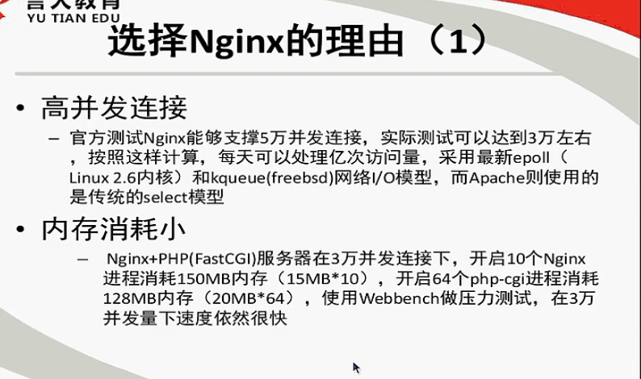
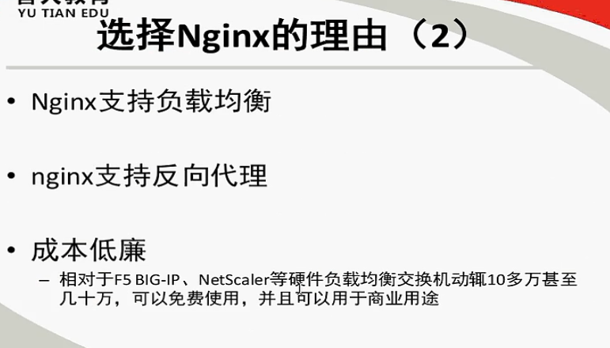
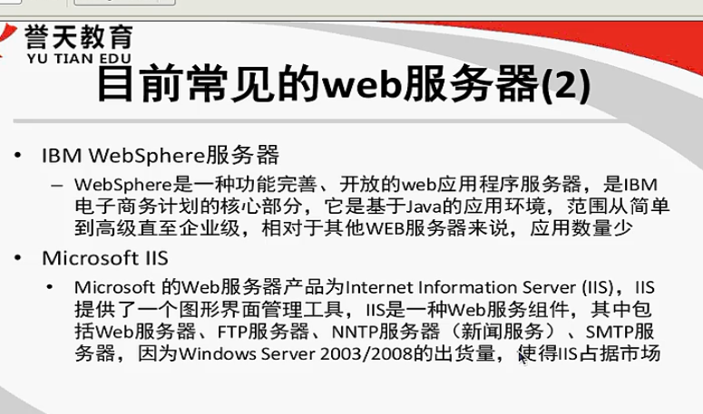

[TOC]


# nginx笔记

## 简介

### Nginx

- Nginx ("engine x") 是一个高性能的 HTTP 和 反向代理 服务器，也是一个 IMAP/POP3/SMTP 代理服务器。
- 第一个公开版本0.1.0发布于2004年10月4日。
- 其将源代码以类BSD许可证的形式发布，因它的稳定性、丰富的功能集、示例配置文件和低系统资源的消耗而闻名
- 官方测试nginx能够支支撑5万并发链接，并且cpu、内存等资源消耗却非常低，运行非常稳定


- 2011年6月1日，nginx 1.0.4发布。

- Nginx是一款轻量级的Web 服务器/反向代理服务器及电子邮件(IMAP/POP3)代理服务器，

- 并在一个BSD-like 协议下发行。由俄罗斯的程序设计师Igor Sysoev所开发，

- 其特点是占有内存少，并发能力强，事实上nginx的并发能力确实在同类型的网页服务器中表现较好，中国大陆使用nginx网站用户有:新浪、网易、腾讯等。

  功能:

- web服务器

- web reverse proxy

- smtp reverse proxy


### Nginx和apache的优缺点

- –  1、nginx相对于apache的优点:
  轻量级，同样起web 服务，比apache 占用更少的内存及资源
  抗并发，nginx 处理请求是异步非阻塞的，而apache 则是阻塞型的，在高并发下nginx
  能保持低资源低消耗高性能
  高度模块化的设计，编写模块相对简单
  社区活跃，各种高性能模块出品迅速啊
- –  2.apache 相对于nginx 的优点:rewrite ，比nginx 的rewrite 强大模块超多，基本想到的都可以找到少bug ，nginx 的bug 相对较多
- –  3、Nginx 配置简洁, Apache 复杂
- –  4、最核心的区别在于apache是同步多进程模型，一个连接对应一个进程;nginx是异步的，多个连接(万级别)可以对应一个进程






### Tengine 是nginx的加强版，封装版，淘宝开源

- –  官网http://tengine.taobao.org/
- –  动态模块加载(DSO)支持。加入一个模块不再需要重新编译整个Tengine;
- –  支持SO_REUSEPORT选项，建连性能提升为官方nginx的三倍;
- –  支持SPDY v3协议，自动检测同一端口的SPDY请求和HTTP请求;
- –  流式上传到HTTP后端服务器或FastCGI服务器，大量减少机器的I/O压力;
- –  更加强大的负载均衡能力，包括一致性hash模块、会话保持模块，还可以对后端的服务器进行主动健康检查，根据服务器状态自动上线下线，以及动态解析upstream中出现的域名;
- –  输入过滤器机制支持。通过使用这种机制Web应用防火墙的编写更为方便;
- –  支持设置proxy、memcached、fastcgi、scgi、uwsgi在后端失败时的重试次数
- –  动态脚本语言Lua支持。扩展功能非常高效简单;
- –  支持管道(pipe)和syslog(本地和远端)形式的日志以及日志抽样;
- –  支持按指定关键字(域名，url等)收集Tengine运行状态;
- –  组合多个CSS、JavaScript文件的访问请求变成一个请求;
- –  自动去除空白字符和注释从而减小页面的体积
- –  .......


### 常见的web服务器





## 高并发高可用架构图


## linux环境安装nginx


### 安装之前准备

1、依赖 gcc openssl-devel pcre-devel zlib-devel
安装:yum -y install gcc openssl-devel pcre-devel zlib-devel

2、创建用户和用户组。为了方便nginx运行而不影响linux安全
创建组:groupadd -r nginx
创建用户:useradd -r -g nginx -M nginx

 			-M 表示不创建用户的家目录。

3、安装文件 [tengine-2.1.0.tar.gz](image-201709260933/tengine-2.1.0.tar.gz)

4、切换到 root用户在做以下操作

### 简洁方式安装:

./configure \--prefix=/usr/tengine

make && make install

### 完整安装：


```
./configure \
--prefix=/opt/sxt/soft/tengine-2.1.0/ \
--sbin-path=/usr/sbin/nginx \
--conf-path=/etc/nginx/nginx.conf \
--error-log-path=/var/log/nginx/error.log \
--http-log-path=/var/log/nginx/access.log \
--pid-path=/var/run/nginx/nginx.pid \
--lock-path=/var/lock/nginx.lock \
--user=nginx \
--group=nginx \
--with-http_ssl_module \
--with-http_flv_module \
--with-http_stub_status_module \
--with-http_gzip_static_module \
--http-client-body-temp-path=/var/tmp/nginx/client/ \
--http-proxy-temp-path=/var/tmp/nginx/proxy/ \
--http-fastcgi-temp-path=/var/tmp/nginx/fcgi/ \
--http-uwsgi-temp-path=/var/tmp/nginx/uwsgi \
--http-scgi-temp-path=/var/tmp/nginx/scgi \
--with-pcre
make && make install
```


### 自定义安装(使用这个上面参考):

```
./configure \
--prefix=/opt/sxt/soft/tengine-2.1.0/ \
--conf-path=/etc/nginx/nginx.conf \
--error-log-path=/var/log/nginx/error.log \
--http-log-path=/var/log/nginx/access.log \
--pid-path=/var/run/nginx/nginx.pid \
--lock-path=/var/lock/nginx.lock \
--user=nginx \
--group=nginx \
--with-http_ssl_module \
--with-http_flv_module \
--with-http_stub_status_module \
--with-http_gzip_static_module \
--http-client-body-temp-path=/var/tmp/nginx/client/ \
--http-proxy-temp-path=/var/tmp/nginx/proxy/ \
--http-fastcgi-temp-path=/var/tmp/nginx/fcgi/ \
--http-uwsgi-temp-path=/var/tmp/nginx/uwsgi \
--http-scgi-temp-path=/var/tmp/nginx/scgi \
--with-pcre
make && make install
启动和配置路径用默认的，用户和用户组限制，都去掉
其中/var/tmp/nginx/client/目录需要手动创建
```

### 添加安装的tengine服务到注册表

1. 加启动文件（[nginx](image-201709260933/nginx)）到目录（cd /etc/init.d）下

2. 修改nginx文件的以下两个目录

   ```

   nginx="/opt/sxt/soft/tengine-2.1.0/sbin/nginx"

   NGINX_CONF_FILE="/opt/sxt/soft/tengine-2.1.0/conf/nginx.conf"
   ```

   

3. 赋予文件执行权限 chmod +x nginx


### 启动服务

service  nginx  start

开机自启

添加到系统服务

chkconfig --add nginx  

chkconfig nginx   on  