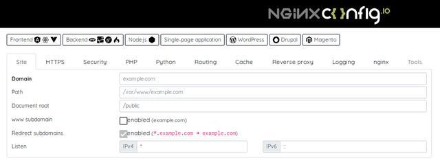
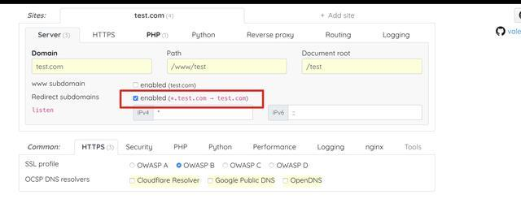
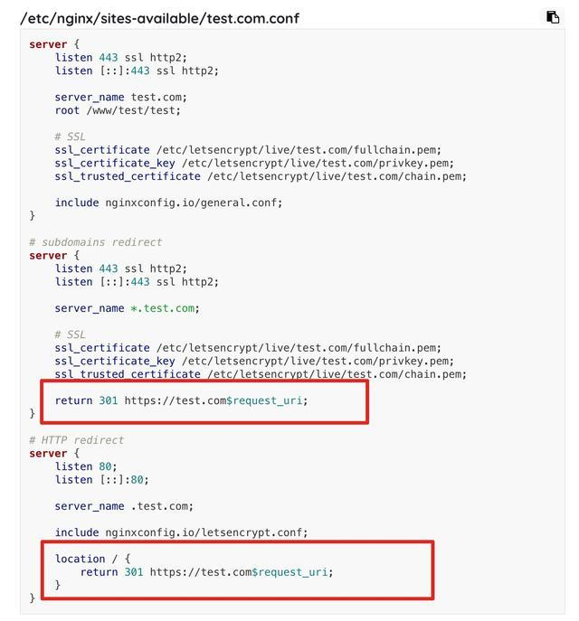

[TOC]

# nginx 配置在线极速生成“神器”

原创 老王谈运维 2019-05-13 17:53:40

## 介绍

NGINX 是一款轻量级的 Web 服务器，最强大的功能之一是能够有效地提供HTML和媒体文件等静态内容。NGINX 使用异步事件驱动模型，在负载下提供可预测的性能。

是当下最受欢迎的**高性能**的 Web 服务器！

但是作为一个Nginx的使用者，你更能**深有体会！**你收藏，浏览，学习过很多篇 Nginx 的配置文章，但总是觉得不是很标准，在实际的使用中总是会出一些问题，咱也不敢问..就是需要自己找一些范本**手动修改**。

尤其是从 Apache 到 Nginx，在把文档转换为 Nginx 使用版本时，需要花费大量的时间在文档编写和文档检视上，就算这样，还是难免会出错！

为了提升广大程序员对于 Nginx 的使用幸（Sha）福（Gua）感（Shi），今天小编就跟大家推荐一个神器！可**在线极速**生成Nginx配置文件的网站 —— **nginxconfig.io**

**网址**：https://nginxconfig.io/

NGINX Config 支持 HTTP、HTTPS、PHP、Python、Node.js、WordPress、Drupal、缓存、逆向代理、日志等各种配置选项。在线生成 Web 服务器 Nginx 配置文件。你需要做的只需要**2步**：1）**打开网站** 2）**填写相应的需求**，系统就会自动生成特定的配置文件。虽然界面是英文的，但是功能的页面做的非常直观，生成的Nginx格式规范。

## 实践案例

说的是轻巧，是骡子是马，咱们试试再定！

**实践需求：**配置域名 test.com 实现 *. test.com 自动跳转到 test.com 以及强制HTTPS（自动跳转到HTTPS）

1）填写相应的需求

2）配置文件

非常简单！非常规范！你还在为Nginx配置而烦心吗？

<https://www.toutiao.com/a6690447596206424584/?tt_from=weixin&utm_campaign=client_share&wxshare_count=1×tamp=1557832169&app=news_article&utm_source=weixin&utm_medium=toutiao_android&req_id=20190514190928010152039078899434B&group_id=6690447596206424584>