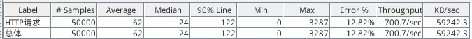
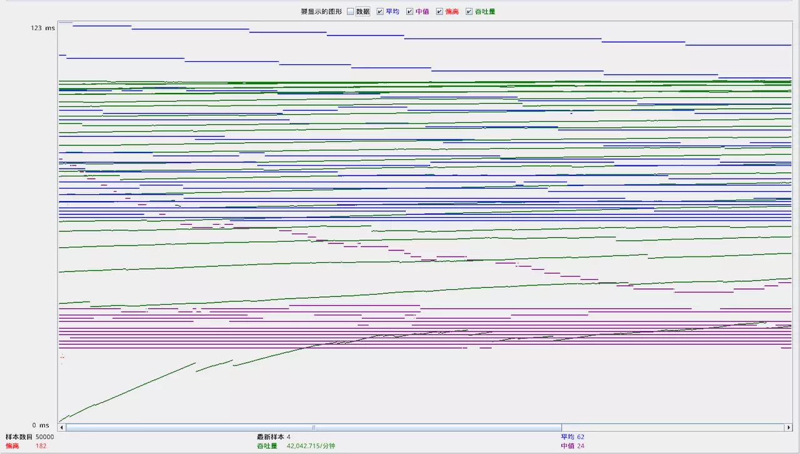
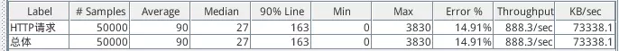
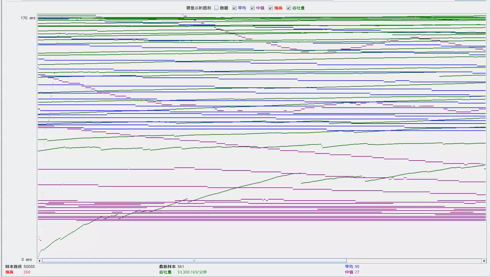
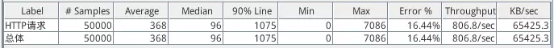
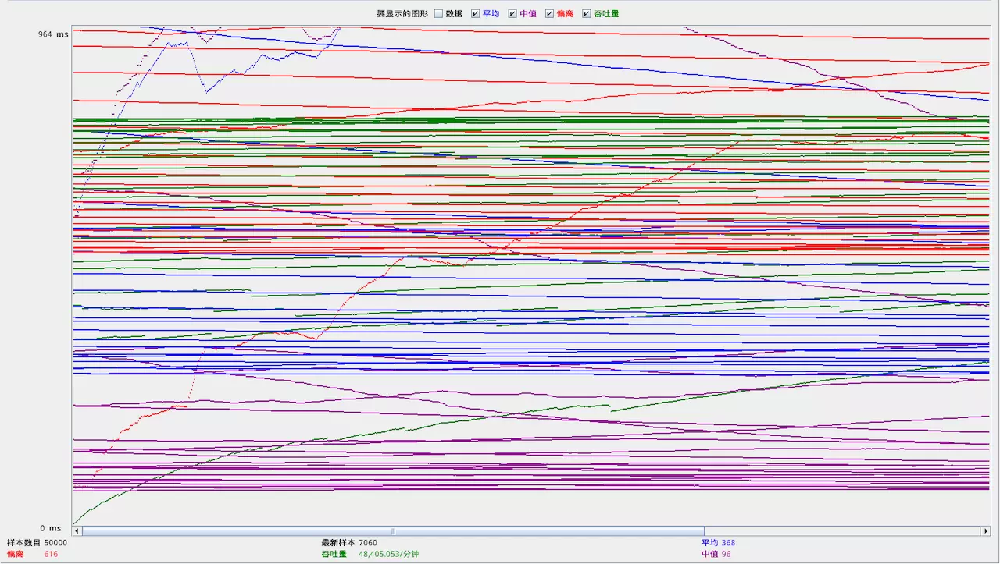
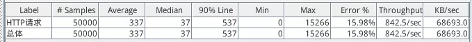
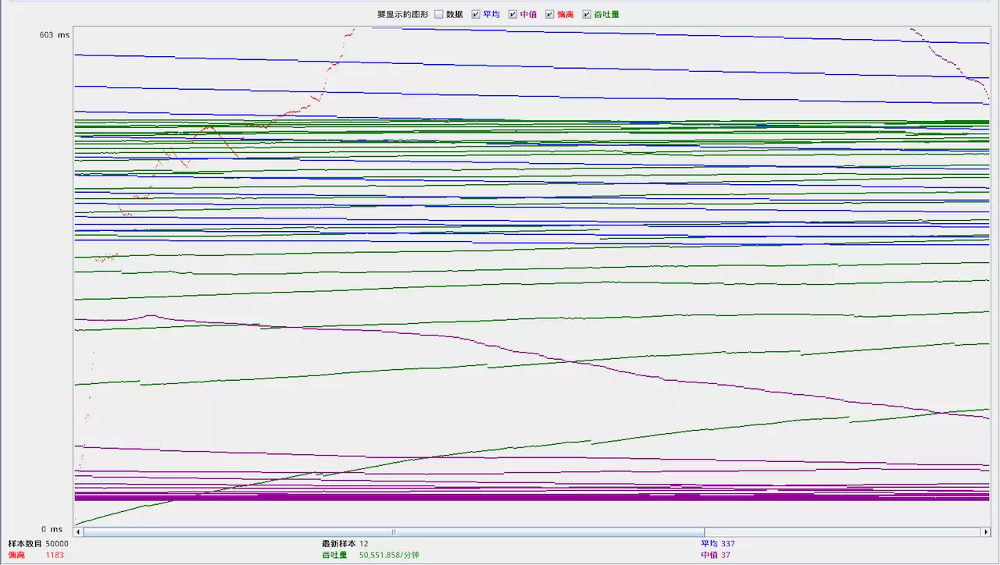
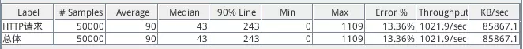
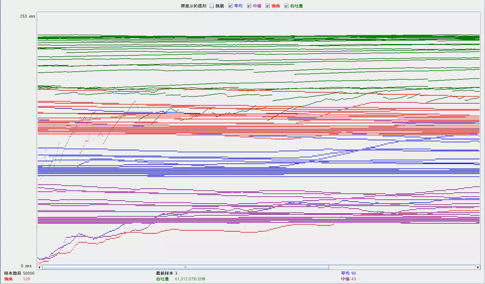

[TOC]


# Tomcat 调优测试

原文链接：[lwhhhh.github.io](https://link.juejin.im/?target=https%3A%2F%2Flwhhhh.github.io%2F2016%2F10%2F03%2Ftomcat%25E8%25B0%2583%25E4%25BC%2598%2F)

 

## 测试环境:

OS: Ubuntu14.04 64位 (运行在Docker1.9)

CPU: Intel i3 双核四线程

Mem: 8G

Tomcat版本: Tomcat8.5

Java SDK版本: JDK 8

测试软件: Apache JMeter 2.8

## 测试说明:

测试代码为接受一个http请求,返回一个String变量s.
该变量初始化为””, 循环10000次,每次添加内容”test\n”

```Java
public class Test extends HttpServlet {
    @Override
    public void doGet(HttpServletRequest request, HttpServletResponse response) throws IOException{
        StringBuffer ret = new StringBuffer();
        for(int i=0;i < 10000; i++) {
           ret.append(String.valueOf(i) + " test\n");
        }
        PrintWriter printWriter = response.getWriter();
        printWriter.println(ret);
    }
}
```

采用JMeter模拟5000个(用户),在10s内对该接口不断发起Get请求,并循环10次.

最后统计结果.

对每个配置的修改都会关闭并重启tomcat

## 调优方式一 : 修改…/bin/catalina.sh(启动时优化)

**Windows下为catalina.bat**

- 添加参数:

  > export JAVA_OPTS=”-server”

  - 作用:tomcat默认以java –client方式运行, 添加”server”参数将tomcat切换为生产模式,使得tomcat能支持更高的并发数和吞吐量.

  - 测试结果:

    修改前:
    

    

    修改后:
    

    

  - 总结:
    最大并发数和吞吐量有明显的提升.

- 添加参数:

  > export JAVA_OPTS=”-server -Xms256M -Xmx256M”

  - 作用:Xms参数表示初始堆的大小，也是堆大小的最小值，默认值是总共的物理内存1/64, 且小于1G(下面是-Xmx同), Xmx参数表示堆的最大值.在本机中这个参数的值大约为128m.这里将其扩大一倍.正常情况下应当将这个参数的数值设置为相同.还有另外一些参数,如Xss,表示每个线程的栈内存,默认为1M,但经过查阅资料表明这些参数一般情况下不需要改动.即增加堆内存是提高tomcat内存性能最好最安全的做法.
  - 测试结果:
    
  - 
  - 总结:
    对比上个参数,可以明显看到并发请求的平均值,中值都有2-3倍的提升,最大值和吞吐率出现了下降.个人猜测吞吐率的下降是因为在吞吐量一定的情况下,每秒并发数的提高拉低了该数值.并发最大值的降低,平均值的升高表明在此配置下系统的处理能力已经有了提高,并且稳定性也得到提升.

- 添加参数:

  > export JAVA_OPTS=”-server -Xms512M -Xmx512M”

  - 作用: 在上条参数的基础上,将堆内存起始值和最大值都提高一倍

  - 测试结果:

    

    

  - 总结:
    并发平均数和吞吐率变化不大,但并发最大值提升2倍左右.
    测试代码按最少的字节算,处理单个用户请求需要50000bytes,在本测试中模拟的用户数是5000,即使5000用户并发处理,所需内存也只在200MB这个级别,所以堆内存设置为512MB与256MB,某些数据项可能已经遇到瓶颈.

- 添加参数:

  > export JAVA_OPTS=”-server -Xms512M -Xmx512M -XX:+AggressiveOpts”

  - 作用: -XX:+AggressiveOpts表示每当JDK版本升级时，你的JVM都会使用最新加入的优化技术（如果有的话）.建议加上,但也要注意若升级JDK版本后系统出现意外情况,应该对该参数的影响进行测试.

- 添加参数:

  > export JAVA_OPTS=”-server -Xms512M -Xmx512M -XX:+AggressiveOpts -XX:+UseBiasedLocking”

  - 作用: 启用一个优化的线程锁.对于tomcat来说,每个http请求都会启用线程,启动该线程锁可以让tomcat对线程进行最优调配.

  - 测试结果:

    

    

  - 总结:
    除了吞吐率其他都降得很厉害.个人猜测因为本次测试代码并不复杂,如果是执行复杂的业务逻辑可能优化效果会比较明显,尤其是设计到当业务的计算量相差较大时.

- 添加参数:

  > export JAVA_OPTS=”-server -Xms512M -Xmx512M -XX:+AggressiveOpts -XX:+UseBiasedLocking -XX:+DisableExplicitGC”

  - 作用: 禁止显示调用System.gc().若在代码中显示调用System.gc()让JVM进行垃圾回收,会极大降低系统响应时间.

## 调优方式二: 更改…/conf/server.xml (容器内优化)

**在server.xml内定位到标签,以下的内容均值在该标签中修改内容**

- 添加参数:

  > URIEncoding=”UTF-8”

  - 作用: 使得tomcat可以解析含有中文名的文件的url

- 添加参数

  > protocol=”org.apache.coyote.http11.Http11Nio2Protocol”
  > **若tomcat为8可改为上面的参数,若为tomcat6建议改为”org.apache.coyote.http11.Http11NioProtocol”**

- 添加参数

  > enableLookups=”false”

- 添加参数

  > acceptCount=”1000”
  >
  > - 指定当所有可以使用的处理请求的线程数都被使用时，可以放到处理队列中的请求数，超过这个数的请求将不予处理，默认设置 100.这里设置为1000

- 添加参数

  > maxThreads=”5000”
  >
  > - 最大并发数，默认设置 200,这里设置为JMeter中的模拟请求数5000

- 测试结果:
  将上述几个参数添加去本机的配置文件中,测试数据没有明显差距,故不贴出.
  可能因为测试用例简单,在这方面进行优化有点杀鸡焉用牛刀了.

## 总结:

在本测试中,堆内存的更改对tomcat的优化效果非常明显.其实这是属于JVM优化的范畴,只不过作用于tomcat身上.
其他参数的优化在本测试中效果不明显,但我相信对于业务复杂的场景,这些优化都是非常必要的,尤其是对server.xml的优化.
另外,测试过程中出现让我很费解的事.相同的配置运行多次,得到的数据会有较大的出入.比如我晚上测试了一边.第二天起来用该配置再测一边,得到的数据会同比波动会非常大.
结合多次实验,发现数据的波动会出现在物理机和Docker容器的唤醒,重新打开JMeter软件等行为之后,这些行为都会导致内存使用率的大量变化,这些都导致JVM的运行环境不够稳定,
所以,该测试的结果并不严谨,仅可作为参考而不可尽信.务必在您的环境亲自测试一遍.

最后,下面给出一份参考配置,转载自网络,本文也参考了他们的博文.

[catalina.sh配置来源](https://link.juejin.im/?target=http%3A%2F%2Fblog.csdn.net%2Flifetragedy%2Farticle%2Fdetails%2F7708724)

[server.xml配置来源](https://link.juejin.im/?target=http%3A%2F%2Fwiki.jikexueyuan.com%2Fproject%2Flinux-in-eye-of-java%2FTomcat-Install-And-Settings.html)

## 参考配置

**catalina.sh**

> export JAVA_OPTS=”-server -Xms1400M -Xmx1400M -Xss512k -XX:+AggressiveOpts -XX:+UseBiasedLocking -XX:PermSize=128M -XX:MaxPermSize=256M -XX:+DisableExplicitGC -XX:MaxTenuringThreshold=31 -XX:+UseConcMarkSweepGC -XX:+UseParNewGC -XX:+CMSParallelRemarkEnabled -XX:+UseCMSCompactAtFullCollection -XX:LargePageSizeInBytes=128m -XX:+UseFastAccessorMethods -XX:+UseCMSInitiatingOccupancyOnly -Djava.awt.headless=true “

**server.xml**

```
Connectorport="8080"
protocol="org.apache.coyote.http11.Http11Nio2Protocol"
connectionTimeout="20000"
redirectPort="8443"
enableLookups="false"
acceptCount="100"
maxThreads="200"
minSpareThreads="10"
compression="on"
compressionMinSize="2048"
compressableMimeType="text/html,text/xml,text/plain,text/css,text/javascript,application/javascript"
URIEncoding="utf-8"
```


https://juejin.im/entry/57f47f660bd1d000589d8114