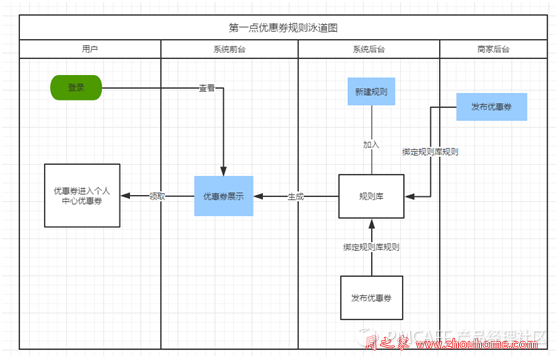
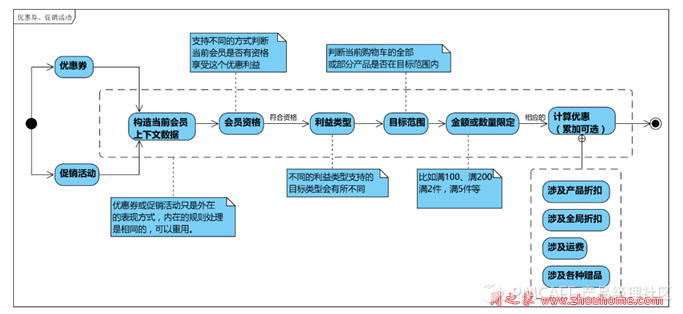
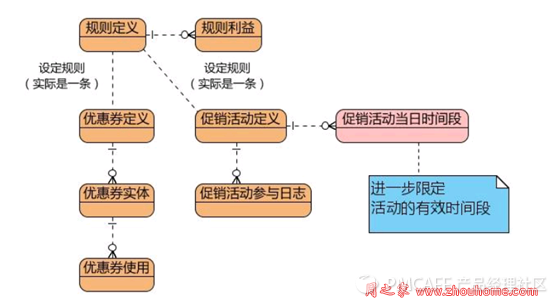
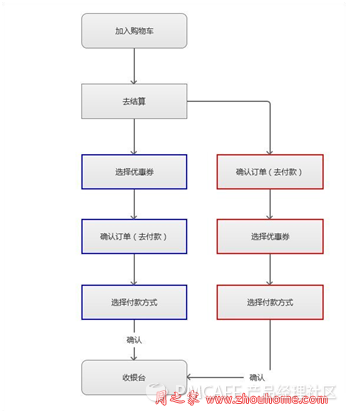
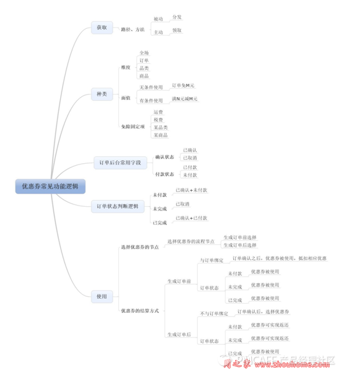

[TOC]

# 优惠券和促销的设计规则

[周州](https://www.pmcaff.com/user/profile/xeBOVlxPQM) 20202阅读 2016-12-08

ps：最新做的事情有点杂，发一个优惠券和促销活动的设计，希望对新人有些帮助！

# **1. 设计思路**

优惠券生成流程

## 1.1. 概述

\1. 表现形式和内在

优惠券 或者 促销活动 只是承载促销的外部表现形式，但是规则是通用的。

 \2. 优惠券

私有形式的，可以是直接关联到会员账户，在结账时选择使用。

公开形式的，在结账时手动录入优惠券码使用。

\3. 设计通用的规则定义和规则利益，形成规则库。

\4. 规则关联 每个优惠券 或者 促销活动 只关联一条规则。

虽然可以关联多条，但是这样 没有实际价值，关联一条会让业务和实现更加清晰。

\5. 优惠券

优惠券分为定义和实体两部分，定义是定义规则，包括优惠券本身使用规则和优惠 规则，实体是根据定义生成的每一张具体的券，这些具体的券可以使用一次或多次 （视同优惠券定义），每次使用都会记录优惠券使用历史。

\6. 促销活动

 和优惠券形式不同，它不需要选择优惠券，也不需要输入优惠券码，只要规则符合 就可以生效。适用于如免费领取赠品，买 A 送 B，全站满 100 减 10 的促销之类。

 \7. 规则定义

按 资格类型和配置 –》选择规则利益类型和配置 –》选择基于对象类型和配置（因 为不同的利益类型可以选择的对象类型是不一样的）--》配置规则利益（有些规则 利益有多条，即阶梯优惠）

\8. 优惠券使用日志

 无论是可以使用单次还是多次的优惠券，记录日志有利于查询。

 \9. 规则参与日志

处理为了查询外，关键的业务是为了判断用户是否参与过这个促销活动，比如有些 免费送活动，每个会员只能参加一次。

## 1.2. 业务术语说明

对促销规则、促销活动和优惠券等业务进行分析设计，设计内容涵括：

## 1.2.1表现形式

分为促销活动和优惠券两类，这两类只是对外的表现形式，但是内在的促销规则均 是采用同样的促销规则结构来实现。

##  1.2.2促销规则

 包含规则定义和规则利益两部分。

##  A.规则定义

包括资格类型、资格配置、利益类型、利益累加计算、基于对象类型（如 无限制（全站产品）、分类、指定产品等，可做更多扩展）、基于对象配 置（即针对前面的类型进行配置）、对计算金额结果的处理方式。即如四舍五入等 规则。

\1.    资格类型

 即要使用优惠券或者享受促销活动等优惠时需要先具备的顾客资格。顾客资格包括 无限制（全站会员）、指定会员、会员组、会员级别 和 自定义的查询条件等。 （因为购物必须注册登录，所以游客是不享受优惠的）

\2.    对象类型和配置

即这些促销是针对那些产品的。可以做更复杂的扩展，只要最终能够查询出产品 SKU 即可。

\3.    利益类型

 即当顾客通过优惠券 或 适用促销活动时，符合顾客资格，并且所选购的单品或整 单（即对象类型无限制）在对象范围时，可以获得的优惠。 优惠资源有满减金额、满折金额、减免运费，赠送积分、赠品、优惠券等。 满可以满数量，也可以使满金额。不同的组合形成一个规则策略，需要开发一个该规则策略 的实现类别。

\4.    利益累加

比如满 100 减 10，如果不累加，则满 200 时，也是减 10；如果累加则减 20.

## B. 规则利益

 当满足前面的规则定义，表示当前购物车的对象可以享受利益，利益有 1~N 条，不 同利益还有进一步的条件限制，以便设置阶梯折扣。

例：比如客户选1件15元/件，5件12元/件，10件10元/件

 

# **2. 业务规划**

## 2.1. 整体业务流

\1. 优惠券或促销活动只是表现形式，可通用规则库内的规则。

\2. 调用规则库内的规则之前，先调取当前会员信息 a) 包括会员 ID、级别、当前访问的 IP 所属的区域等。 b) 至于更多的信息可以在相应的计算策略中，根据需要，通过客户 ID 查询获得。

\3. 会员资格

根据会员上下文，判断当前这个会员能否有资格适用这个优惠券或促销活动关联的 促销规则。

 \4. 利益类型 不同的利益类型支持的目标类型会有所不同。所以判断了资格后，先查询出（对应维护时，就是先选择利益类型）关联的利益类型，然后再下一步到目标范围。

 \5. 目标范围

目标有好多种，简单而言就是当前的购物全部或 部分在这个范围之内，就可以享受优惠了。

 \6. 金额或数量限定

满足了前面的条件后，进一步计算金额或数量是否满足。 比如日用洗涤用品类，满 199 减 50，满 399 减 120. 7. 计算优惠 前面的都通过后，根据条件和累加（可选）计算优惠，优惠方式可以是各类赠品、 满减、满折、运费等。

 

# **3. 数据结构**

## 3.1. 实例图说明

 

\1. 规则定义和规则利益表为底层规则结构定义，为优惠券和促销活动所共用。

\2. 优惠券定义和促销活动为两种表现方式，分别包含不同的业务逻辑。

\3. 优惠券定义

定义了优惠券本身的规则，包括可用次数、可拥有数量、时效类型等。【注】目前不支持同时使用多张优惠券的业务（淘宝、京东等也并不支持），因为 多张优惠券同时生效导致的折扣将很难控制，而且站在商家的立场，一次购物只能 用一张优惠券有利于多次购物。 所以优惠券表的排他式使用、优先级目前是没有投入使用的。

\4. 优惠券实体

优惠券实体是对应具体的券，该实体是根据优惠券定义而生成的，实体有自己进一 步的业务，如冗余一部分优惠券定义的字段、状态等。大多数优惠券只能用一次， 顾客获得并使用后，就失效了。

\5.    优惠券使用

无论是只能用一次的优惠券或者可用多次的优惠券，每一次使用均需要记录一条使用历史记录。

\6.    促销活动

促销活动和优惠券的区分是没有发券和用券的步骤，顾客在网站购物自动享受优惠。

 \7. 促销活动参与日志

 促销活动和优惠券不同，优惠券有天然的限定。促销活动比如通过日志才知道那些 会员是否参与过这个活动，有些活动只限每个会员只能参与一次。

# **4. 使用规则**

## 使用流程图：

常用的流程有2种：

（1）蓝色：确认购物车内容之后，“选择优惠券”，继续下一步确认订单操作（用户订单确认操作之后，系统生成此订单，订单内容不可再更改），选择支付方式，调取收银台

（2）红色：确认购物车内容之后，直接让用户确认订单（用户订单确认操作之后，系统生成此订单，订单内容不可再更改），然后“选择优惠券”，选择支付方式，调取收银台

两者的区别在于，优惠券的选择，是在“系统生成订单”之前，还是在“系统生成订单”之后

生成订单前选择优惠券，则优惠券与订单为绑定关系，系统生成此订单之后，优惠券则被使用，此时用户不付款而取消订单，已经选择的优惠券则不做返回（因为被用了）；

生成订单后选择优惠券，则优惠券与订单不为绑定关系，系统生成此订单之后，才让用户选择使用哪张优惠券，之后支付成功之后，被选优惠券才被使用，如果次流程中用户取消订单，则优惠券可以做到反还。

# **附：优惠券功能逻辑**

# 

------

**周州：重庆山茶花网络科技有限公司 产品负责人**

**本文由PMCAFF会员 @周州原创发布于PMCAFF产品社区（www.pmcaff.com），未经许可，禁止转载。**

<https://coffee.pmcaff.com/article/522932721808512/pmcaff?utm_source=forum&from=selection>