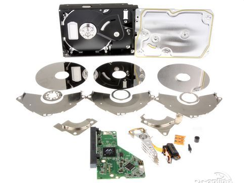

# 硬盘的存储原理是什么？为什么一张小小的硬盘可以存下如此多的数据？

磁铁有两个极性, 一个是南极(S极) , 一个是北极(N 极) , 硬盘正是利用磁粒子的极性来记录数据的。盘片表面的那些磁粉就是磁粒子。盘片被划分成若干个同心圆( 称为磁道),在每个同心圆的磁道上就好像有无数的任意排列的小磁铁, 当这些小磁铁受到来自磁头磁场的影响时,排列的方向随之改变, 利用磁头的磁力统一某区域小磁铁的方向, 就可以使该区域磁场呈现相同极性, 如果把 S/N 两种极性与二进制中的 0和 1 对应, 就可以表示二进制数据, 这些磁粒子都是永磁体, 即便磁头离开, 它依然可以长时间保持形成的极性, 这样就能达到储存信息的目的了。磁头在读取数据时, 可以感应磁粒子的不同极性, 从而转换成不同的电脉冲信号, 利用解码器将这些原始信号翻译出来, 就成为了电脑能使用的数据。

现在制造硬盘的技术通常为温彻斯特技术，最早把温彻斯特技术放在小型驱动器上的是IBM，其62-PC，首次采用直径为20.3厘米的盘片。此后CDC公司、NEC公司开始生产20.3厘米的硬盘驱动器。 1980年Shugart公司首先制成13.3厘米硬盘驱动器，体积的更小型化，但其容量只有6MB。1983年，Rodime公司也制成了13.3厘米的硬盘驱动器，容量也仅有6MB左右。

硬盘另外一个发展里程碑就是使用溅射工艺来生产连续介质，这样就让硬盘的密度进一步增大，为提高硬盘的存储空间奠定了良好的基础。1991年IBM首次实现了1Gbit/英寸的密度，1992年日立公司则达到2Gbit/英寸，1997年又是IBM公司领先一步，得到了11.6Gbit/英寸的实验结果。1998年Seagate公司实现了16.3Gbit/英寸的密度，1999年IBM又推出了更加大的27.6Gbit/英寸。硬盘中磁头同盘片之间的距离很小，一般来说只有十万分之一厘米，因此一张小小的硬盘可以存下如此多的数据并不稀奇。

https://www.guokr.com/question/550537/