[TOC]


# 计算机原理学习（3）-- 内存工作原理

# 前言

前面两篇文章介绍了计算机硬件是如何工作的。而从这一章开始将逐渐的转到软件上面来。我们还有内存这一个很重要的部分没有介绍。这一章不仅仅介绍内存的工作原理，还会介绍内存的编址、内存数据存放。逐渐从硬件过渡到软件上来。为后面介绍程序运行打下基础。 

# 1. 内存工作原理

CPU和内存是计算机中最重要的两个组件，前面已经知道了CPU是如何工作的，上一篇也介绍了内存采用的DRAM的存储原理。CPU工作需要知道指令或数据的内存地址，那么这样一个地址是如何和内存这样一个硬件联系起来的呢？现在就看看内存到的是怎么工作的。

## 1.1 DRAM芯片结构

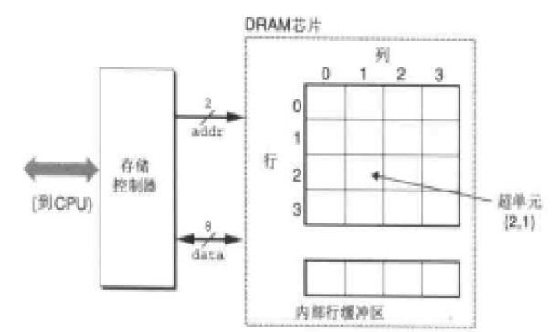

上图是DRAM芯片一个单元的结构图。一个单元被分为了N个超单元（可以叫做cell），每个单元由M个DRAM单元组成。我们知道一个DRAM单元可以存放1bit数据， 所以描述一个DRAM芯片可以存储N*M位数据。上图就是一个有16个超单元，每个单元8位的存储模块，我们可以称为16*8bit 的DRAM芯片。而超单元（2,1）我们可以通过如矩阵的方式访问，比如 data = DRAM[2.1] 。这样每个超单元都能有唯一的地址，这也是内存地址的基础。

 

每个超单元的信息通过地址线和数据线传输查找和传输数据。如上图有2根地址线和8根数据线连接到存储控制器（注意这里的存储控制器和前面讲的北桥的内存控制器不是一回事），存储控制器电路一次可以传送M位数据到DRAM芯片或从DRAM传出M位数据。为了读取或写入【i,j】超单元的数据，存储控制器需要通过地址线传入行地址i 和列地址j。这里我们把**行地址称为RAS(Row Access Strobe)请求, 列地址称为(Column Access Strobe)请求。**

但是我们发现地址线只有2为，也就是寻址空间是0-3。而确定一个超单元至少需要4位地址线，那么是怎么实现的呢？

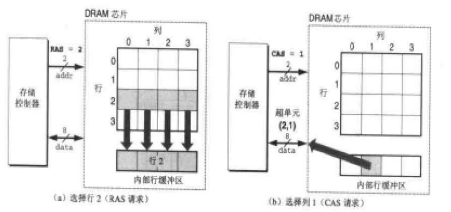

解决这个问题采用的是分时传送地址码的方法。看上图我们可以发现在DRAM芯片内部有一个行缓冲区，实际上获取一个cell的数据，是传送了2次数据，第一次发送RAS，将一行的数据放入行缓冲区，第二期发送CAS，从行缓冲区中取得数据并通过数据线传出。这些地址线和数据线在芯片上是以管脚（PIN）与控制电路相连的。将DRAM电路设计成二维矩阵而不是一位线性数组是为了降低芯片上的管脚数量。入上图如果使用线性数组，需要4根地址管脚，而采用二维矩阵并使用RAS\CAS两次请求的方式只需要2个地址管脚。但这样的缺点是增加了访问时间。

## 1.2 内存模块

内存模块也就是我们常说的内存条。我们在购买内存是经常会听到我这个内存采用的是什么颗粒，如下左图，我们看到内存PCB上的一块块的就是内存颗粒。也就是我们DRAM芯片。通过管脚和PCB连接。不同厂商，不同类型的内存可以的大小，管脚，性能，封装都不一样，但是原理都是一样。这里我们就不展开介绍了。而下有图展示了一个1M*4bit的DRAM芯片的管脚图。

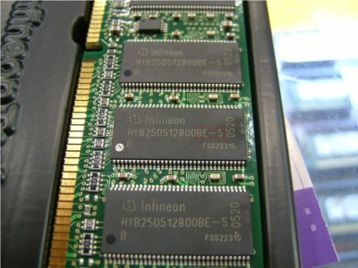  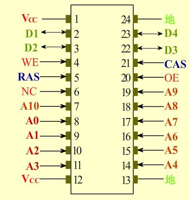

对于一个内存颗粒来说，它的容量和字长是有限的，所以我们使用内存是会把多个颗粒组成内存模块来对内存进行字长和容量的扩展。目前的内存一般内存条上面会有多颗内存颗粒，比如一条64M的内存可能是由8个8M*8bit 的SDRAM内存颗粒组成。

 

### 1.2.1 字长位数扩展 

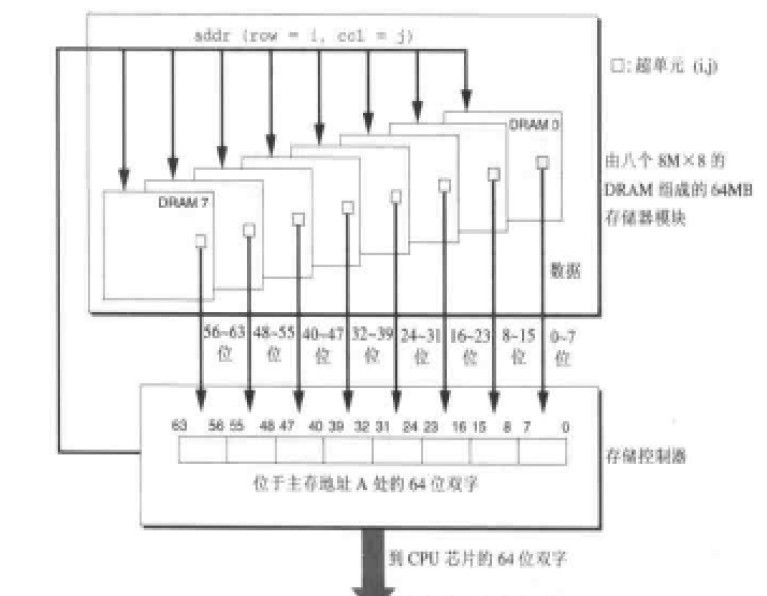

位扩展的方法很简单，只需将多片RAM的相应地址端、读/写控制端 和片选信号CS并接在一起，而各片RAM的I/O端并行输出即可。 如上图，我们采用了8个DRAM芯片分，别编号为0-7，每个超单元中存储8位数据。在获取add（row=i，col=j）地址的数据的时候，从每个DRAM芯片的【i, j】单元取出一个字节的数据，这样传送到CPU的一共是8*8b = 64b的数据。我们通过8个8M*8b的内存颗粒扩展为了8M*64b的内存模块。

 

 

### 1.2.2 字存储容量扩展

 

RAM的字扩展是利用译码器输出控制各片RAM的片选信号CS来实现的。RAM进行字扩展时必须增加地址线，而增加的地址线作为高位地址与译码器的输入相连。同时各片RAM的相应地址端、读/写控制端 、相应I/O端应并接在一起使用。下图是我们通过4个2M*8b的内存颗粒，将内存容量扩展到了8M，字长为8位。

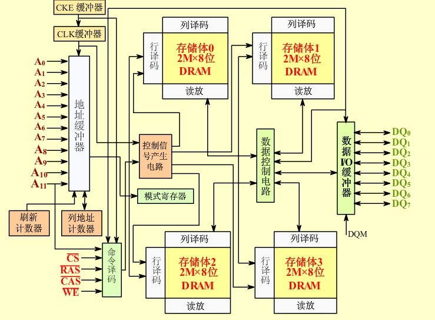

 

最后，内存通过主板上的内存插槽DIMM和内存总线相连接。对于不同内存比如SDRAM和DDR他们内存金手指的定义是不同的。这里就不需要详细介绍了。

 

# 2. 内存编址

 

前面我们知道了DRAM颗粒以及内存模块是如何扩展字长和容量的。一个内存可能是8位，也可能是64位，容量可能是1M，也可能是1G。那么内存是如何编地的呢？和地址总线，计算机字长之间又有什么关系呢？

 

 

## 2.1 字长

 

计算机在同一时间内处理的一组二进制数称为一个计算机的“字”，而这组二进制数的位数就是“字长”。。通常称处理字长为8位数据的CPU叫8位CPU，32位CPU就是在同一时间内处理字长为32位的二进制数据。 所以这里的字并不是我们理解的双字节（Word）而是和硬件相关的一个概念。一般来说计算机的数据线的位数和字长是相同的。这样从内存获取数据后，只需要一次就能把数据全部传送给CPU。

 

## 2.2 地址总线

 

前面我们已经介绍过地址总线的功能。地址总线的数量决定了他最大的寻址范围。就目前来说一般地址总线先字长相同。比如32位计算机拥有32为数据线和32为地线，最大寻址范围是4G（0x00000000 ~ 0xFFFFFFFF）。当然也有例外，Intel的8086是16为字长的CPU，采用了16位数据线和20位数据线。

 

## 2.3 内存编址

 

从前面我们知道一个内存的大小和它芯片扩展方式有关。比如我们内存模块是采用 16M*8bit的内存颗粒，那么我们使用4个颗粒进行位扩展，成为16M*32bit，使用4个颗粒进行字容量扩展变为64M*32bit。那么我们内存模块使用了16个内存颗粒，实际大小是256MB。

 

我们需要对这个256M的内存进行编址以便CPU能够使用它，通常我们多种编址方式：

1. 按字编址：    对于这个256M内存来说，它的寻址范围是64M，而每个内存地址可以存储32bit数据。
2. 按半字编址：对于这个256M内存来说，它的寻址范围是128M，而每个内存地址可以存储16bit数据。
3. 按字节编址：对于这个256M内存来说，它的寻址范围是256M，而每个内存地址可以存储8bit数据。

对于我们现在的计算机来说，**主要都是采用按字节编址的方式。**所以我们可以把内存简单的看成一个线性数组，数组每个元素的大小为8bit，我们称为一个存储单元。这一点很重要，因为后面讨论的所有问题内存都是以按字节编址的方式。 这也是为什么对于32位计算机来说，能使用的最多容量的内存为4GB。如果我们按字编地址，能使用的最大内存容量就是16GB了。

 

于是很容易想到一个问题，为什么我们要采用字节编址的方式呢？关于这个问题，我在网上基本没有找到答案，甚至都找不到问这个问题的。所以这里没法给出答案，为什么为什么呢？ 麻烦知道的朋友告诉我哈。

 

另一方面的问题是，内存编址方式和DRAM芯片是否有关呢？ 我认为还是有一定关系。比如我DRAM的芯片是8M*8bit，那么芯片最小的存储单位就是8bit，那么我们内存编址就不能按照半个字节来编址。否则内存取出8bit，根本不知道你要那4bit传给CPU。也有一种说法是现在的DRAM芯片cell都是8bit，所以采用按字节编址。另一方面应该也和数据总线位宽有关。

 

 

# 3. 内存数据

 

前面我们知道了，内存是按字节编址，每个地址的存储单元可以存放8bit的数据。我们也知道CPU通过内存地址获取一条指令和数据，而他们存在存储单元中。现在就有一个问题。我们的数据和指令不可能刚好是8bit，如果小于8位，没什么问题，顶多是浪费几位（或许按字节编址是为了节省内存空间考虑）。但是当数据或指令的长度大于8bit呢？因为这种情况是很容易出现的，比如一个16bit的Int数据在内存是如何存储的呢？

 

## 3.1 内存数据存放

 

其实一个简单的办法就是使用多个存储单元来存放数据或指令。比如Int16使用2个内存单元，而Int32使用4个内存单元。当读取数据时，一次读取多个内存单元。于是这里又出现2个问题：

1. 多个存储单元存储的顺序？
2. 如何确定要读几个内存单元？


### 3.1.1 大端和小端存储

1. Little-Endian 就是低位字节排放在内存的低地址端，高位字节排放在内存的高地址端。
2. Big-Endian 就是高位字节排放在内存的低地址端，低位字节排放在内存的高地址端。

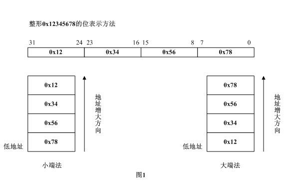

需要说明的是，计算机采用大端还是小端存储是CPU来决定的， 我们常用的X86体系的CPU采用小端，一下ARM体系的CPU也是用小端，但有一些CPU却采用大端比如PowerPC、Sun。判断CPU采用哪种方式很简单：

```
bool IsBigEndian()  


{  


    int vlaue = 0x1234;  


    char lowAdd =  *(char *)&value;   


    if( lowAdd == 0x12)  


    {  


        return true;  


    }  


    return false;  


}
```

既然不同计算机存储的方式不同，那么在不同计算机之间交互就可能需要进行大小端的转换。这一点我们在Socket编程中可以看到。这里就不介绍了，对以我们单一CPU来说我们可以不需要管这个转换的问题，另外我们目前个人PC都是采用小端方式，所以我们后面默认都是这种方式。

 

### 3.1.2 CPU指令

前面我们多次提到了指令的概念，也知道指令是0和1组成的，而汇编代码提高了机器码的可读性。为什么突然在这里介绍CPU指令呢？ 主要是解释上面的第二个问题，当我读取一个数据或指令时，我怎么知道需要读取多少个内存单元。

 

#### 3.1.2.1 CPU指令格式

首先我们来看看CPU指令的格式，我们知道CPU质量主要就是告诉CPU做什么事情，所以一条CPU指令一般包含操作码（OP）和操作

| **操作码字段** | **地址码字段** |
| -------------- | -------------- |
|                |                |

 

 

根据一条指令中有几个操作数地址，可将该指令称为几操作数指令或几地址指令。

| **操作码** | **Ａ1** | **Ａ2** | **Ａ3** |
| ---------- | ------- | ------- | ------- |
|            |         |         |         |

 

**三地址指令: (A1)　OP　(A2)　-->　A3**

| **操作码** | **Ａ1** | **Ａ2** |
| ---------- | ------- | ------- |
|            |         |         |

 

**二地址指令: (A1)　OP　(A2)　-->　A1**

| **操作码** | **Ａ1** |
| ---------- | ------- |
|            |         |

 

**一地址指令: (AC)　OP　(A)　-->　AC**　　　

| **操作码** |      |
| ---------- | ---- |
|            |      |

 

　　　　**零地址指令**

A1为被操作数地址，也称源操作数地址； A2为操作数地址，也称终点操作数地址； A3为存放结果的地址。 同样，A1,A2,A3以是内存中的单元地址，也可以是运算器中通用寄存器的地址。所以就有一个寻址的问题。关于指令寻址后面会介绍。

CPU指令设计是十分复杂的，因为在计算机中都是0和1保存，那计算机如何区分一条指令中的操作数和操作码呢？如何保证指令不会重复呢？这个不是我们讨论的重点，有兴趣的可以看看计算机体系结构的书，里面都会有介绍。从上图来看我们知道CPU的指令长度是变长的。所以CPU并不能确定一条指令需要占用几个内存单元，那么CPU又是如何确定一条指令是否读取完了呢？

 

#### 3.1.2.2 指令的获取

#### 

现在的CPU多数采用可变长指令系统。关键是指令的第一字节。 当CPU读指令时，并不是一下把整个指令读近来，而是先读入指令的第一个字节。指令译码器分析这个字节，就知道这是几字节指令。接着顺序读入后面的字节。每读一个字节，程序计数器PC加一。整个指令读入后，PC就指向下一指令（等于为读下一指令做好了准备）。

Sample1:

```
MOV AL,00  机器码是1011 0000 0000 0000
```

机器码是16位在内存中占用2个字节：

【00000000】 <- 0x0002

【10110000】 <- 0x0001

比如上面这条MOV汇编指令，把立即数00存入AL寄存器。而CPU获取指令过程如下：

1. 从程序计数器获取当前指令的地址0x0001。
2. 存储控制器从0x0001中读出整个字节，发送给CPU。PC+1 = 0X0002.
3. CPU识别出【10110000】表示：操作是MOV AL，并且A2是一个立即数长度为一个字节，所以整个指令的字长为2字节。
4. CPU从地址0x0002取出指令的最后一个字节
5. CPU将立即数00存入AL寄存器。

这里的疑问应该是在第3步，CPU是怎么知道是MOV AL 立即数的操作呢？我们在看下面一个列子。

 

Sample2:

```
MOV AL,[0000] 机器码是1010 0000 0000 0000 0000 0000
```

 

这里同样是一条MOV的汇编指令，整个指令需要占用3个字节。

【00000000】 <-0x0003

【00000000】 <- 0x0002

【10100000】 <- 0x0001

 

我们可以比较一下2条指令第一个字节的区别，发现这里的MOV  AL是1010 0000，而不是Sample1中的1011 000。CPU读取了第一个字节后识别出，操作是MOV AL [D16]，表示是一个寄存器间接寻址，A3操作是存放的是一个16位就是地址偏移量（为什么是16位，后面文章会介绍），CPU就判定这条指令长度3个字节。于是从内存0x0002~0x0003读出指令的后2个字节，进行寻址找到真正的数据内存地址，再次通过CPU读入，并完成操作。

 

从上面我们可以看出一个指令会根据不同的寻址格式，有不同的机器码与之对应。而每个机器码对应的指令的长度都是在CPU设计时就规定好了。8086采用变长指令，指令长度是1-6个字节，后面可以添加8位或16位的偏移量或立即数。 下面的指令格式相比上面2个就更加复杂。

 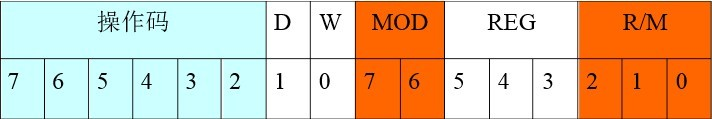

- 第一个字节的高6位是操作码，W表示传说的数据是字(W=1)还是字节(W=0)，D表示数据传输方向D=0数据从寄存器传出，D=1数据传入寄存器。
- 第二个字节中REG表示寄存器号，3位可以表示8种寄存器，根据第一字节的W，可以表示是8位还是16位寄存器。表3-1中列出了8086寄存器编码表
- 第二个字节中的MOD和R/M指定了操作数的寻址方式，表3-2列出了8086的编码

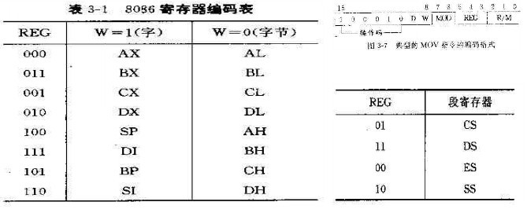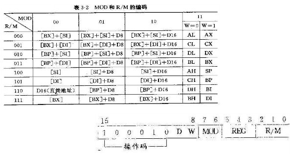

这里没必要也无法更详细介绍CPU指令的，只需要知道，CPU指令中已经定义了指令的长度，不会出现混乱读取内存单元的现象。有兴趣的可以查看引用中的连接。

####  

## 3.1.3  内存数据

 

#### 3.1.3.1 内存数据的操作

 

从上面我们可以知道，操作数可以是立即数，可以存放在寄存器，也可以存放在内存。对于第一个例子，指令已经说明，操作时是一个字节，于是CPU可以从下一个内存地址读取操作时，而对于第二个列子，操作数只是地址偏移，所以当CPU获得这个数据后，需要转换成实际的内存地址，在进行一次内存访问，把数据读入到寄存器中。这里就出现我们前面提到的问题，这个数据我们要读几个存储单元呢？

```
	MyClass cla;


008C3EC9  lea         ecx,[cla]  


008C3ECC  call        MyClass::MyClass (08C1050h)  


008C3ED1  mov         dword ptr [ebp-4],0  


	cla.num5 = 500;


008C3ED8  mov         dword ptr [ebp-6Ch],1F4h  


	int b1 = MyClass::num1;


008C3EDF  mov         dword ptr [b1],64h  


	int b2 = MyClass::num2;


008C3EE6  mov         dword ptr [b2],0C8h  


	int b3 = MyClass::num3;


008C3EF0  mov         eax,dword ptr ds:[008C9008h]  


008C3EF5  mov         dword ptr [b3],eax  


	int b4 = cla.num4;


008C3EFB  mov         eax,dword ptr [cla]  


008C3EFE  mov         dword ptr [b4],eax  


	int b5 = cla.num5;


008C3F04  mov         eax,dword ptr [ebp-6Ch]  


008C3F07  mov         dword ptr [b5],eax  
```

让我们看一段C++代码和对应的汇编代码，操作很简单，创建一个Myclass对象后，对成员变量赋值。而赋值都是试用Mov操作符。对于这些变量我们有赋值操作和取值操作，那么是如何确定要读取或写入数据的大小呢？

```
	cla.num5 = 500;


008C3ED8  mov         dword ptr [ebp-6Ch],1F4h  
```

我看先看看赋值操作，往dword ptr [ebp-6Ch]内存存入一个立即数， [ebp-6Ch]是num5的内存地址，而前面的dword ptr 表示这是进行一个双子操作。还记得上面指令格式中第一个字节的W字段吗？ 在8086中只能进行字节或字操作，而现在CPU都可以进行双字操作。

```
	int b5 = cla.num5;


008C3F04  mov         eax,dword ptr [ebp-6Ch]  
```

同样，当我们要从一个内存读取数据的时候，也要指定读取数据的操作类型，这里也是双字操作。这样以来，就能从内存中正确的读出需要的长度了。就这么一个简单的赋值操作，获取你从来没想过在内存中怎么存放，又是怎么读取的。这一切都是编译器和CPU在背后为我们完成了。

 

#### 3.1.3.2 内存对齐

 前面我们清楚了CPU是如何正确读取数大小不同的数据的，最后一部分来看看有关内存对齐的问题。对于大部分程序员来说，内存对齐应该是透明的。内存对齐是编译器的管辖范围。编译器为程序中的每个数据单元安排在适当的位置上。

 

##### 3.1.3.2.1 对齐原因

从前面我们知道，目前计算机内存按照字节编址，每个地址的内存大小为1个字节。而读取数据的大小和数据线有关。比如数据线为8位那么一次读取一个字节，而如果数据线为32位，那么一次需要读取32个字节，这样是为了一次更多的获取数据提高效率。否则读取一个int变量就需要进行4次内存操作。对于内存访问一般有以下两个条件：

1. CPU进行一次内存访问读取的数据和字长相同。
2. 有些CPU只能对字长倍数的内存地址进行访问。

对于第一个条件一般来说，目前存储器一个cell是8bit，进行位扩展使他和字长还有数据线位数是相同，那么一次就能传送CPU可以处理最多的数据。而前面我们说过目前是按字节编址可能是因为一个cell是8bit，所以一次内存操作读取的数据就是和字长相同。

也正是因为和存储器扩展有关（参考1.2.1的图），每个DRAM位扩展芯片使用相同RAS。如果需要跨行访问，那么需要传递2次RAS。所以以32位CPU为例，CPU只能对0,4,8,16这样的地址进行寻址。而很多32位CPU禁掉了地址线中的低2位A0，A1，这样他们的地址必须是4的倍数，否则会发送错误。


如上图，当计算机数据线为32位时，一次读入4个地址范围的数据。当一个int变量存放在0-3的地址中时，CPU一次就内存操作就可以取得int变量的值。但是如果int变量存放在1-4的地址中呢？ 根据上面条件2的解释，这个时候CPU需要进行2次内存访问，第一次读取0-4的数据，并且只保存1-3的内容，第二次访问读取4-7的数据并且只保存4的数据，然后将1-4组合起来。如下图：

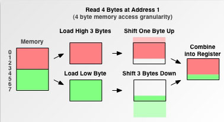

所以内存对齐不但可以解决不同CPU的兼容性问题，还能减少内存访问次数，提高效率。当然目前关于这个原因争论很多，可以看看CSDN上的讨论：<http://bbs.csdn.net/topics/30388330>

 

##### 3.1.3.2.2 如何对齐内存

内存对齐有一个对齐系数，一般是2,4,8,16字节这样。而不同平台上的对齐方式不同，这个主要是编译器来决定的。

具体的规则可以参考之前转的一篇文章，这里就不详细写了： <http://blog.csdn.net/cc_net/article/details/2908600>

 

# 总结

通过这一篇对内存工作的介绍，我们从内存的硬件结构，存储方式过渡到了内存的编址方式，然后又探讨了按字节编址带来的问题和解决的办法。这里就涉及到了CPU的指令格式，编译器的支持。最后我们也是从硬件和软件方面讨论了内存对齐的问题。

我自己感觉，内存的访问管理是计算机中最重要的部分，也是计算机硬件和软件之间交互的过渡的一个地方。所以理解了内存的工作原理，对于后面理解不同的内存模型很有帮助。

 

 

# 参考

[SDRAM DRAM工作原理](http://blueguide.blog.163.com/blog/static/165632634201186103450253/)

[详解大端模式和小端模式](http://blog.csdn.net/ce123_zhouwei/article/details/6971544)

[cpu是怎样识别一条接一条的指令的](http://www.asmedu.net/blog/user/postcontent.jsp?neighborId=24179&kindId=36107&postId=41060&vs=1)

[8086指令与机器码对应](http://wenku.baidu.com/view/5dc768146c175f0e7cd13755.html)

[8086/8088指令格式](http://www.eefocus.com/article/09-05/73951s.html) 

[为什么要进行内存对齐内存对齐？](http://www.dewen.org/q/5835)


https://blog.csdn.net/cc_net/article/details/11097267