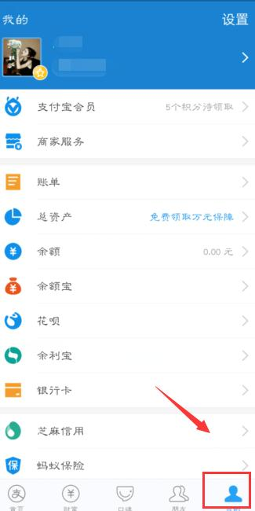
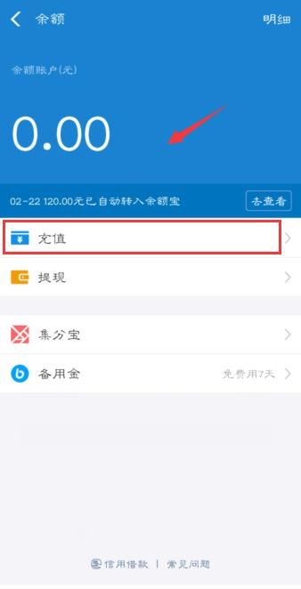
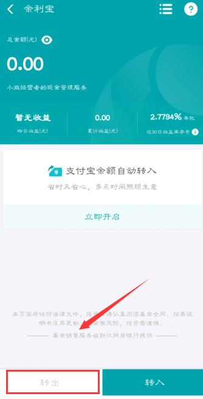

# 支付宝提现永久免收手续费，这个简单方法，你一定要学会！

支付宝提现永久免收手续费，这个简单方法，你一定要学会！

支付宝是我们日常社会生活，使用的比较频繁的工具，可能没有微信支付多，但是金额肯定比微信支付大。但是支付宝使用起来很多好处，提现收费却不尽人意。今天就教给大家一招，支付宝提现永久免收手续费，这个简单方法，你一定要学会哦。

现在使用支付宝超出一定额度之后就要收费，虽然网上给出了各种解决办法，但基本上都是治标不治本的。那么，支付宝提现真的没办法不收费吗？其实并不是，使用支付宝这个可以免费提现的方法，你一定要学会哦。

1.首先进入支付宝，点击页面底部【我的】图标，进入界面显示如下：

2.然后点击【余额】，进入页面之后需要点击【充值】，然后将余额宝或银行卡里的钱充值到支付宝余额中；

3.然后返回我的界面，选择【余利宝】并进入，进入余利宝之后，就可以转入余额里面的钱了；

4.等到余利宝中有余额时，直接将点击【转出】就可以提现啦，而且不收取任何费用哦。

如果使用手机，想要将音频文件转换成文字，可以在手机应用商店找到：录音转文字助手，录音转文字助手支持实时录音识别成文字，也支持上传音频文件转换成文字，非常实用哦。

当然，如果你不是余利宝的用户也没关系，直接开通支付宝收款码就可申请余利宝了，学会了赶紧去试试吧。

https://t.cj.sina.com.cn/articles/view/6633842979/18b68692300100hfsw