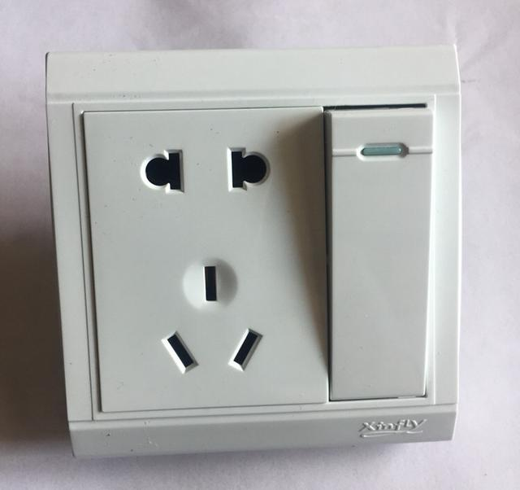
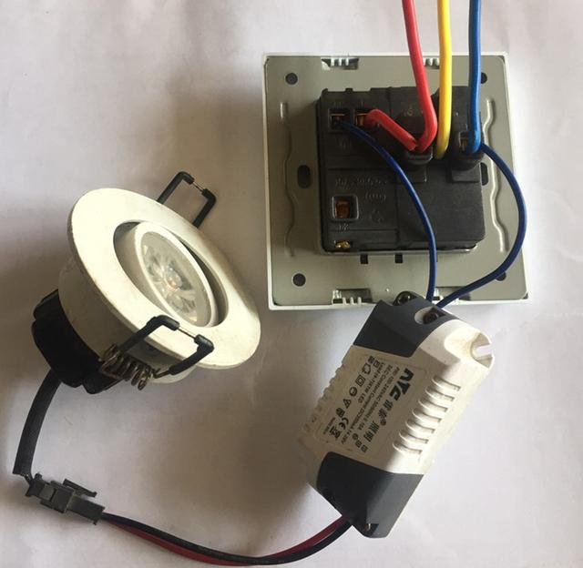
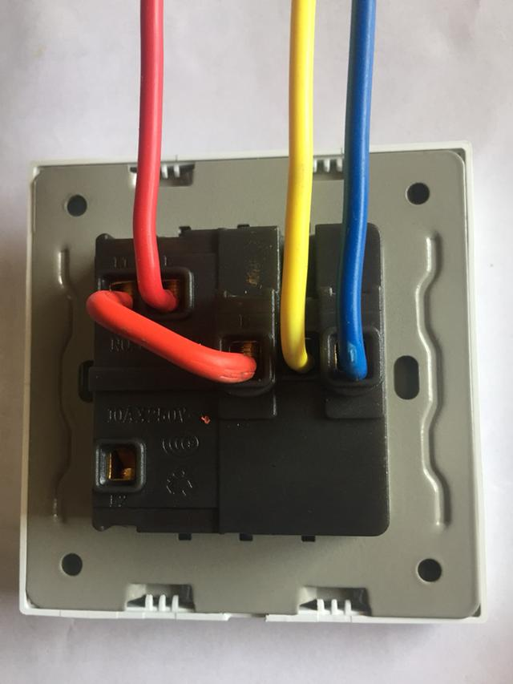
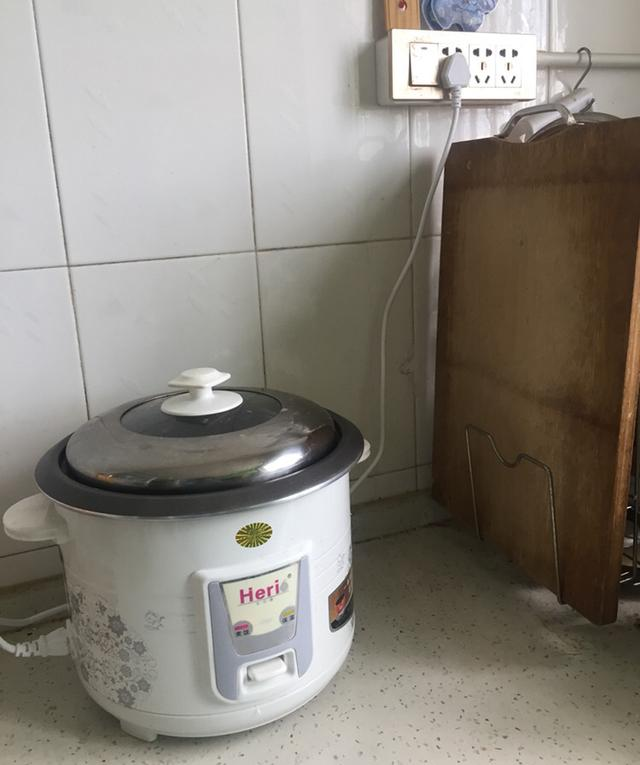
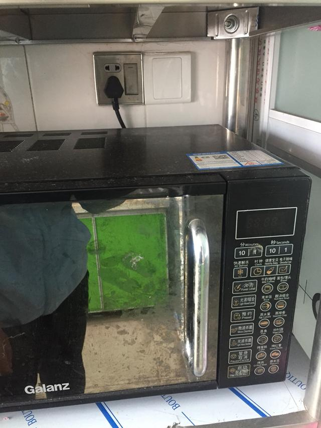

[TOC]

# 五孔插座带开关面板怎么接？ 

 

房间需要另外加一盏壁灯，特别是有孩子的一些家庭，突然开灯会造成眼睛不适，这时候迫切需要加一盏小夜灯来使用。那么我们该怎么做？其实很简单，只要把五孔插座换成一开五孔就可以了，然后买个小夜灯插在面板上即可。

一开五孔，当然还有双开五孔

如图上的面板，可以自己接线，我把接线方法放在下面，供大家参考，这种五孔带开关面板有两种的接线方式可以选择的。

## 第一，是要求开关控制另外一盏灯，插座保证随时有电。

火线进到五孔的L接线孔，从接线孔串联一根火线进到开关的L处，在把灯的控制线（就是给灯的火线）接在L1上，蓝色零线就接在五孔的N接线孔上，地线也是如此，就好了。

第一种，插座正常使用，开关控制灯

## 第二，要求开关控制五孔面板的通电和断电，家里就用这种方式即可。

把小夜灯插在插座里，火线先进到开关的L接线孔，在从L1（L2也可以）出来进到五孔的L接线孔，蓝色零线接五孔N接线孔上，地线也是这样即可

第二种，开关控制插座的接法

其实在日常生活中，我们经常看到一开五孔的场景，就说厨房吧，控制电饭煲的、微波炉、电磁炉等等，我自己家里还控制洗衣机。不用一直拔插头，省力还不伤电器。

从来不拔插头，觉得挺好

控制微波炉的单开五孔

特别注意一点的是电磁炉，我们知道电磁炉一般在2200w左右，而插座基本是10A。已经无限接近五孔插座电流数，这也导致好多家庭插座损坏的故障。因此建议电磁炉选择16A的开关插座（一开五孔），可避免此事发生。

<https://baijiahao.baidu.com/s?id=1612636404140910750&wfr=spider&for=pc>