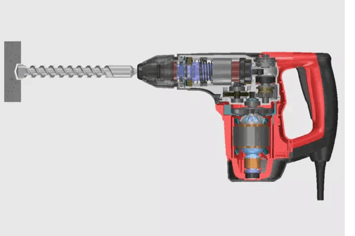
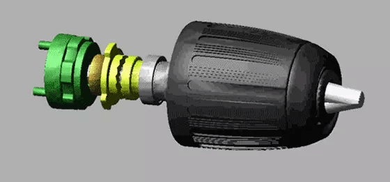
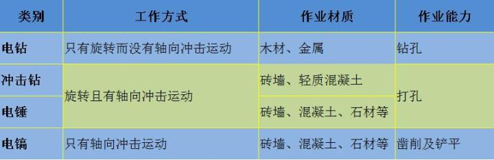
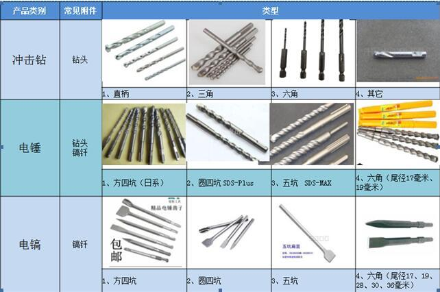

[TOC]

# 电锤与冲击钻的区别

个人的一点见解哦，求轻拍

我认为**冲击钻和电锤**的区别主要包括以下几方面：

## **1、主要在于施力结构不同。** 

一般而言，冲击钻靠的是一组冲击齿轮相互摩擦产生前后运动；而电锤靠的是气缸压缩往复产生前后运动。这两种不同结构产生的冲击力，后者更大。 在操作方式上，冲击钻需要使用者施力而产生冲击，而电锤不需要施力就可以产生冲击力。

电锤的操作示意如下：

冲击钻的操作示意如下：

 

**2、什么时候需要使用冲击钻？什么时候需要使用电锤？**

涉及到需要在水泥墙上钻孔的时候，需要用到冲击钻；

涉及到需要在钢筋混凝土等坚硬的结构上钻孔时，需要用到电锤；

**3、为什么普通电钻不可以钻墙，而冲击钻和电锤可以？**

普通电钻靠钻头的旋转钻入物体；

而冲击钻和电锤在此基础上增加了一个轴向运动，钻头在旋转时同步进行轴向运动，从而更有力的钻入坚硬物体。

**4、以下是整理的电钻、冲击钻、电锤、电镐的工作方式、作业材质和作业能力的不同**

**5、锤、镐、钻使用附件的区别**

还有其他区别，可以发出来一起探讨。

<https://zhuanlan.zhihu.com/p/28909907>