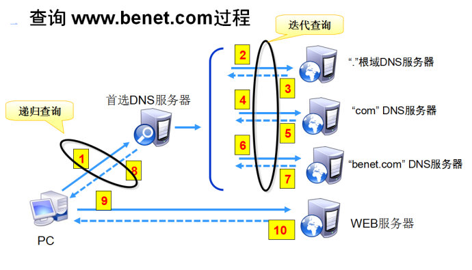
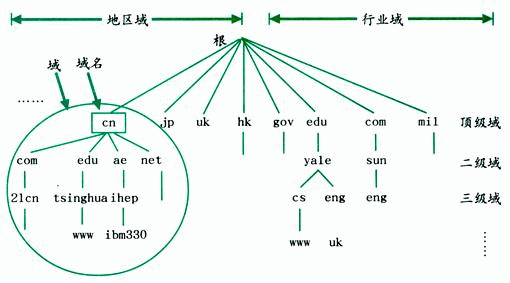

[TOC]

# DNS的作用是什么？为什么一定要配置DNS才能上网

## 简介

  DNS是域名解析协议

​    DNS 是域名系统 (Domain Name System) 的缩写，是因特网的一项核心服务，它作为可以将域名和IP地址相互

映射的一个分布式数据库，能够使人更方便的访问互联网，而不用去记住能够被机器直接读取的IP数串。这也是DNS的官方说法。

说白了就是：在互联网中通过IP 地址来进行通信。但是IP 地址的表示形式是数字，很难进行记忆（比如116.213.120.232），

所以为每个 IP取一个人类更易记忆的域名形式（比如www.google.com），而通过DNS 来把解析域名成为 IP（将方便

人理解的命名格式解析成计算机能够理解的格式，也可以将IP 翻译成域名）

  DNS服务的作用

​      将域名解析为IP 地址

​           客户端向DNS服务器（DNS服务器有自己的IP地址）发送域名查询请求

   DNS服务器告知客户机Web服务器的IP 地址

   客户机与Web 服务器通信

## DNS查询过程（这是很重要的了解DNS原理的一个过程）

　　　　通过分级管理可以有效的管理全球上亿的域名信息（类似于在公司中，CEO只管理各个部门的经理；各个部门的经理只管理自己部门中的各个组长；各个组长只管理自己组的组员。至少这是一种比较有效的管理方式）

　　　　下面以一个客户机想要访问 www.benet.com 这个WEB服务器的过程来理解DNS的原理

　

　　　　　　1.客户机（PC）向首选DNS服务器（首选DNS服务器是指当前你的PC机连接的DNS服务器，Windows可以使用ipconfig命令查看）发起请求：”你知道www.benet.com的IP吗？“如果首选DNS服务器知道（一般如果首选DNS服务器曾经解析过，那么会进行一段时间内的缓存，默认三天，如果正好在缓存时间内，那么首选服务器就会知道这个域名的IP），那么首选DNS 服务器就会直接给客户机返回域名的IP 地址

　　　　　　2.若首选DNS 服务器上没有相关信息，就不能直接返回域名的IP 地址，这时候，首选DNS 服务器就会去询问根DNS服务器（所有的DNS 服务器都知道全球的13 台DNS根服务器在哪里），根服务器可能不知道这个具体的 www.benet.com 的IP地址，但是它知道一级域 com 的IP（也就是说根服务器只负责维护所有的一级域，所以也就几百条数据在这里，虽然数据量少，但是它接受来自全球的请求，所以负载也很大）

　　　　　　3.根服务器将com 的IP地址返回给 首选DNS 服务器

　　　　　　4.首选DNS服务器再去请求 "com" DNS服务器：”你知道 www.benet.com的IP吗“，但是com DNS服务器也不知道 www.benet.com 的IP，但是com DNS 服务器知道 benet.com 的IP，

　　　　　　5.”com“DNS服务器将这个信息返回给 首选DNS 服务器

　　　　　　6.首选DNS服务器再去请求 "benet.com" DNS服务器，这时候 benet.com 服务器当然就会知道 www.benet.com的IP地址

　　　　　　7.”benet.com“DNS服务器将这个信息返回给首选DNS  服务器

　　　　　　8.首选DNS 服务器将获取到的 www.benet.com的IP返回给客户机

　　　　　　9.客户机根据获取到的www.benet.com 的IP地址来访问WEB服务器

　　　　　　10.WEB服务器返回相关的数据

域名空间结构

　　　　

## 扩充：

为什么一定要设置DNS才能上网？有些朋友可能会发现，为什么我可能登陆QQ、MSN，但却打不开网页呢？其实大部分原因都是因为DNS服务器故障造成的，DNS服务器地址是唯一的，是运营商提供给终端用户用来解析IP地址及域名的关系，而如果不设定DNS服务器地址，那么就无法查询地址的去向，自然也就打不开网页，而QQ、MSN等即时聊天软件，采用的是UDP传输协议，即不可靠传输协议，无需提供DNS服务器地址，也同样可以登陆。

<https://blog.csdn.net/qq_31930499/article/details/79767330>