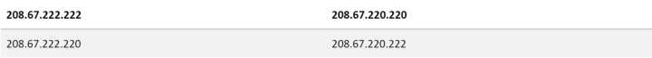
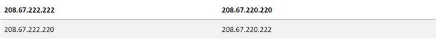
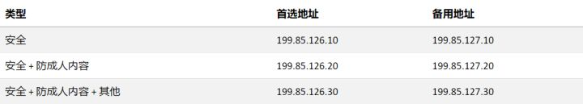
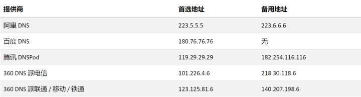

[TOC]

# 公共DNS

## 国外

- **IBM 的 9.9.9.9**

IBM 的 DNS 服务器 9.9.9.9 [主打防止恶意网站以及钓鱼网站](https://link.zhihu.com/?target=https%3A//developer.ibm.com/cn/blog/2017/ibm-dns-quad9/)。但是就速度来说，国内访问可能不是很理想。

- **Google 的 8.8.8.8 / 8.8.4.4**

这恐怕是最知名的 DNS 服务器之一了，这个 DNS 服务器一直以稳定著称，在国外的用户建议使用。

- **OpenDNS**

OpenDNS 有四个 DNS 服务器地址：（粗体为主要地址）

[OpenDNS](https://link.zhihu.com/?target=http%3A//opendns.com/) 同样也是一款老牌 DNS 提供商，可惜的是同样，这款 DNS 在国内也没有服务器，导致访问速度也不理想。

**诺顿 DNS**

[诺顿 DNS](https://link.zhihu.com/?target=http%3A//dns.norton.com/) 有三个类型：

诺顿在安全界的大名相信大家都有所耳闻，这款 DNS 在安全方面也有不俗的表现。如果您在国外且对安全有要求的话可以尝试。

## **国内**

- 114.114.114.114 / 114.114.115.115

这款国内的 DNS 有着访问速度快，以及稳定的好名声，而且在各省都有服务器。这款 DNS 同样也有保护儿童上网的 DNS 服务器，您可以访问他们的 [官网](https://link.zhihu.com/?target=https%3A//www.114dns.com/) 查看。

**其他国内产商的 DNS**

下表列出国内其他厂商的 DNS，您可以根据需求测试选择。

## 为什么要手动设置 DNS？

通常，宽带运营商会为我们分配一个 DNS 服务器。这个 DNS 通常是最快的，距离最近的服务器，那么为什么我们要手动设置 DNS 呢？原因会有以下几点：

1. 访问某些网络服务很缓慢，比如 Apple 的 iCloud 服务。
2. 比较担心安全问题，希望能通过设置 DNS 来保证你访问安全的网站，
3. 厌烦了每当你输入一个不正确的网址，运营商总会给你跳转到一个充满广告的界面。

如果你经常被以上问题所烦扰，那么自定义 DNS 应该会有效地解决你的问题。

<https://www.zhihu.com/question/32229915>