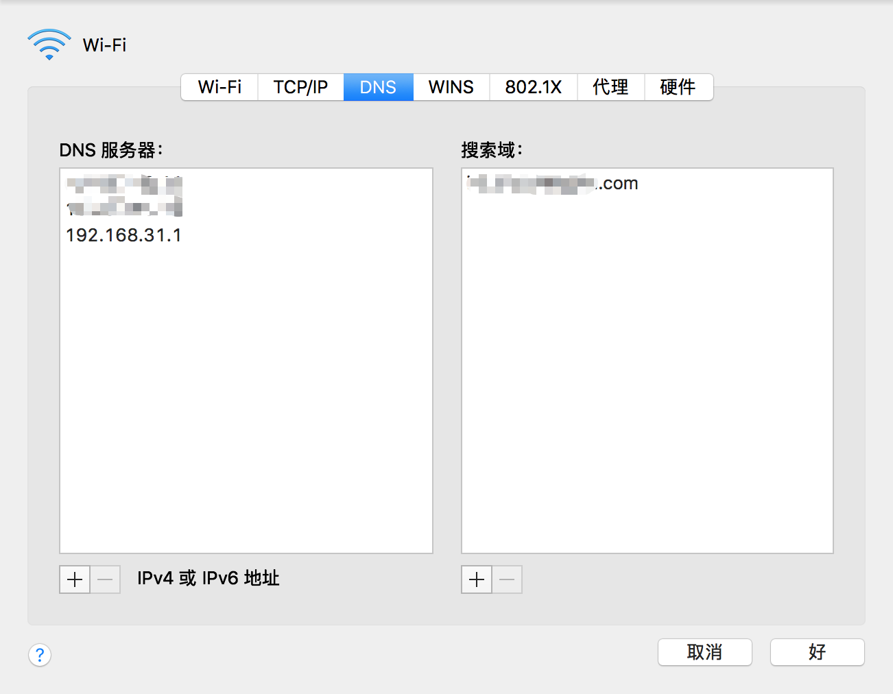

[TOC]

# wifi设置里搜索域是什么，有什么作用？

## 问

下图mac wifi设置里搜索域是什么，有什么作用？

## 答

Apple的技术支持页面有介绍过，比如添加[http://apple.com](https://link.zhihu.com/?target=http%3A//apple.com)为搜索域后当你在浏览器中输入store后就可以快速的访问[http://store.apple.com](https://link.zhihu.com/?target=http%3A//store.apple.com)这个域名但是实测中好像并没什么卵用～

[发布于 2017-06-08]()

作者：知乎用户

链接：https://www.zhihu.com/question/54150372/answer/180926885

来源：知乎

著作权归作者所有。商业转载请联系作者获得授权，非商业转载请注明出处。