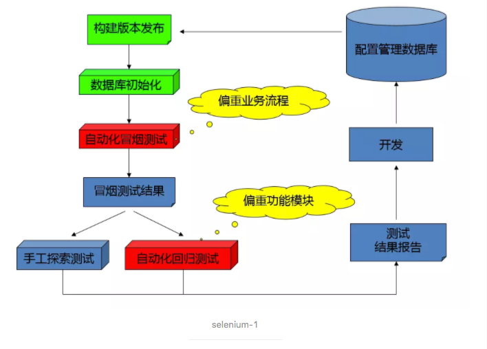
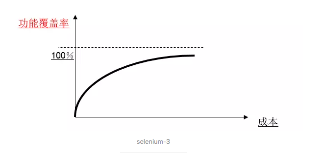
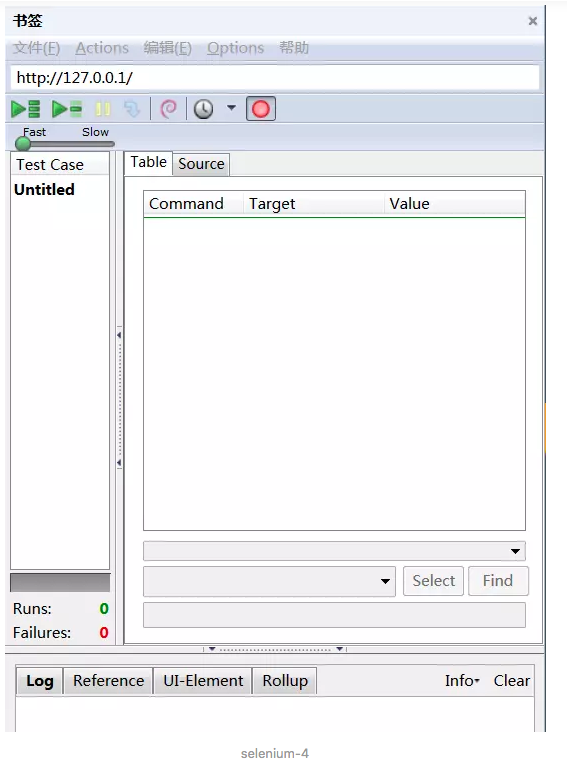
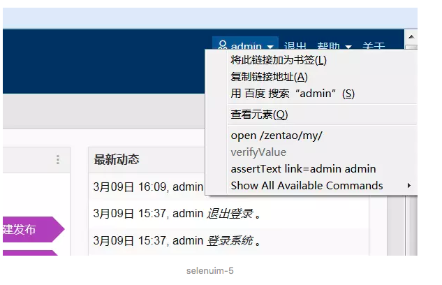

# 软件测试教程 自动化测试selenium篇

------

第一篇主要讲解了自动化测试的基本内容，实施方法等。最后用IDE生成了一个样例。这节课将详细的介绍webdriver常用的API。

本课程主要讲述以下内容：

> 什么是自动化测试
>
> 如何实施自动化测试
>
> 发展方向
>
> 什么是selenium
>
> 使用Selenium IDE录制脚本
>
> selenium+python环境搭建

## 什么是自动化测试

**自动化测试介绍**

自动化测试指软件测试的自动化，在预设状态下运行应用程序或者系统，预设条件包括正常和异常，最后评估运行结果。将人为驱动的测试行为转化为机器执行的过程。

常见的自动化测试工具：QTP、selenium、Rational Robot 、jmeter、appium、soapui等等

selenium 是一个web 的自动化测试工具，不少学习功能自动化的同学开始首选selenium ，
相因为它相比QTP 有诸多有点：

- 免费，也不用再为破解QTP 而大伤脑筋
- 小巧，对于不同的语言它只是一个包而已，而QTP 需要下载安装1个多G 的程序。
- 这也是最重要的一点，不管你以前更熟悉C、java、ruby、python、或都是C# ，你都
  可以通过selenium 完成自动化测试，而QTP 只支持VBS
- 支持多平台：windows、linux、MAC ，支持多浏览器：ie、ff、safari、opera、chrome
- 支持分布式测试用例的执行，可以把测试用例分布到不同的测试机器的执行，相当于分
  发机的功能。

*自动化工具和自动化框架的区别？*

自动化测试框架一般可以分为两个层次，上层是管理整个自动化测试的开发，执行以及维护，在比较庞大的项目中，它体现重要的作用，它可以管理整个自动测试，包括自动化测试用例执行的次序、测试脚本的维护、以及集中管理测试用例、测试报告和测试任务等。下层主要是测试脚本的开发，充分的使用相关的测试工具，构建测试驱动，并完成测试业务逻辑。

自动化测试的演变：测试工具----数据驱动----关键字驱动----测试框架----测试平台

**自动化测试方法**

测试对象：UI、接口、代码

测试过程：系统测试、集成测试、单元测试

执行人员：测试人员、开发人员

- 自动化测试可以在整个测试过程中任何一个阶段实施
- 测试人员一般在系统测试时进行自动化测试
- 集成测试阶段多进行自动构建、部署，以及冒烟测试的自动化
- 单元测试针对代码级别进行测试，可进行静态代码检查，或者执行单元测试用例，典型的框架比如junit，jmock等，该部分多由开发人员实施

**UI自动化**

- 用例维护量大
- 页面相关性强，必须后期介入
- UI测试适合与界面变动较小的项目

**接口自动化**

- 可在产品前期介入
- 用例维护量小
- 页面相关性小
- 适合接口变动较小，界面变动频繁的项目

**自动化测试的优势**

降低大型系统的由于变更或者多期开发引起的大量的回归测试的人力投入，这可能是自动化测试最主要的任务，特别是在程序修改比较频繁时，效果是非常明显的，自动化测试前期人力投入较多，但后期进入维护期后，可节省大量人力，而手工测试后期需要增加大量人力用于回归测试

减少重复测试的时间，实现快速回归测试

创建优良可靠的测试过程，减少人为错误

可以运行更多更繁琐的测试

可以执行一些手工测试困难或不可能进行的测试

更好的利用资源

测试具有一致性和重复性

测试脚本的重用性

## 如何实施自动化测试

*项目能实施自动化么？怎么实施？值得不值得？*

**自动化测试的适用对象**

实施自动化测试的前提条件：需求变动不频繁、项目周期足够长、自动化测试脚本可重复使用

1、需求变动频繁的项目，自动化脚本不能重复使用，维护成本太大，性价比低

2、项目周期短，自动化脚本编制完成后使用次数不多，性价比低

3、交互型较强的项目，需要人工干预的项目，自动化无法实施

适合做自动化的项目：

1、产品型项目。产品型的项目，新版本是在旧版本的基础上进行改进，功能变不大的项目，但项目的新老功能都必须重复的进行回归测试。回归测试是自动化测试的强项，它能够很好的验证你是否引入了新的缺陷，老的缺陷是否修改过来了。在某种程度上可以把自动化测试工具叫做回归测试工具。

2、机械并频繁的测试。每次需要输入相同、大量的一些数据，并且在一个项目中运行的周期比较长。

**什么时候实施**

如果我们自动化实施失败了，很显然，我们在不合时宜的时机进行了这份工作。

建议：可预见的需求不影响自动化测试用例的设计



selenium-1

**如何实施自动化测试**

单纯的讲，自动化测试的具体实现，应该是包含下面七个过程的。

1. 分析：总体把握系统逻辑，分析出系统的核心体系架构。
2. 设计：设计测试用例，测试用例要足够明确和清晰，覆盖面广而精
3. 实现：实现脚本，有两个要求一是断言，二是合理的运用参数化。
4. 执行：执行脚本远远没有我们想象中那么简单。脚本执行过程中的异常需要我们仔细的去分析原因。
5. 总结：测试结果的分析，和测试过程的总结是自动化测试的关键。
6. 维护：自动化测试脚本的维护是一个难以解决但又必须要解决的问题。
7. 分析：在自动化测试过程中深刻的分析自动化用例的覆盖风险和脚本维护的成本。


selenium-2

**自动化测试实施失败的因素**

1、期望值过高。就像管理人员要求完全测试一样，期望100％的测试自动化，也同样是一个不现实的需求。



selenium-3

2、对收益和成本认识不清。抛开工具的开发或者购买成本和培训成本，自动化测试的成本应该还包括两部分（实现成本中还隐含了测试准备成本）：

 成本＝实现成本＋运行维护成本

自动化测试的收益是由测试脚本的重复运行次数，或自动测试脚本的利用率决定的。

## 发展方向

1. 自动化脚本的执行，维护和结果分析
2. 自动化脚本的编写
3. 自动化测试方案的设计，框架的选型
4. 自动化测试框架的编码实现
5. 自动化测试框架的设计

**自动化测试需要了解的技能**

了解基本业务

了解业务的技术框架

懂得功能测试

懂得一种编程语言

懂数据库、操作系统

了解常见的测试框架

......

## 什么是selenium

Selenium是ThroughtWorks公司一个强大的开源Web功能测试工具系列，支持多种开发语言：ruby，python，java，perl，c#等，同时Selenium 测试直接自动运行在浏览器中，就像真正的用户在手工操作一样。支持的浏览器包括 IE、Chrome 和 Firefox等。

Selenium已经从之前的1.0(RC)进化到了现在的Selenium2(Selenium1+WebDriver)。

Selenium 2.0（又名Selenium WebDriver）的主要新功能是集成了 WebDriver。WebDriver 曾经是 Selenium 1（又名 Selenium RC）的竞争对手。Selenium RC 在浏览器中运行 JavaScript 应用，而 WebDriver 通过原生浏览器支持或者浏览器扩展直接控制浏览器。

之所以合并，原因如下：

- WebDriver 解决了 Selenium 存在的缺点（比如，绕过 JS 沙箱）；
- Selenium 解决了 WebDriver 存在的问题（例如支持广泛的浏览器）;
- Selenium 的主要贡献者们都觉得合并项目是为用户提供最优秀框架的最佳途径。

Selenium 2.0 还包括 Selenium Server，通过 Selenium Grid 支持分布式测试。新的 Selenium Grid 支持使用原来的 Selenium RC API 和 WebDriver API 测试。Selenium IDE也将支持 WebDriver API，包括将录制生成的测试用例导出为 WebDriver 所支持的各种编程语言（Ruby、Python、C# 和 Java）。

## 使用selenium IDE录制脚本

selenium最简单的使用方式就是IDE录制脚本。

1、安装Firefox 17.0 - 40.* ，因为firefox更新过快，selenium的不同版本对firefox的支持不同。

注意，安装完毕后，在选项菜单取消自动更新。为了兼容selenium以及ide，建议使用54版本。

下载地址：http://ftp.mozilla.org/pub/firefox/releases

2、安装selenium IDE

下载地址：https://addons.mozilla.org/en-US/firefox/addon/selenium-ide/

SeleniumIDE 是一个 Firefox 插件，是用来开发测试用例的集成开发工具，其简单易用，能够高效的开发测试用例，并可转换成相应的语言脚本。

注意：IDE仅作为辅助工具来快速生成用例或者个人测试使用。实际很少用它来管理自动化测试用例并执行。

如下以本机安装的禅道为例介绍IDE的使用。

1、打开Firefox-工具-选择selenium ide：



selenium-4

2、点击 File 菜单，弹出下拉列表，选择 New Test Case，此时左中部 Test Case 窗口会增加一个 Untitle 2 的测试案例，右键点击'Property'，在弹出窗口中重命名为”TestDemo”

3、点击 IDE 的右上部录制按钮（小红点）开始手动录制

4、在地址栏中输入待测试的网址( 禅道)如http://127.0.0.1，输入用户名和密码，进行登录操作。这时可以看到IDE进行了录制操作。

5、在页面中点击右键，可以增加检查点。



selenuim-5

)

6、录制结束后，点击录制按钮（小红点），结束本次手动录制。在selenium IDE 中，选中一个 Test Case，点击 File 菜单，下拉列表中选择“Export Test Case As”-“python2/ unittest/ WebDriver”;导出为Testdemo.py文件。

7、将该脚本在python中运行并调试。


```python
# -*- coding: utf-8 -*-
from selenium import webdriver
from selenium.webdriver.common.by import By
from selenium.webdriver.common.keys import Keys
from selenium.webdriver.support.ui import Select
from selenium.common.exceptions import NoSuchElementException
from selenium.common.exceptions import NoAlertPresentException
import unittest, time, re

class 1(unittest.TestCase):
    def setUp(self):
        self.driver = webdriver.Firefox()
        self.driver.implicitly_wait(30)
        self.base_url = "http://127.0.0.1/"
        self.verificationErrors = []
        self.accept_next_alert = True
    
    def test_1(self):
        driver = self.driver
        driver.get(self.base_url + "/")
        driver.find_element_by_id("zentao").click()
        driver.find_element_by_id("zentao").click()
        driver.find_element_by_id("account").clear()
        driver.find_element_by_id("account").send_keys("admin")
        driver.find_element_by_id("account").clear()
        driver.find_element_by_id("account").send_keys("admin")
        driver.find_element_by_name("password").clear()
        driver.find_element_by_name("password").send_keys("password123")
        driver.find_element_by_name("password").clear()
        driver.find_element_by_name("password").send_keys("password123")
        driver.find_element_by_id("submit").click()
        driver.find_element_by_id("submit").click()
        self.assertEqual("admin", driver.find_element_by_link_text("admin").text)
        driver.find_element_by_link_text(u"退出").click()
        driver.find_element_by_link_text(u"退出").click()
    
    def is_element_present(self, how, what):
        try: self.driver.find_element(by=how, value=what)
        except NoSuchElementException as e: return False
        return True
    
    def is_alert_present(self):
        try: self.driver.switch_to_alert()
        except NoAlertPresentException as e: return False
        return True
    
    def close_alert_and_get_its_text(self):
        try:
            alert = self.driver.switch_to_alert()
            alert_text = alert.text
            if self.accept_next_alert:
                alert.accept()
            else:
                alert.dismiss()
            return alert_text
        finally: self.accept_next_alert = True
    
    def tearDown(self):
        self.driver.quit()
        self.assertEqual([], self.verificationErrors)

if __name__ == "__main__":
    unittest.main()
```

至此，我们就完成了一个test case的生成。

## selenium+python环境搭建

下载[pythonhttp://python.org/getit/](pythonhttp://python.org/getit/)

下载setuptools 【python 的基础包工具】http://pypi.python.org/pypi/setuptools

下载pip 【python 的安装包管理工具】https://pypi.python.org/pypi/pip

- 安装python，setuptools
- 安装pip ，解压在了C:\pip-1.3.1 目录下

打开命令提示符（开始---cmd 回车）进入C:\pip-1.3.1目录下输入：
C:\pip-1.3.1 > python setup.py install

再切换到C:\Python27\Scripts 目录下输入：
C:\Python27\Scripts > easy_install pip

- 安装selenium（下载地址： https://pypi.python.org/pypi/selenium ）

如果是联网状态的话，可以直接在C:\Python27\Scripts 下输入命令安装：
C:\Python27\Scripts > pip install -U selenium

如果没联网，下载最新版本并解压把整个目录放到C:\Python27\Lib\site-packages 目录下。

建议python版本2.7


```ruby
案例：
拿上一节生成的python脚本来试验一下
Traceback (most recent call last):
  File "C:\Users\liujiey\Desktop\chandao.py", line 12, in setUp
    self.driver = webdriver.Firefox()
  File "C:\Python27\lib\site-packages\selenium\webdriver\firefox\webdriver.py", line 152, in __init__
    self.service.start()
  File "C:\Python27\lib\site-packages\selenium\webdriver\common\service.py", line 83, in start
    os.path.basename(self.path), self.start_error_message)
WebDriverException: Message: 'geckodriver' executable needs to be in PATH. 

1. selenium 3.x开始，webdriver/firefox/webdriver.py的__init__中，executable_path="geckodriver"；而2.x是executable_path="wires"

2. firefox 47以上版本，需要下载第三方driver

解决办法：

1、下载geckodriver.exe：

下载地址：https://github.com/mozilla/geckodriver/releases，请根据系统版本选择下载；（如Windows 64位系统）

下载解压后将getckodriver.exe复制到Firefox的安装目录下，如（C:\Program Files\Mozilla Firefox），并在环境变量Path中添加路径：C:\Program Files\Mozilla Firefox；

2、firefox升级
```

**安装chrome driver**

下载地址：http://npm.taobao.org/mirrors/chromedriver/

下载解压，你会得到一个chromedriver.exe 文件，放到chrome 的安装目录下...\Google\Chrome\Application\ ,然后设置path 环境变量，把chrome 的安装目录（我的：C:\Program Files\Google\Chrome\Application），然后再调用运行。


```python
# coding = utf-8
from selenium import webdriver
driver =webdriver.Chrome()
driver.get('http://www.baidu.com')
print driver.title
driver.quit()
```

**只有安装了对应的driver才能运行对应的浏览器**


https://www.jianshu.com/p/97613f833606