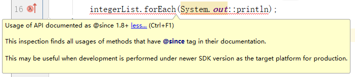

[TOC]


# maven 设置默认使用JDK1.8

原创琚建飞 发布于2018-07-16 21:17:35 阅读数 13313 收藏

## 背景

　　做测试时，发现不可以使用forEach方法，具体代码如下：

```
List<Integer> integerList = Arrays.asList(1,2,3,4,5);
integerList.forEach(System.out::println);
```

　　IDEA提示信息如图1-1所示：

 

图1-1 错误提示

## 第一次解决方案

　　修改IDEA的两处设置。具体如下：

```
1、File → Settings → Java Compiler → Target bytecode version 改为1.8
2、File → Project Structure → Modules → Language level 改为 8-Lambdas,type annotations etc.
```


## 第二次解决方案

　　好景不长，同样的错误提示再次出现在我新建的Maven项目中，设置被还原了。那如何设置默认使用JDK1.8呢？

　　答案：在settings文件中配置即可。具体代码如下：

```xml
<profile> 
<id>jdk-1.8</id> 
 <activation> 
  <activeByDefault>true</activeByDefault> 
  <jdk>1.8</jdk> 
 </activation> 
<properties> 
<maven.compiler.source>1.8</maven.compiler.source> 
<maven.compiler.target>1.8</maven.compiler.target> 
<maven.compiler.compilerVersion>1.8</maven.compiler.compilerVersion> 
</properties>
</profile>
```

　　注意：需将上面的配置添加到settings文件的<profiles>标签内。

 

## 扩展

　　为了方便项目迁移，也可以在pom文件中配置。具体如下：

```xml
<build>
  <plugins>
    <plugin>
      <groupId>org.apache.maven.plugins</groupId>
      <artifactId>maven-compiler-plugin</artifactId>
      <version>3.8.1</version>
      <configuration>
        <source>1.8</source>
        <target>1.8</target>
      </configuration>
    </plugin>
  </plugins>
</build>
```


原文链接：https://blog.csdn.net/Gnd15732625435/article/details/81071766