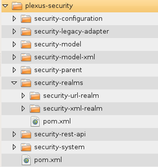

[TOC]


# maven的-pl -am -amd参数学习 按需构建多模块，玩转Maven反应堆

## 简介

在多模块Maven项目中，反应堆（Reactor）是一个包含了所有需要构建模块的抽象概念，对于Maven用户来说，主要关心的是两点：

1. 哪些模块会被包含到反应堆中？
2. 反应堆中所有模块的构建顺序是什么？

例如有这样的一个多模块项目:



 

plexus-security包含了8个子模块，其中security-realms还包括了更进一层的两个子模块。

运行mvn clean install可以看到这样的输出：

```
[INFO] Scanning for projects...  
[INFO] ------------------------------------------------------------------------  
[INFO] Reactor Build Order:  
[INFO]   
[INFO] Plexus Security Aggregator  
[INFO] Security: Parent  
[INFO] Security: Model  
[INFO] Security: XML Model  
[INFO] Security: Configuration  
[INFO] Security: System  
[INFO] Security: Realms Parent  
[INFO] Plexus XML Realm  
[INFO] Security: REST API  
[INFO] Plexus URL Realm  
[INFO] Security Legacy Adapter  
[INFO]                                                                           
[INFO] ------------------------------------------------------------------------  
```

 

在默认情况下，Maven会根据多模块配置构建所有的模块，Maven还会根据模块间的依赖关系自动计算构建顺序，以确保被依赖的模块会先得以构建。值得一提的是，在这种情形下，Maven会将父模块看成是其子模块的依赖，因此该例中Security Parent会较先得以构建。

 

一般来说，我们要么构建整个项目，要么构建单个模块，但是有些时候，我们会想要仅仅构建这个完整的反应堆中的某些模块，换句话说，我们会需要裁剪反应堆。

例如说，我对模块security-configuration做了一些更改，而我知道在完整反应堆顺序中，security-model-xml和security-model在其之前，不会依赖它，因此就没必要构建他们。我们只需要构建security-configuration及其之后的项目。

##  参数说明

Maven提供了很多命令行选项让我们自定义反应堆，输入mvn -h可以看到这样一些选项：

```
Options:  
 -am,--also-make                        If project list is specified, also  
                                        build projects required by the  
                                        list  
 -amd,--also-make-dependents            If project list is specified, also  
 -pl,--projects <arg>                   Build specified reactor projects  
                                        instead of all projects. A project  
                                        can be specified by  
                                        [groupId]:artifactId or by its  
                                        relative path.  
 -rf,--resume-from <arg>                Resume reactor from specified  
                                        project  
```

###  -rf,--resume-from

**--resume-from** 表示从该模块恢复，也就是说选择从哪里开始构建，等于剪掉了完整反应堆的前面一部分。

例如我运行 mvn clean install -rf security-configuration/ ，就会得到这样的一个反应堆：

```
[INFO] ------------------------------------------------------------------------  
[INFO] Reactor Build Order:  
[INFO]   
[INFO] Security: Configuration  
[INFO] Security: System  
[INFO] Security: Realms Parent  
[INFO] Plexus XML Realm  
[INFO] Security: REST API  
[INFO] Plexus URL Realm  
[INFO] Security Legacy Adapter  
[INFO]                                                                           
[INFO] ------------------------------------------------------------------------  
```

与完整反应堆相比，前面的四个模块不见了，只保留了security-system及其之后的模块。

###  -pl,--projects

**--projects** 表示手动选择需要构建的项目，项目间以逗号分隔。

例如我运行 mvn clean install -pl security-configuration/,security-realms/security-xml-realm/，会得到如下反应堆：

```
[INFO] ------------------------------------------------------------------------  
[INFO] Reactor Build Order:  
[INFO]   
[INFO] Security: Configuration  
[INFO] Plexus XML Realm  
[INFO]                                                                           
[INFO] ------------------------------------------------------------------------  
```

###  -am,--also-make

**--also-make** 的前提是--projects参数，表示同时构建所列模块依赖的其他模块。

例如我运行 mvn clean install -pl security-model-xml/ -am，会得到如下反应堆：

```
[INFO] ------------------------------------------------------------------------  
[INFO] Reactor Build Order:  
[INFO]   
[INFO] Security: Parent  
[INFO] Security: Model  
[INFO] Security: XML Model  
[INFO]                                                                           
[INFO] ------------------------------------------------------------------------  
```

这里security-model-xml依赖于security-model，而security-parent是security-model-xml的父项目，因此这两个模块都会得以构建。

###  -amd,--also-make-dependents 

**--also-make-dependents** 的前提是--projects参数，表示同时构建那些依赖于所列模块的模块。

例如我运行 mvn clean install -pl security-model-xml/ -amd，会得到如下反应堆：

```
[INFO] ------------------------------------------------------------------------  
[INFO] Reactor Build Order:  
[INFO]   
[INFO] Security: XML Model  
[INFO] Plexus XML Realm  
[INFO] Security: REST API  
[INFO] Plexus URL Realm  
[INFO] Security Legacy Adapter  
[INFO]                                                                           
[INFO] ------------------------------------------------------------------------  
```

除了security-model-xml本身，所有其他依赖于该模块的模块也会被加入到反应堆中。

### 除此之外

**除此之外**，在-pl、-am或者-pl、-amd的基础上，还能应用-rf参数，紧接着上面的例子，再加上参数-rf -rf security-rest-api/，

如：mvn clean install -pl security-model-xml/ -amd -rf security-rest-api/，便可以得到如下的反应堆：

```
[INFO] ------------------------------------------------------------------------  
[INFO] Reactor Build Order:  
[INFO]   
[INFO] Security: REST API  
[INFO] Plexus URL Realm  
[INFO] Security Legacy Adapter  
[INFO]                                                                           
[INFO] ------------------------------------------------------------------------  
```

 

这个反应堆表示：计算所有security-model-xml及依赖于它的模块，在次基础上，从security-rest-api模块开始构建。

在开发过程中，灵活应用上述4个参数，可以帮助我们跳过那些无须构建的项目模块，从而加速构建，当项目庞大，模块特别多的时候，这种效果就异常明显。

最后提一下，Maven从2.1版本才加入了此功能。 :)


<https://juvenshun.iteye.com/blog/565240>