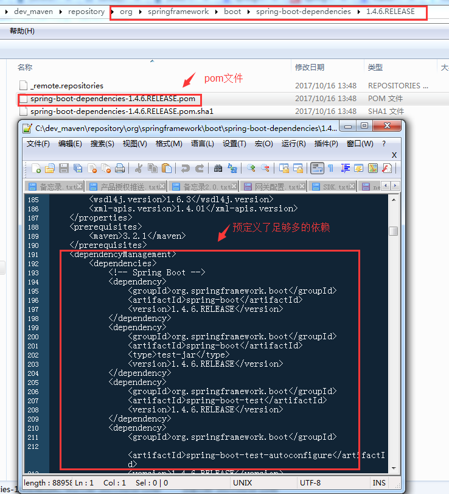

[TOC]


# maven中import scope依赖方式解决单继承问题的理解    新建 SpringBoot 项目， maven 不通过继承 parent 的方式

## 分析现状

在maven多模块项目中，为了保持模块间依赖的统一，常规做法是在parent model中，使用dependencyManagement预定义所有模块需要用到的dependency(依赖)

```
<dependencyManagement>
        <dependencies>
            <!-- Feign是一种声明式、模板化的HTTP客户端:以HTTP接口的形式暴露自身服务 -->
            <dependency>
                <groupId>org.springframework.cloud</groupId>
                <artifactId>spring-cloud-starter-feign</artifactId>
                <version>${spring-cloud-starter-feign.version}</version>
            </dependency>
            <!-- 支持面向方面的编程即AOP，包括spring-aop和AspectJ -->
            <dependency>
                <groupId>org.springframework.boot</groupId>
                <artifactId>spring-boot-starter-aop</artifactId>
                <version>${spring.boot.version}</version>
            </dependency>
            <dependency>
                <groupId>org.aspectj</groupId>
                <artifactId>aspectjrt</artifactId>
                <version>${aspectjrt.version}</version>
            </dependency>
        </dependencies>
    </dependencyManagement>
```

然后，子model根据实际需要引入parent中预定义的依赖

```
<dependencies>
        <dependency>
            <groupId>org.springframework.boot</groupId>
            <artifactId>spring-boot-starter-aop</artifactId>
        </dependency>
    </dependencies>
```

### 好处：

1、依赖统一管理(parent中定义，需要变动dependency版本，只要修改一处即可)；

2、代码简洁(子model只需要指定groupId、artifactId即可)

3、dependencyManagement只会影响现有依赖的配置，但不会引入依赖，即子model不会继承parent中dependencyManagement所有预定义的depandency，只引入需要的依赖即可，简单说就是“按需引入依赖”或者“按需继承”；因此，在parent中严禁直接使用depandencys预定义依赖，坏处是子model会自动继承depandencys中所有预定义依赖；

 

### 问题:

但是，问题也出现了：

单继承：maven的继承跟java一样，单继承，也就是说子model中只能出现一个parent标签；

parent模块中，dependencyManagement中预定义太多的依赖，造成pom文件过长，而且很乱；

如何让这些依赖可以分类并清晰的管理？

### 解决办法:

问题解决：import scope依赖

如何使用：

1、maven2.9以上版本

2、将dependency分类，每一类建立单独的pom文件

3、在需要使用到这些依赖的子model中，使用dependencyManagement管理依赖，并import scope依赖

3、注意：scope=import只能用在dependencyManagement里面,且仅用于type=pom的dependency

示例：

```xml
    <dependencyManagement>
        <dependencies>
            <dependency>
                <groupId>org.springframework.boot</groupId>
                <artifactId>spring-boot-dependencies</artifactId>
                <!-- 重要：版本号要和父模块中预定义的spring boot版本号保持一致 -->
                <version>${spring.boot.version}</version>
                <type>pom</type>
                <scope>import</scope>
            </dependency>
        </dependencies>
    </dependencyManagement>
```

 maven编译后，下载了pom文件，在maven的本地仓库下查看pom文件如下：



好处分析：

1、单一职责原则，根据依赖的分类，细化每一个单一职责的pom文件

2、解决单继承问题，通过import pom文件达到依赖的目的（典型的非继承模式），从而不用从父类中引用依赖

3、父模块的pom就会非常干净，容易维护


https://www.cnblogs.com/huahua035/p/7680607.html