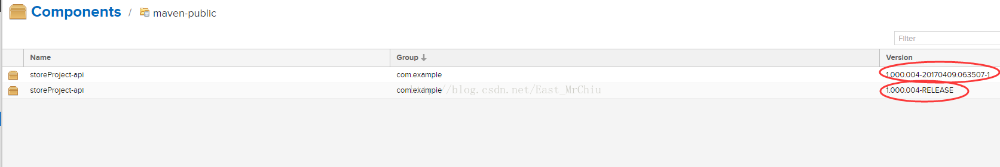

# maven Snapshot和Release版本的区别 

## 简介

Snapshot版本代表不稳定、尚处于开发中的版本，快照版本。

Release版本则代表稳定的版本，发行版本。

## 什么时候用Snapshot版本？

依赖库中的jar正处于开发的阶段，会被经常被更新，这种情况下，如果使用Release，会频繁增加版本号，导致版本号的滥用。

在上传jar时，选择Snapshot和Release上传时，在版本号的构建上有所不同，如图：

可以很明显的看到，上传同样的版本号jar包时，Snapshot在版本号的后面会自动追加一串新的数字，就是所谓的日期标签，这样在不断更新jar包时，可以不用每次都要将版本号提高一个版本，可以有效的维护版本号。

## 稳定版使用Snapshot版本行不行？

不行，因为会造成不稳定。比如说，今天你依赖某个snapshot版本的第三方库成功构建了自己的应用，明天再构建时可能就会失败，因为今晚第三方可能已经更新了它的snapshot库。你再次构建时，Maven会去远程repository下载snapshot的最新版本，你构建时用的库就是新的jar文件了，这时正确性就很难保证了。稳定版应该依赖Release版本的jar包，这样更新时需要更新版本号，版本号没变时，依赖的jar包也不会变。

<https://blog.csdn.net/East_MrChiu/article/details/69817471>